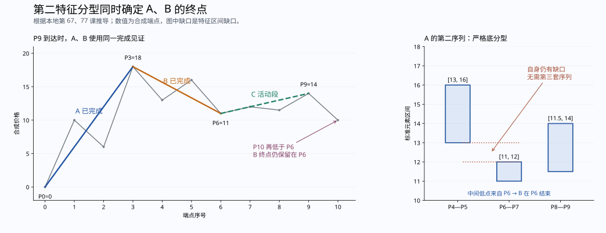
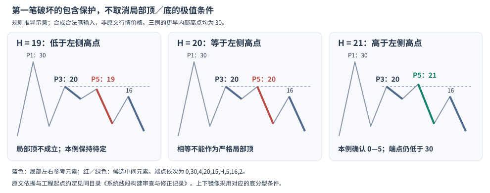
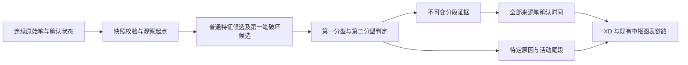

# 系统线段构建审查与修正记录

**2026-09-17 当前状态：图 01—05 的用户裁定均已落实；本地全量验证覆盖 142 份行情窗口、1,154,607 根 K 线，检查范围内未发现新的划分错误，全仓库回归 2,176 项通过。** 最新结果及边界见[全量验证报告](segment_full_validation_20260917.md)，此前实现修正和性能测量见[再次审查报告](segment_reaudit_20260917.md)。图 01 采用原始首笔判类；图 02 保留 P6 并确认后续 P6—P11；图 03 同价尾段显示至 P5、保持未完成；图 04、05 原规则保留。原文与用户裁定的区别见[裁定报告](segment_review_decisions_20260917.md)。

**以下为裁定前审查的历史记录。** 下文的“当前”“尚待核实”、1,579 项旧计数及“生产规则本轮未改”，均指对应历史阶段；后续变更见裁定与再次审查报告，最新验证见全量验证报告。原文出处与未变更规则仍可查阅。

审查日期：2026-09-16。对照版本：`d54ccfe7c735e7e54ca7d28d2a247fda14ef72b8`。理论依据只取自 `D:\缠论` 中实际读取的原文与配图。排除实际行情跳空的特殊划分规则，保留特征序列区间缺口及第二种线段结束条件。

尚未闭合的规则现按五项逐一解释，区分原文条款衔接、同价物理端点和实现覆盖性证明；另列本轮可以进一步确定的边界条件。[尚未明确规则与原文推导](segment_unresolved_rules_analysis.md)。

**已修正多项会改变实际分段、确认时间和缓存结果的复现问题；全套原文规则符合性仍未完成。** 第 79 课的上图和“只改变 9”的变体、第 77 课的线段反弹结构都能复现漏分；连续包含超过扫描上限、中间证据笔未确认、同列表追加或历史笔替换，也分别复现漏确认、提前确认和旧结果复用。审查前原有 47 项重点测试全部通过，新增的首批 79 项检查中有 29 项失败，包括镜像和数值变换产生的重复失败，不能把它们算成 29 种独立理论错误。

最终合并回归的核心、架构、图表与持久化共 **1,579 项测试全部通过**，其中本次原图及性质测试文件包含 216 项，图形族测试文件包含 58 项、覆盖第 79 课的 7,024 个基础变体、2,568 个受约束后续变体、5,136 个同价内包后续变体及第 81 课与相关推导的 50 个大小关系变体；候选审查器另有 29 项识别能力测试。另有 3,000 组固定笔链的 90,000 个前缀、10,000 组较长随机笔链的 610,000 个前缀，以及五个价格等级上最多十四端点的 5,120,320 个有效前缀检查。六价格等级、最多十一端点的 1,761,447 个有效前缀检查包含五等级集合不能表示的同向内包正例，但不足以覆盖新增十三端点的同价内包正例；后者另以固定前四点、六等级至十三端点的双向后续枚举检查 217,918 个前缀。候选扫描专门检查还覆盖 1,235,092 个双向有限枚举前缀及 10,000 条较长完整笔链。不同检查集合可能重叠，不把它们相加冒充独立图形总数。**这些结果证明已列案例及检查性质通过，不构成全部可能输入与原文等价的数学证明。** 下文单独列出尚不能逐笔重建的原文行情例子及工程约定。

系统实际路径为 `CL → BiCalculator.contiguous_bis → XdCalculator → XD → 中枢与图表`。条件观察范围也调用同一个计算器。因此本次修正进入当前生产代码路径，而非另建一套仅供研究的演示算法。原有笔构建配置保持 `old-user-path-b-completed-prefix-v14`；本报告的数值图例均以输入笔已经合法为前提，不把端点折线测试当作完整 K 线成笔证明。

后续验证还补上了一处检查器漏检：第一分型的中间包含链和第一个独立右元素，现在也从原始笔逐项重建。删除链内来源、使用错误合并边界、提前截断中间链、借用更晚右元素这四类篡改的上下镜像，旧检查器全部误放行，新检查器全部拒绝。这 8 项属于验证工具的识别能力测试，不能计为 8 种生产划分错误。[详细过程与原文依据](segment_search_obligations.md)。

第二种候选待定时为何不能被内部局部分型绕过，也补上了条件性因果论证：在原候选第一分型合格的前提下，可以构造后续使它在未创新极值前完成；提前确认另一个段界会与此后续冲突。1,254 个待定上下文通过构造检查，其中 455 个含有看似可用的内部局部分型。该结论不代替对最初候选前史资格的证明。[原文图示、推导与复算](segment_pending_priority_audit.md)。

**进一步复核撤回了一项过强结论：包含后重判缺口尚未完成原文符合性验证。** 一组全异价输入中，首笔破坏后先突破其终点，却因包含生成标准缺口而继续等待第二分型；按原始首笔判类的受控实验则确认。两种口径改变两份本地行情的段界。第 67 课的标准序列定义与第 70、71 课的首笔破坏说明仍须完整衔接，不能把既有测试按当前口径通过当成裁定。生产规则本轮未改。[原文、图形、输入可达性与行情对照](segment_gap_classification_audit.md)。

发现及处理结果如下。

| 问题 | 原实现与复现 | 当前处理 |
|---|---|---|
| 复杂非极值端点漏分 | 全段记录极值过滤与“必须穿越整段起点”的补充分支，挡住了第 79 课的 8、第 77 课反弹段的实际终点 | 普通候选保留参考点语境；第一笔破坏另按局部候选及其连续包含结构检验。端点由实际破坏证据确定，不再强制搬到内部最高、最低位置。[O71][O77][O79] |
| 第一笔破坏的等待不完整 | 只补相邻三笔，无法处理第三笔包含在第一笔内、后面继续包含才出现有效破坏的情况 | 沿同一个候选逐笔处理；包含则继续合并，原向越过候选起点则取消，出现有效反向结构则确认。没有向远处任找两根突破笔。[O71][O77][O79] |
| 同向内包后有效左参考丢失 | 第 79 课下图在 10—11 后补齐合法反向三笔，仍漏掉 3—10；局部分支机械使用内部笔 8，未保留包含链外的笔 6 | 保存逐项同向内包的 `pivot_stem`，核对其外侧有效参考、标准边界及真实来源，再检查严格分型与完整后续。不能借任意较早元素作左肩。[O71][O79] |
| 同价包含链的价格来源被误当成段界 | 同向内包后的两个高点同价，较晚位置才有完整强首笔破坏；因较早笔已供应相同价格而拒绝该候选，仍然漏分 | 包含链只解释价格与左参考，实际段界取完成分型的中间元素；这两种来源不再强制绑定。新增 K 线生成、图形族及行情正例。[O71][O75][O79] |
| 固定 50 笔扫描上限漏确认 | 连续包含 25 次及以上的测试开始漏掉同一个 P3 分界 | 删除价格结构判断中的固定上限；待定结构不足时直接保留待定状态，出现延伸见证时推进至该见证，避免重复扫描已判明区间。[O65][O67] |
| 包含处理方向错误 | 用固定段方向处理后续全部包含，并可能向前重新合并已经处理过的元素 | 同一语境内，最近非包含元素决定随后包含方向；按时间顺序处理。上下边界分别记录来源。只有一个元素时的方向种子另列为工程约定。[O65] |
| 转折前标准参考元素的来源不完整 | 失效转折归回原段后，`[6,10]` 与 `[4,14]` 应合为 `[6,14]`，证据却只保存后一原始元素 `[4,14]` | 递推维护符合参考角色的标准元素及包含来源。本例划分不变，左元素修为 `[6,14]`，来源为笔 `(1,3)`，低边来自 1、高边来自 3；镜像情况同样验证。[O65][O71][O81] |
| 参考顶点筛选丢掉已有包含贡献 | 同一参考链随后加入 `[8,12]`，应得到 `[8,14]`，却因 12 不创新高而仍保存 `[6,14]`；低边及来源缺失 | 先保留已有标准元素的包含贡献，再判断不包含元素的参考顶／底资格。方向极值、段界、时间与范围不变，另补独立来源对照并更新缓存版本。[详细原文与验证](segment_reference_inclusion_audit.md) |
| 包含后重判缺口：原文解释尚待核实 | 左元素 `[0,8]` 与原中间元素 `[7,12]` 相交，但后者和 `[9,11]` 包含处理后成为 `[9,12]`，标准序列已有 `(8,9)` 缺口 | 当前分类在中间包含之后，因而等待第二序列；这实现了对第 67 课的一种解释。与第 70、71 课首笔破坏说明的衔接尚未证明，撤回该项已获确定修复依据的表述。[专项复核](segment_gap_classification_audit.md) |
| 第二序列的分型校验不足 | 固定方向合并后可能留下并非标准序列的相邻包含，仅比较高点或低点仍会认为出现分型 | 第二序列使用严格的顺序包含，分型显式核对高、低两个坐标；不套用第一种情况跨候选边界的豁免。[O62][O67][O78] |
| 第二分型完成证据没有传给后一段 | A 通过第二分型确认后，B 被当成独立的新问题重算；第二分型自身有缺口时，B 又被要求寻找第三套序列，后续新低还能把 B 延长。即使没有自己的缺口，独立重算也可能丢失包含后的非极值终点 | A 的第二分型直接成为 B 的完成证据，保存 `parent_key`、同一标准三元素与同一见证。B 的实际终点取该中间元素的方向极值来源，正式时间仍依赖 A 的全部证据。[O67][O77] |
| 第一笔破坏补充分支缺少严格极值 | `0,30,4,20,15,19,5,16,2` 仍把 P5=19 当作顶；P5=20 相等时也误确认，虽然左侧高点为 20 | 补充分支也须有严格的局部顶／底极值。跨候选边界的包含保护不取消分型前提；这与第 79 课允许实际端点低于更早的内部极值是两回事。[O62][O67][O71][O79] |
| 中间证据缺失仍能确认 | `0,10,6,14,8,12,5` 中将第一反向笔的 `locked_at` 清空，原实现仍确认 0—3 | 检查从本段起点至实际最远见证的所有原始笔，包括包含中被合并的笔、辅助笔和第二序列笔。任一待确认或取舍未决笔都阻止正式确认。[O71][O72] |
| 确认时间提前 | 只取最右侧笔和个别辅助笔的时间，中间笔确认较晚时没有计入 | 确认时间取全部依赖的最晚时间，并承接前段确认时间；第二种情况的否定见证同样保留。时间字段属于工程实现推导。[O71][O72][O79] |
| 第二种候选失效后回头确认内部转折 | 第二序列未完成就原向突破时，仅提高最远见证索引，仍扫描已经失效的旧结构；合成链中因此把 P9 补确认为终点 | 将失效见证笔纳入原段，推进到该笔后重新找候选；记录失效候选身份，独立重算其第二序列并禁止同一原段回头确认该失效区间。[O78][O81] |
| 确认后导出的实际区间缩窄 | `XD.high/low` 保留内部极值，但 `zs_high/zs_low` 在确认时变成两端价格；第 79 课合成例由 `[12,32]` 缩成 `[12,30]` | 兼容导出字段统一取全部组成笔区间，并更新区间缓存版本。当前正式中枢适配器本已独立使用组成笔，本项修正不能被描述为该适配器此前也算错。[O78] |
| 缓存漏掉输入修订 | 同一列表追加直接返回旧段；用二分 identity 前缀检测时，替换历史笔而保留后缀也可能漏检 | 保存不可变的输入值及对象身份快照，核对端点、范围、确认状态、取舍状态和来源对象。输入变化重算；不变才复用 |
| 固定 `1e-9` 容差 | 补充分支混入与价格尺度无关的容差，且 `Decimal` 输入会发生类型错误 | 删除该容差；结构按输入数值直接比较，包含不做四舍五入或近似相等。[O75] |
| 有限精确数值在浮点转换中溢出 | `Decimal`、整数、`Fraction` 放大到有限的 `10**400` 量级，校验或调试字符串格式化仍会溢出；原地改成 `Decimal('sNaN')` 时缓存比较先抛异常 | 精确数值直接检查有限性；日志不强制转浮点或截小数；先校验再比较快照。合法量级不改变划分，无穷与 NaN 仍被拒绝 |
| 反复失效候选造成历史重复扫描 | 连续出现包含回撤、再创新极值时，每次重新扫描原段全部参考元素；测试输入加倍，严格大小比较次数由 26,571 增至 98,121 | 随原始笔推进维护前界参考元素，删除不参与最终三元素判定的历史包含计算；使用比较次数检验该路径的增长，保留无固定扫描上限 |
| 不合格普通候选反复扫描同向内包尾部 | 已加包含端点支持后，100、200、400 次内包仍约需 0.010、0.043、0.182 秒，反复计算同一尾部 | 普通中间元素不具备严格极值、且任何改善必先触发原向延伸时立即排除此普通候选；局部语境仍继续检查。40,011 根合成输入笔约 0.30 秒，并有比较次数增长测试 |
| 跳笔与事后合并的风险 | 历史起始三笔不重叠时曾允许跳一笔继续建段；另保留了事后极值校正、级联合并路径 | 在确认分界时核验后继实际前三笔重叠；删除跳笔补段、极值搬移和已取得完整几何证据后的级联合并。这些是审查发现并移除的风险路径，不另冒充新的独立行情复现 |

**第 79 课是本次最关键的正反对照。** 作者正文要求此前无其他走势；34、56 合并的是区间 36，0—3 的段界仍为 3。上图三段，下图由于 9—10 与 7—8 包含，第二段可延至 10，而 10—11 只有一笔；仅将 9 移到 7 以下且保持 10，结论又成为三段。[O79]

本地整理版所收上图：


本地整理版所收下图：


图片包含整理者的演示标线；段数结论取作者正文，不把图片上的全部彩线均视为作者亲绘。数值复现采用保持图中关系的合成端点，不伪称原始行情价格：

| 图例 | 合成端点 P0…P11 | 原系统 | 修正结果 |
|---|---|---|---|
| 上图 | `30,20,29,12,32,14,26,18,30,15,24,8` | 0—3；3—10 待定 | 0—3、3—8 已确认；8—11 活动段 |
| 下图 | `30,20,29,12,32,14,26,18,30,21,28,8` | 0—3；3—10 待定 | 0—3 已确认；3—10 活动段 |
| 只改变 9 | 下图的 P9 改为 15，P10 仍为 28 | 仍为 0—3；3—10 待定 | 0—3、3—8 已确认；8—11 活动段 |
| P9=P7 | 下图的 P9 改为 18 | 0—3；3—10 待定 | 保持包含，3—10 待定；此等值结论是包含定义下的推导 |

对下图继续追加合成 P12=10、P13=5 后，当前确认 3—10，下一段 10—13 待定。实际第一序列为笔 6、10、12，即 `[18,26]、[8,28]、[5,10]`；笔 7、9 的同向内包说明为何笔 8 不替代外侧左参考。相同逻辑也纠正了此前把一组行情简化数据 P7=3891 排除的过强断言：其有效左顶是 P3=3877，内部 P5=3895 不应直接作为比较对象。完整推导、原图、后续图及纠错说明见 [同向包含后的候选端点与有效左参考](segment_contained_pivot_audit.md)。

若先在原下图 P10=28 后加入 23、28，再接 8、10、5，包含链高边最早由笔 9 提供，但实际完成分型的中间元素是笔 12。当前确认 3—12；此前把包含链来源 9 强制当作段尾，拒绝了此处证据。这是价格来源与破坏位置混用造成的另一处漏分。连续 732 根合成 K 线经未修改的生产笔算法取得 19 根笔，仍可复现；两个方向逐根回放均通过。完整规则、来源表和图示见同一专项报告。

“三段图”中最右一段有了几何范围，不等于它自己的结束已经确认。系统把这两个概念分别保存。第二段 3—8 的端点价格是 30，段内最高价是 P4 的 32；二者都保留。第一段的合并元素记录原始笔索引 `(3,5)`，低边来自笔 3，高边来自笔 5；下一段仍使用原始的五笔，绝不把合并区间当成一根新笔后再分段。

第 81 课仍使用原作者明确指定的 `12、56、78`，没有把较低的 3 提升为原段新参考顶，也没有误删作为右侧辅助的 7。5=7、5<7 时的一段，以及 5>7 时的三段，均有上下镜像回归；同一新增笔既越过旧极值又补足第二分型时，先检验完整分型证据，再处理候选延伸。[O81]

**第二特征分型必须同时确定相邻两段，不能只确认 A。** 第 77 课说明第二序列对应 C 对 B 的破坏，B 完成，A 也完成；随后明确在这条证据链中不再区分第一、第二种情况。第 67 课同样明确第二个序列的分型不分两种情况。代码据此传递已经得到的标准分型，不再让 B 重新申请另一套证据。`parent_key` 和确认时间字段是对上述依赖关系的工程表达，并非作者使用过的术语。[第 77 课第 367—418 行](<D:/缠论/chanlun_lesson_corpus/L077_一些概念的再分辨(2007-09-05232401).md:367>)、[第 67 课第 85—109 行](<D:/缠论/chanlun_lesson_corpus/L067_线段的划分标准(2007-08-01223155).md:85>)。

可复现的合成端点为 `0,10,6,18,13,16,11,12,11.5,14`。A 的第二序列是 `[13,16]、[11,12]、[11.5,14]`，构成严格底分型，而它自己的首二元素仍有 `(12,13)` 缺口。修正前只有 A 的 0—3 被确认；现在 A 的 0—3、B 的 3—6 在 P9 的同一见证上完成，6—9 为活动段。再追加 P10=10，B 仍结束于 P6，不能改为 3—10。原先的“无需第三序列”测试只检查 A，遗漏了 B 的完成状态；现已补查 B 的端点、证据来源、确认时间及后续行为。[O67][O77]



另一个推导输入 `40,25,32,0,15,10,12,5,18,4,13,6,11,5` 中，第二序列须先把笔 6、8 的区间合并为 `[4,12]`，再与 `[6,13]、[5,11]` 构成顶分型。它证明 B 在 P10=13 结束，虽然 B 内部 P8=18 更高。直接继承该证据可保留 0—3、3—10 两条完成段；把 B 改按独立第一序列的参考点规则重算会改变这个语境。[O65][O67][O77]

这一依赖同时约束正式确认：A 中任一证据笔未锁定或取舍未决时，B 也不能正式确认；A 中间证据比最右笔更晚完成时，两段都取该较晚时间。另用精确分数构造 1、8、32 对连续收缩的特征缺口，逐次追加并检查所有已完成端点和见证时间。它覆盖第 77 课描述的一类有限收缩链，不被扩张为任意嵌套结构的完备证明。[O77]

第 81 课的图形族补充了 50 个双向大小关系变体：保留图中的首个特征缺口和前三笔重叠，分别令 P5>P7、P5=P7、P5<P7；在 P5>P7 下，再分别检验第二分型首二元素相交、相接、有缺口。将 P7 降至 P4 或更低的两组是结合第 67、77 课的推导，不冒充第 81 课原图。具体不等式在 `lesson81_family` 中完整列明。[O67][O77][O81]

**局部第一笔破坏不能绕过分型的极值条件。** 第 67 课第 112—115 行明确把出现特征序列分型作为线段结束的前提。由第 62、67 课的分型定义及第 71 课的边界包含保护推导：向上段的中间高点仍须严格高于相邻两元素高点，向下段反之；保护包含关系不等于把较低或相等的中间高点变成顶。第 79 课的非极值端点只说明端点可以低于更早的内部极值，图中的局部 `67、89、10-11` 仍有成立的顶结构。此处是对原文规则的联合推导，不伪称作者给出了 Python 条件。[O62][O67][O71][O79]

三组对照为 `0,30,4,20,15,H,5,16,2`：`H=19` 或 `20` 不确认，`H=21` 才在局部有效分型下确认 0—5；上下镜像也检查。真实行情 `SZ.002299_1m.parquet` 第 4600—5149 行的旧输出也有同类错误：左元素高点 16.73、中间高点 16.58，仍被当成顶。修正后该窗口的首个有效顶高点为 17.25，两侧为 17.20、17.19，实际段界在点 32。该窗口得到一条确认段和一条活动尾段；原测试“至少三段”的数量断言因此不成立，现改为保留行情并核对完整分型、段界和尾部跨度。复现记录见 [window_4600_5150.json](../output/segment_audit/window_4600_5150.json)。



另一个旧价格链的 P7=3891 虽低于 P5=3895，但笔 4、6 的同向内包保留了外侧有效左顶 P3=3877。此前审查直接比较 P5 与 P7，将该分界排除，结论过强，现已纠正。保留全部原价后，0—7、7—10 均有完整证据确认；继续追加原测试的后三笔，只完成后续 10—13，不改动已确认的 0—7。测试同时核对包含来源、反向起始三笔重叠及确认时间，详见上文的同向包含复核。

第 79 课还增加了按大小关系生成的图形族：上图、下图、P9=P7 三组，分别含标准首二元素严格相交与刚好相接，连同上下镜像共 **7,024 个**实现。生成器枚举指定不等式下的全部有序等级关系，允许未被条件约束的价格相等。它特意保留 `P6>=P1`，确保包含后的 `[P3,P6]` 与 `[P1,P2]` 无缺口；去掉这个条件时，当前实现可能改判第二种，不能沿用受约束集合的答案，相关判类推广仍待专项复核。这是有明确约束的图形族检查，不能称为所有第 79 课前史和后续变化的穷举。见 [生成条件](../tests/core/segment_figure_families.py) 与 [回归入口](../tests/core/test_segment_figure_families.py)。[O67][O79]

**第二序列必须保持自己的候选语境。** 对 `0,10,6,18,13,14,11,17,4,14,13,17,9,13,9`，较晚位置虽然能凑出一个局部第一种分型，早先假设的第二序列却未完成。不能绕过早先尚未确认的破坏关系，把另一假设下的局部分型移来确认。此负例依据第 78 课“B 对前段的破坏尚未确认时，该例分析不适用”的前提构造；它检验候选归属，不冒充原行情。[O78]

按当前包含后判类口径，一个旧回归的确认时点也已调整：固定价格链的原中间元素 `[1375,1385]` 与左元素 `[1384,1388]` 相交，但包含处理后中间元素变成 `[1375,1383]`，已有 `(1383,1384)` 缺口。当前测试因而从笔 11 改为等笔 18 见证第二序列的顶分型，并保留原端点、全部后续前缀的不可回改以及待定笔不能正式确认等断言。该时点符合当前标准序列解释；在首笔与标准元素判类的衔接解决前，不再将原断言一概称为已证实的原文错误。[O67][专项复核](segment_gap_classification_audit.md)

第 77 课两幅嵌套走势分别用 `77_pen_rebound` 和 `77_segment_rebound` 检验。前者的反弹只有一笔，A 后来创新低时旧段延续；后者反弹已破坏 A，第一破坏笔、A 与反弹结合成新段，不能再用后续新低删除已有分界。该检验沿实际特征元素的包含与破坏完成，没有要求所有复杂走势都必须突破最初那根破坏笔的原始终点。[O77]

现有研究规约的 20 项规则逐项审查如下。“通过”均指列明的实现与测试范围，不表示对所有图形给出穷举证明。

| 规则 | 审查结论及实现位置 | 验证范围 |
|---|---|---|
| R01 合法笔与固定口径 | 输入校验方向、相接、范围、连续作用域；生产笔仍由现有笔模块生成 | 本次不重定义笔；现有笔与下游契约测试通过。[O62] |
| R02 精度与精确包含 | 移除固定容差，支持原数值与 Decimal；不在段层重新量化价格 | 精确相等、近似不等、正仿射变换通过。[O75] |
| R03 至少三笔、奇数、起始重叠、同向首尾 | 分界两侧检查实际原始笔；待定输出也须方向合法且前三笔重叠 | 原图、随机前缀及真实行情不变量通过。[O65][O77][O78] |
| R04 前史与承接 | 唯一观察起点之后连续构建，每条后继链承接前段证据；不跳笔补历史 | 观察起点仍是工程约定，未宣称有限窗口等于完整上市历史。[O78][O79] |
| R05 反向笔构成特征序列 | 第一、第二序列方向分开处理 | 双向镜像通过。[O67] |
| R06 参考点、候选分界、确认位置 | 参考点筛选、局部第一笔破坏、实际端点和见证索引分别处理 | 第 81 课 12/56/78 与第 79 课非极值端点通过。[O71][O81] |
| R07 顺序包含与来源 | 顺序处理，持久来源链，冻结原始索引和两侧价格来源；包含链来源与分型中间元素的实际分界来源分开 | 连续包含、同价来源角色、方向转换、不向前重并、40,000 余笔长链通过。[O65][O75][O79] |
| R08 包含的语境限制 | 第一分型跨候选界不吞并；候选之后内部可合并；第二序列严格合并 | 强破坏、79 合并、81 第二序列通过。[O71][O78] |
| R09 分型及特征缺口 | 当前在中间元素包含处理后，按标准首两个元素分类；`initial_gap` 记录该分型第一次齐备时的类别，第二分型要求两个价格坐标成立 | 相应实现检查通过，但新增缺口与首笔破坏条款的衔接仍待核实；实际行情跳空仍排除。[专项复核](segment_gap_classification_audit.md) |
| R10 笔破坏≠段破坏 | 第二种情况不以笔破坏为统一入口；第一笔破坏仍须后续结构 | 未回补原缺口仍确认、单笔破坏不确认均通过。[O67][O71] |
| R11 第一种结束 | 有效分型及其真实中间来源定界，使用右侧完整证据 | 普通第一种和边界保护通过；补充分支也必须保留中间高／低点的严格方向极值。[O67][O71] |
| R12 强第一笔与内部待定 | 首笔破坏后沿本候选处理连续包含；同向内包另保留有效左参考及边界来源 | 直接三笔、内包延后、同向候选收缩、新极值取消通过；仍要求相对有效参考的严格顶／底，不能机械换成原始相邻笔。[O71][O77][O79] |
| R13 复杂包含 | 合并区间不改写原始笔计数；实际非极值端点可保留；内包后的同价点仍分别检查实际破坏语境 | 79 上、下图、改变 9、等值及同价内包后续变体通过。[O75][O79] |
| R14 第二种结束 | 第一分型有缺口时等待第二分型；同一第二分型同时完成 A、B，B 不再因自身缺口递归第三套 | 未补缺确认、自身缺口、合并后的非极值终点、前段证据未锁定和后续新极值案例通过。[O67][O77] |
| R15 第二序列归属与严格包含 | 从候选出发，在其自身语境内扫描和终止 | 81 三变体通过；69 的历史标号图仅核对语境约束，未精确重建。[O69][O78][O81] |
| R16 补缺、新极值、第二分型先后 | 不因后来补缺将第二种改成第一种；先查当根已构成的第二分型；失效见证同时推进原段与时间 | 补缺仍待定、原向新极值取消、同根补齐证据通过；失效后不能回头确认旧内部候选。[O70][O78][O81] |
| R17 嵌套破坏 | 连续包含与实际反弹破坏决定是否保留新段；第二分型保留向相邻段的证据依赖 | 77 笔反弹、线段反弹及最多 32 对有限收缩缺口通过；不另宣称任意深度通用证明器已实现。[O77] |
| R18 旧段延续的前提 | 只有当前候选未完成破坏才继续；下一段正式时间受前段完整证据约束 | 失败反向结构及已确认前缀不回改通过。[O78] |
| R19 实际端点与内部区间 | 删除段界极值搬移；`XD.high/low` 及 `zs_high/zs_low` 均保留组成笔范围 | 79 非极值端点、确认前后对象导出、实际价格与时间适配测试通过。[O78][O79] |
| R20 待定、几何分界、正式确认 | `evidence`、`tail_state`、`formed_at`、`locked_at` 与 `forming` 分工明确 | 缺失任一证据、较晚中间见证、输入修订、前缀时间通过。[O71][O72][O79] |

研究中的 18 项推导没有被整体冒充原文程序定律。D01、D02、D05—D08、D10—D11、D13—D15、D17—D18 对应来源、候选语境、等待、确认、修订与验证机制，已按本次案例落地。D03 的普通参考极点筛选只用于相应角色，另有第一笔破坏的局部上下文，不作为所有段界都须创新极值的约束。D04 的首元素方向种子仍属工程约定。D09 的第 79 课结构已验证，没有全局折叠任何内包三笔。D12 已实现第 77 课明确的第二分型相邻完成依赖，但任意深度独立子区间证明图尚未作为通用求解器实现。D16 已区分输入不足、无观察起点、等待第一分型、等待第二分型和活动尾部；尚未建立枚举所有候选证明并报告冲突的通用框架。

后续候选审查进一步核对了 `_try_end` 的等待第一分型与延伸跳转：在同一包含链中的子候选若已取得有效外向右肩，该右肩也必定会使整条包含链出现第二个标准元素，因此不能继续被当成只有一个包含元素的区间跳过。另发现第二种候选失效后仅更新时钟、不推进原段，会回头确认此前被阻止的内部转折；该错误已修正，并增加独立第二序列与失效范围检查。第二种待定结构之间的候选优先级仍未取得全局证明。完整反例、推演、原文出处和限制见 [候选扫描的证明义务与复核](segment_search_obligations.md)。

最新复核又修正了确认后兼容导出字段丢失内部极值的问题，并具体证明同价边界的来源选择可能影响后续分段。第二序列 `[13,16]、[11,13]、[12,14]` 的中间低边可由两根笔供应；在合成输入中，较早来源与较晚来源的受控实验分别得到两条、三条确认段。当前保留较早来源，并将它登记为 `segment_equal_extreme_rule`，不再仅称为来源附注，也不宣称它已获原文的全局唯一性证明。[实际区间与等值来源复核](segment_output_and_tie_audit.md) 给出完整点链、原文定位、对照证据及限制。

同向内包的补充进一步覆盖了原来 `D03` 参考角色解释不完整的一种情况：候选从旧高点收缩后，有效左参考可能不再是原始相邻笔。该来源现在显式保存并独立重建；这不是完整的任意子区间证明图，仍不替代候选唯一性的全局证明。

既有 42 项特殊情形目录中的 40 项本次范围逐一对应如下。这里严格区分“有数值回归”“由通用性质检查”“原行情逐笔输入仍不足”。

| 案例 | 本次覆盖方式 |
|---|---|
| S01 | 合法笔前置条件及输入契约；不把折线端点代替原始成笔证明 |
| S02 | 保留当前笔版本；未将新笔条件作为删除复杂段的理由 |
| S03 | 原始起始三笔重叠、禁止向后借三笔；行情及随机不变量 |
| S04 | 奇数、同向首尾、确认辅助笔不计入前段；随机不变量 |
| S05 | 起点选择明确为有限窗口工程约定；79 图例按无前史输入 |
| S06 | 前段证据未正式完成时，后继几何不获得独立正式确认 |
| S07 | `71_strong`，跨边界不合并 |
| S08 | `79_lower` 与连续包含各截断前缀 |
| S09 | `71_strong` 与既有相邻反向破坏测试 |
| S10 | 连续包含后出现有效外向元素；长链等待测试 |
| S11 | `77_pen_rebound`、81 等值与较高 7 变体 |
| S12 | 专门测试第一笔破坏后立即原向创新极值、第三反向笔与第一笔不重叠，以及原有反向包含测试 |
| S13 | 专门测试多次创新极值后只有一笔急跌仍待定；未逐笔复刻当日行情标号 |
| S14 | `70_fill_still_pending` 的第二序列等待状态 |
| S15 | 同一案例保留第二种分类，不凭补缺确认 |
| S16 | `67_second_no_fill` |
| S17 | 第二分型自身有缺口仍同时完成 A、B；包含后的 B 实际终点、后续新极值与有限收缩链均有回归 |
| S18 | `81_equal`、`81_higher7` |
| S19 | `81_equal`，上下镜像 |
| S20 | `81_higher7`，上下镜像 |
| S21 | `81_lower7`，以 81 更正说明为准 |
| S22 | `81_equal`、`81_higher7` 的旧极值延伸；`78_invalidated_gap_absorbs_prior_local_turn` 不回头确认已失效区间 |
| S23 | `81_lower7`，先检查当根已补足的第二分型 |
| S24 | 顺序包含、方向变化、非传递反例、包含后出现特征缺口、长链来源保留 |
| S25 | `71_strong` 与 79 中间元素合并 |
| S26 | 核对 69 的归属限制；没有该历史图完整笔链，不宣称标号精确复算通过 |
| S27 | `81_reference`，参考 1、实际边界 5、确认见证 8 分开 |
| S28 | 未实现“被更早任意元素覆盖就不是缺口”的读者规则 |
| S29 | 79 的区间 36 保留两根来源，段界仍为 3 |
| S30 | 79 上、下图、只改变 9、P9=P7 变体 |
| S31 | 77 图形在反弹完成以前的各个前缀 |
| S32 | `77_pen_rebound` |
| S33 | `77_segment_rebound` |
| S34 | 79 实际端点与内部价格范围、现有 range adapter 测试 |
| S35 | 使用同一序列规则处理非单调形态；未对所有原行情三角形、平台标号逐笔复刻 |
| S36 | 76 作者否定结论明确；缺少完整逐笔价格，不能据读者叙述添加“补缺且破终点就成段” |
| S37 | 68 作者明确要求底分型；精确行情笔链未恢复，保留原结论边界 |
| S38 | 精确包含、相等、Decimal、正仿射测试；有限大数不转浮点、NaN 与原地异常修订先校验 |
| S41 | 输入修订重算；正文与编注数据分歧未被外部资料裁定 |
| S42 | 证据链全部确认、时间最大值、待定及已确认前缀检查 |

S39、S40 是实际行情跳空的历史口径，本次按要求排除。[O68][O69][O72][O76]

代码结构采用“输入快照和契约校验 → 候选破坏判定 → 不可变证据 → 正式段与活动尾部”，保留系统现有 `XD` 接口。没有引入另一套运行开关或旁路算法。



主要改动位于 [xd_calculator.py](../src/chanlun/core/xd_calculator.py)、[segment_evidence.py](../src/chanlun/core/segment_evidence.py)。`FeatureEvidence` 保存区间边界及原始笔来源；`SegmentEvidence` 保存段界、规则、分类时是否有特征缺口、最远见证和两套序列，`parent_key` 保存继承第二分型时的父段身份，`pivot_stem` 解释同向内包后的左参考与候选边界价格，其较早价格来源不强制决定实际段界；`SourcePens` 保留合并来源而不反复复制整条列表；`SegmentTail` 保存待定原因。可通过 `calculator.evidence`、`calculator.tail_state`、`xd.construction_evidence` 审查。索引均为当前输入的零起始笔位置，图中点 P3 对应前段的结束笔索引 2。

为防止旧算法结果混用，[base_profile.py](../src/chanlun/core/strict_structure/base_profile.py) 已更新算法身份，包括局部严格极值、参考元素递推、快照前有限性校验、第二分型完成相邻两段和失效后推进原段；[cl.py](../src/chanlun/core/cl.py) 的缓存模式由 `chanlun-analysis-cl-v14` 升为 `v15`。旧模式及缺少上述关键语义的中间版本缓存，均有拒绝复用测试。工作区代码已修改；本次没有部署或重启运行中的服务。

工程验证数据如下。数量变化不是理论正确性的判据；确认时间和段界都可能影响下游中枢与信号，因此不能继续沿用旧算法快照。

| 本地回放文件 | K 线数 | 相同笔输入数 | 原线段数→当前线段数 | 原确认数→当前确认数 |
|---|---:|---:|---:|---:|
| SZ.002299_1m.parquet | 21,954 | 1,931 | 266→254 | 264→252 |
| SH.600519_5m.parquet | 12,072 | 759 | 94→104 | 92→102 |
| QQQ.US_30m.parquet | 819 | 42 | 5→5 | 3→3 |

另以当前代码为基础，仅关闭第二分型向 B 的证据传递做受控对照：三份样本分别为 250→254、102→104、5→5 段。前两份样本分别有 41、20 条后继证明使用该依赖；按起点、终点、方向比较，有 29 条新增段区间、23 条被替换的旧段区间，下游连续分段也会受起点变化影响，不能把段数净增量当作独立理论错误数。全部当前证据通过独立区间重算，具体来源、固定笔端点链及代码哈希见 [second_fractal_handoff_markets.json](../output/segment_audit/second_fractal_handoff_markets.json)。关闭传递的算法只是对照，不是原文判定基准。

本轮“第二种失效后回头确认”的修复，在这三份固定行情的最终分段及确认时间中没有差异。两份 A 股样本分别有 15、6 次失效事件通过独立语境复核，但这些样本没有触发合成反例中的错误复用路径；不能把它们当作已复现该错误的行情。受控对照见 [invalidation_transition_markets.json](../output/segment_audit/invalidation_transition_markets.json)。

同向内包修正的独立对照中，SZ.002299 从 244→254 段、242→252 条确认段，出现 4 条包含 `pivot_stem` 的完成证据；其中仅恢复旧同价限制的对照为 252→254 段，确认数 250→252。另两份样本的分界和时间不变。仅关闭普通候选的提前排除优化时，三份样本的分界及确认时间也均不变。[完整包含语境对照](../output/segment_audit/contained_pivot_checks.json) 与[同价限制的单独对照](../output/segment_audit/equal_contained_pivot.json) 保留各自基准和代码哈希，不能与上表相对原始 commit 的差异混为一组。

三份行情的固定笔前缀回放均通过。长连续包含测试覆盖 40,004—40,006 笔，待定、完成和原向延伸三条路径在本机分别约 0.17、0.29、0.20 秒；这是单次观测，不是跨机器性能保证。原文没有 50 笔的几何截断条件，也不能为提速把超过阈值的合法分界丢弃。[O65][O67]

反复失效后延伸的另一条性能路径，4,803 笔从约 0.46 秒降到约 0.02 秒；40,003 笔约 0.16 秒。与长包含一次扫描不同，这里修复的是每次候选都重扫此前参考序列的问题。这些观测保存在 [extension_performance.json](../output/segment_audit/extension_performance.json)，并有按严格大小比较次数而非机器速度判定的回归。

验证入口为 [test_segment_source_rules.py](../tests/core/test_segment_source_rules.py) 和 [audit_segments.py](../script/audit_segments.py)。完整复现数值、基准 commit、行情文件哈希及计时保存在 [audit_results.json](../output/segment_audit/audit_results.json)。随机检查在每一前缀比较同一实现的更新结果和冷启动结果，另检查已确认分界及时间不变；它不是另一套独立理论算法。

```powershell
python -m pytest tests/core tests/architecture tests/web tests/persistence -q
python -X utf8 script/audit_segments.py --walks 3000
python -X utf8 script/check_segment_model.py --levels 5 --points 14 --output output/segment_audit/bounded_model_5x14.json
python -X utf8 script/check_segment_model.py --levels 6 --points 11 --output output/segment_audit/bounded_model_6x11.json
python -X utf8 script/check_segment_model.py --walks 10000 --points 64 --output output/segment_audit/deeper_causal_model.json
python -X utf8 script/check_segment_equal_pivot.py
python -X utf8 script/check_segment_equal_return.py
```

`check_segment_model.py` 检查已确认边界和时间不回改、新出现的确认不得回填更早时间、实际前三笔重叠、首个分型的严格方向极值、所有价格边界的原始笔来源，以及普通候选的前界标准参考元素、第一分型中间包含链及第一个独立右元素，以及第二序列的完整重算。局部参考若跳过原始相邻元素，必须有完整的 `pivot_stem` 解释并重建其区间、嵌套关系与边界来源。对第二分型，另要求相邻后继证据确实存在，核对其父段身份、连续起点、反向方向、标准三元素及同一见证；有自身缺口的后继必须具有这条可验证的父段证据，不能无依据地豁免。重算用独立的区间元组实现，不调用生产包含或分型辅助函数。局部第一笔破坏和继承的第二分型有不同参考语境，不能把普通候选的历史筛选条件强加给它们。五价格等级／十四端点及六价格等级／十一端点的枚举均从首笔向上出发；较长随机路径覆盖两个方向。该检查验证列明的性质和当前解释，不是另一套完整原文判定器，也不是全输入等价证明。结果各自保存实际运行代码哈希。

本轮还从本地 DOCX 实际提取并查看了 32—33、17—18 和 74/75 问答的五张配图；与原 ZIP 成员逐字节一致的记录见 [source_figures/manifest.json](../output/segment_audit/source_figures/manifest.json)。图片提供了更多上下文，但没有补足能重建所有合法笔的完整原始 K 线数据，不能据像素距离断言精确相等或精确复算通过。

第 81 课所收 2007-09-20 16:16:16 回复还直接涉及 32—33 与第 81 课图的争议：作者要求按定义判断，并说部分划分差异“可能”来自数据；这不是已经查明该例数据差异的证明。[本地第 1315—1345 行](<D:/缠论/chanlun_lesson_corpus/L081_图例、更正及分型、走势类型的哲学本质(2007-09-17.md:1315>)。DOCX 在正文直系段落 35487 重收早期答复，在 37549 的重复收录中多出“第二段”“这顶分型”等措辞；本次保留这一整理差异，没有据此添加早期文字未明确给出的通用排除式。原 DOCX 路径见 [O76]，段落序号为 `word/document.xml` 的 `w:body/w:p` 从 1 起计。

原文依据与定位：

- [O62] 第 62 课，PDF 1756—1757 页，顶底分型与笔前置条件；[本地文件第 37 行起](<D:/缠论/chanlun_lesson_corpus/L062_分型、笔与线段(2007-06-30094951).md:37>)。
- [O65] 第 65 课，PDF 1809—1810 页，顺序包含、非传递性、方向定义；1811—1813 页，笔破坏和初始三笔重叠；[第 49—100 行、第 220—271 行](<D:/缠论/chanlun_lesson_corpus/L065_再说说分型、笔、线段(2007-07-16221416).md:49>)。第 265 行“注”是编注，未当作作者新增判据。
- [O67] 第 67 课，PDF 1836—1837 页，特征序列和两种结束定义；[第 40—118 行](<D:/缠论/chanlun_lesson_corpus/L067_线段的划分标准(2007-08-01223155).md:40>)。
- [O68] 第 68 课所收作者回复，PDF 1860 页；[第 1033—1060 行](<D:/缠论/chanlun_lesson_corpus/L068_走势预测的精确意义(2007-08-05103628).md:1033>)，区分读者提出的条件与作者的否定回答。
- [O69] 第 69 课所收作者回复，PDF 1873 页；[第 547—583 行](<D:/缠论/chanlun_lesson_corpus/L069_月线分段与上海大走势分析、预判(2007-08-09.md:547>)，第二序列归属约束。
- [O70] 第 70 课所收 2007-08-16 16:54:24 回复，PDF 1895 页；[第 877—892 行](<D:/缠论/chanlun_lesson_corpus/L070_一个教科书式走势的示范分析(2007-08-15.md:877>)，后来补缺不能替代第二种条件。
- [O71] 第 71 课，PDF 1899—1901 页；[第 76—124 行及第 172—208 行](<D:/缠论/chanlun_lesson_corpus/L071_线段划分标准的再分辨(2007-08-16230206).md:76>)，第一笔破坏、内部待定、候选与包含边界；PDF 1911 页第 1045—1078 行，笔破坏与段破坏的关系。
- [O72] 第 72 课所收行情文章，PDF 1918—1919 页；[第 517—538 行](<D:/缠论/chanlun_lesson_corpus/L072_本ID已有课程的再梳理(2007-08-21223720).md:517>)，图上暂标与最终确认不同。
- [O75] 第 75 课所收 2007-08-30 作者回复，PDF 1943—1944 页；[第 682—685 行及第 778—790 行](<D:/缠论/chanlun_lesson_corpus/L075_逗庄家玩的一些杂史1(2007-08-29220023).md:682>)，包含中的绝对相等与测量相等有别。
- [O76] 第 76 课所收作者回复，PDF 1956 页；[第 472—490 行](<D:/缠论/chanlun_lesson_corpus/L076_逗庄家玩的一些杂史2(2010-09-04102048).md:472>)。DOCX 原文件 `D:\缠论\缠中说禅缠论108课教你炒股票配图+回复版本（共3697页）.docx` 的正文直系段落 39502—39509 含提问、回答和对应图像；尚不足以恢复所有笔价及端点。
- [O77] 第 77 课，PDF 1963—1967 页；[第 298—469 行](<D:/缠论/chanlun_lesson_corpus/L077_一些概念的再分辨(2007-09-05232401).md:298>)，前三笔、第二序列停止条件及 A 的两种反弹。
- [O78] 第 78 课，PDF 1970—1974 页；[第 40—121 行、第 133—259 行](<D:/缠论/chanlun_lesson_corpus/L078_继续说线段的划分(2007-09-06222831).md:40>)。第 184—187 行是与正文数据有分歧的编注，未借它裁定作者正文错误。实际区间与线段标准化另见 PDF 第 1976 页，[第 280—313 行及图 8](<D:/缠论/chanlun_lesson_corpus/L078_继续说线段的划分(2007-09-06222831).md:280>)。
- [O79] 第 79 课，PDF 1991—1992 页；[第 247—295 行](<D:/缠论/chanlun_lesson_corpus/L079_分型的辅助操作与一些问题的再解答(2007-09-10.md:247>)。关于包含方向的红字说明属于整理注释，本次方向依据仍取第 65 课的作者定义。
- [O81] 第 81 课，PDF 2026—2027 页，5/7 对比及对第 71 课图的更正；[第 22—88 行](<D:/缠论/chanlun_lesson_corpus/L081_图例、更正及分型、走势类型的哲学本质(2007-09-17.md:22>)。PDF 2039 页，[第 988—1030 行](<D:/缠论/chanlun_lesson_corpus/L081_图例、更正及分型、走势类型的哲学本质(2007-09-17.md:988>)，作者选择 12、56、78；“被更早区间覆盖不是真缺口”的读者建议未被作为作者规则。

本次保留的边界是明确的：S26、S36、S37 的原行情没有完成精确逐笔复算；首个观察起点、缺少前项时的包含方向种子、活动尾段的显示终点属于公开的工程约定；实际分型中间元素内部的同价来源选择仍可能改变后续分段，当前采用较早来源的约定，尚不能声称原文唯一指定了它；第 71 课首笔破坏文字条件与标准包含后判类的衔接，在全异价输入及精确返回首笔起点时都需核实，前者已复现会改变实际行情段界的解释差别；任意前史下参考元素与第二种待定候选的完整处理也未获得全局证明。已修正的复现错误及仍未裁定的规则已分别标明，不能据有限测试把系统标注为“所有特殊情况已经得到原文级完备证明”。
