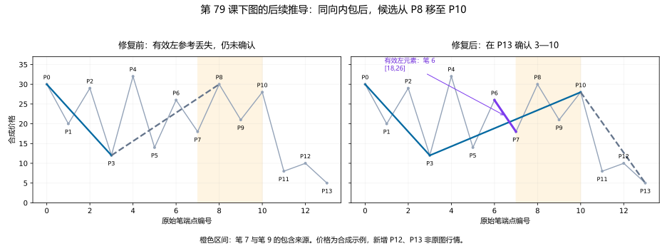
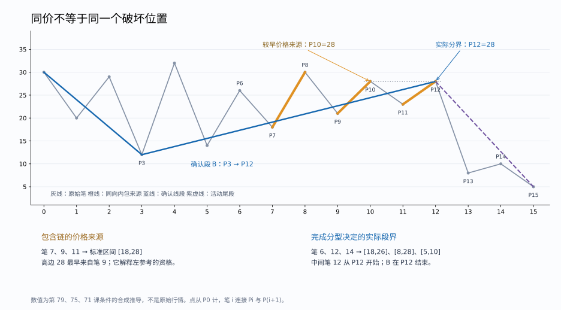

# 同向包含后的候选端点与有效左参考

日期：2026-09-16。原文只使用实际读取、查看的 `D:\缠论` 文件和图示。以下后续点位与程序规则属于明确标出的推导；实际行情跳空仍不在范围内。

## 新发现：第 79 课未完成下图的后续仍会漏分

第 79 课先认定上下两图至少有两段，再说明下图的 9—10 与 7—8 有包含关系，第二段可延至 10；10—11 当时只有一笔，还要继续看两笔。[第 247—295 行，PDF 第 1991—1992 页](<D:/缠论/chanlun_lesson_corpus/L079_分型的辅助操作与一些问题的再解答(2007-09-10.md:247>)。


原图关系的既有合成实现为：

```
P0 … P11 = 30,20,29,12,32,14,26,18,30,21,28,8
新增 P12=10、P13=5
```

到 P11，两版都输出 0—3 确认、3—10 待定。新增的 10—11、11—12、12—13 三笔连续重叠，而且第三笔跌破第一笔的结束位置。这是依据第 71 课构造的完成条件，不是原图已有的价格。[第 100—124 行](<D:/缠论/chanlun_lesson_corpus/L071_线段划分标准的再分辨(2007-08-16230206).md:100>)。

修复前，系统仍不能确认第二段，活动段显示终点还退回 P8。原因是普通参考仍保留内部高点 32，而局部分支机械地拿笔 8 的高点 30 与 P10=28 比较，因而认为没有顶。它丢失了 7—8、9—10 包含处理所保留的外侧参考。

修复后，在 P13 确认 3—10；10—13 为正在形成的下一段。实际证据为：

| 证据角色 | 原始笔索引 | 区间 |
|---|---|---|
| 有效左元素 | 6，即 P6→P7 | `[18,26]` |
| 顶分型中间元素 | 10，即 P10→P11 | `[8,28]` |
| 右元素 | 12，即 P12→P13 | `[5,10]` |
| 解释左侧取舍的同向包含链 | 7、9 | `[18,30]` 与 `[21,28]`，对应标准区间 `[18,28]` |

P10=28 严格高于有效左元素的高点 26，也高于右元素的高点 10。笔 8 处于同向包含链内部，不能替代该外侧参考；但它仍是组成第二段的真实笔，价格范围和正式确认都必须计入它。



## 推导落实为可核验的上下文

这里实现的是第 79 课下图的同向内包延伸，并未把任意较早元素都放开为候选参考。

1. 同方向的相邻来源笔依次间隔一笔，后一笔完整位于前一笔区间内，才延续这个包含链。新的向外元素开始新语境；不使用任意包含的传递律。
2. 链不能跨过当前实际段起点，而且必须有段内的外侧左元素。链覆盖当前段首笔时，不能借前一段的笔补出左肩。
3. 对向上段的此类内包链，标准区间取最早低边和逐步收缩后的高边；向下镜像取最早高边和逐步收缩后的低边。这里仅对已验证的逐项内包链归纳第 79 课所示取舍，不是对所有特征序列另设固定包含方向。
4. 候选终点的价格必须等于该包含链的标准方向边界，但**区间价格来源与实际段界不是同一个角色**。实际分界取完成分型的中间元素来源；包含链中更早的同价供应者不能否决一个较晚才具备完整破坏证据的候选。此前将这两种来源强制绑定的限制已被下节反例推翻。
5. 这一局部分支继续检查强首笔跨越有效左元素、严格局部顶／底、反向实际前三笔重叠及后续独立右肩；中间包含后再判特征缺口，有缺口仍检查第二序列。这是此路径的完成条件，不是把强首笔条件冒充第 65 课全部笔破坏的定义。

`SegmentEvidence.pivot_stem` 保存完整标准区间、原始笔索引和两侧价格来源。它只解释参考元素的资格，不替换物理笔、不搬移已经确认的段界。全部组成笔和见证笔仍参与确认时间计算，包括参考角色被略过的内部笔。

独立审查器用原始区间元组重新检查：来源是否连续、逐项内包是否成立、起点是否最大可追溯到该处、外侧参考是否正确、标准价格是否可重建。实际端点须等于包含链的方向边界价格，并且由完成分型的中间元素供应；不要求它与包含链中最早的同价笔重合。删除 `pivot_stem`、篡改来源或标准区间，或把它的价格来源强行改作实际段界，都必须被拒绝。

## 同价内包：区间来源不能替代实际破坏位置

继续复核发现，上节最初实现的“包含链价格来源必须等于段尾笔”限制过强。第 75 课明确一端相同也是包含；第 79 课下图用同向包含解释第二段的延伸；第 71 课要求在候选位置检查首笔及完整后续。合读这些条款，不能仅因两个内部高点价格相同，就把它们视为同一个破坏语境。[第 75 课第 406—424 行](<D:/缠论/chanlun_lesson_corpus/L075_逗庄家玩的一些杂史1(2007-08-29220023).md:406>)、[第 79 课第 286—295 行](<D:/缠论/chanlun_lesson_corpus/L079_分型的辅助操作与一些问题的再解答(2007-09-10.md:286>)、[第 71 课第 100—124 行](<D:/缠论/chanlun_lesson_corpus/L071_线段划分标准的再分辨(2007-08-16230206).md:100>)。以下是本次明确标出的联合推导，不是作者原图新增的数字。

在原下图 P10=28 后，先加入 P11=23、P12=28，再接 8、10、5：

```
30,20,29,12,32,14,26,18,30,21,28,23,28,8,10,5
```

同向笔 7、9、11 的区间依次为 `[18,30]、[21,28]、[23,28]`，逐项内包。P10 与 P12 都是 28，但 P10 后第一反向笔只到 23，不满足这条局部分支跨越有效左元素低边 18 的强首笔条件；P12 后第一反向笔到 8，随后的 8→10→5 又提供独立右元素。不能把较晚的首笔破坏移到 P10，也不能因 P10 更早提供价格 28，就拒绝 P12 的完整证据。

| 角色 | 实际来源 | 含义 |
|---|---|---|
| 包含链标准区间 `[18,28]` 的高边 | 笔 9，结束于 P10 | 最早提供数值 28，仍保留为价格来源 |
| 有效左元素 `[18,26]` | 笔 6 | 同向内包链外的参考 |
| 实际顶分型中间元素 `[8,28]` | 笔 12，从 P12 开始 | 此处才具备该局部首笔破坏，决定 B 结束于 P12 |
| 右元素 `[5,10]` | 笔 14 | 在 P15 完成证据 |

修复前为 `0—3 确认、3—8 待定`；修复后为 `0—3 确认、3—12 确认、12—15 待定`。`pivot_stem.high_source_index` 仍是 9，实际段尾笔为 11；二者不同是正确的角色区分。代码仍然检查严格的有效顶／底、完整包含来源和真实后继三笔，未把任意同价点都开放为段界。实际分型中间元素内部的同价来源仍采用既有较早来源约定，[第二分型同价来源的未决问题](segment_output_and_tie_audit.md) 并未因此解决。



该修正不只依赖假设合法的笔输入。连续、无行情跳空的 732 根合成 K 线，经未修改的生产笔算法生成 19 根连续笔，重现了相同漏分及修正；上下镜像均逐根回放全部 732 个 K 线前缀，已确认的物理分界和时间不回改，增量与批量输出一致。

新增 5,136 个受约束图形族实现，包括内包低边抬高和完全相等的两种变体；另覆盖 1、8、32 次同价内包及其镜像。以 `[0,5,1,3]` 为固定前缀，在六个价格等级上枚举到十三端点，双向共检查 217,918 个前缀，其中 1,598 个前缀实际出现价格来源与段界不同的证据，并与旧限制产生不同输出。这不是任意前缀的六等级全枚举，也不是 1,598 种独立理论错误。

相同笔输入的本地行情中，SZ.002299 从 252→254 段、250→252 条确认段。新增有效证据的包含来源为笔 `(502,504)`，价格 16.79 最早由 502 提供，实际段尾为 504；完成分型的中间来源是 `(505,507)`，见证为 509。另两份行情的分界和时间不变。[复算脚本](../script/check_segment_equal_pivot.py) 与[包含实际代码哈希的结果](../output/segment_audit/equal_contained_pivot.json) 保存定向枚举、K 线到笔回放及行情对照。

## 纠正此前过强的原始相邻笔要求

既有行情简化测试保留以下原价格：

```
3860,3910,3866,3877,3863,3895,3880,3891,3853,3864,3848,3888,3872,3905
```

此前审查曾因 P7=3891 低于原始相邻的 P5=3895，将这个端点判为不合格。这一判断过强：同向笔 4、6 形成内包链，其外侧有效左元素是笔 3，顶价为 P3=3877。因此 P7=3891 是相对此有效左参考的严格顶，并不是将非顶强行当顶。

当前证据的第一序列为 `[3863,3877]、[3853,3891]、[3848,3864]`，包含来源为笔 `(4,6)`，确认见证为笔 9。当前输出 0—7、7—10 确认，10—13 待定。继续追加原测试中的 `3860,3890,3830` 后，0—7 的端点和确认时间保持不变，10—13 再完成。

原测试中对反向起始三笔重叠、前后段衔接及原始输入不变的要求全部保留。P3 仍不能成为第一段终点，因为它之后的起始三笔没有重叠。这个修正不能被简化成“所有低于相邻高点的端点都允许”；必须有明确的包含来源和严格的有效分型。

## 同时消除这一长链上的重复扫描

仅预先计算包含链起点，还不足以解决长链成本：普通分支仍会反复扫描一个根本不可能成为顶／底的中间元素。

向上情形，若候选首元素高点不高于左参考 L，且当前延伸阈值 E 也不高于 L，则在没有原向延伸之前，包含后的中间元素不可能严格高于 L。任何以后能把中间高点抬过 L 的来源，必先由其前一根向上笔越过 E，使原候选进入延伸。故当前普通分型候选可以立即排除，继续按时间检查其他局部语境；向下镜像同理。这是本次推导，不能拿它跳过待定第二序列的前史要求。第 81 课对有效参考的具体区分提供了相关约束。[第 958—1030 行](<D:/缠论/chanlun_lesson_corpus/L081_图例、更正及分型、走势类型的哲学本质(2007-09-17.md:958>)。

受控实验只移除该提前排除判断：100、200、400 次内包时，计算约为 0.010、0.043、0.182 秒，体现反复扫描的增长；加入判断后分别约 0.001、0.002、0.004 秒。20,000 次内包、40,011 根合成输入笔的计算约 0.30 秒，并取得相同的有效末端。以上是单次本机观测；回归测试另用数值比较次数检验增长，不依赖固定的耗时阈值。

## 覆盖与限制

新增第 79 课下图及 P9=P7 变体的受约束后续族，共 2,568 个上下镜像实现。它要求 P10>P6，并将新增 P12 放在 P11 与 P3 之间、P13 放在 P11 以下；不是所有后续价格的穷举。另有第二分型之后再次发生同向内包的独立例子，以及仅六个价格等级的简化正例。后者不能仅用五个价格等级的旧枚举代替，故增加六等级、最多十一端点的有限检查。

三份相同笔输入的行情对照中，相对尚未支持同向内包的保存版本，SZ.002299 1m 从 244 条变为 254 条，确认段从 242 条变为 252 条，共出现 4 个含 `pivot_stem` 的完成证据；新分界使后续段得以继续构建。仅恢复旧同价来源限制的较近对照则为 252→254，已在上节单独列明。SH.600519 5m 和 QQQ.US 30m 在这两次对照中段数不变。当前输出的来源证据通过独立重建；提前排除优化在三份样本上均不改变分段及确认时间。段数变化不等于独立错误种数。

当前代码的合并回归为 1,579 项全部通过。独立检查分别完成五价格等级／十四端点的 5,120,320 个前缀、六价格等级／十一端点的 1,761,447 个前缀，以及 10,000 条较长随机链的 610,000 个前缀；新增的十三端点同价例由上节另列的 217,918 个固定前缀后续检查覆盖。结果文件中的实现哈希已逐一核对。不同集合不合计为互不重复图形数量，也不将已列性质通过视为所有原文语境的完备证明。[汇总结果](../output/segment_audit/audit_results.json)。

复核入口：[原图与性质测试](../tests/core/test_segment_source_rules.py)、[图形族](../tests/core/test_segment_figure_families.py)、[独立证据检查](../script/check_segment_model.py)、[受控对照脚本](../output/segment_audit/compare_contained_pivot_contexts.py)、[对照结果及实际代码哈希](../output/segment_audit/contained_pivot_checks.json)。

本轮补上了一个可复现的包含语境缺口，也纠正了先前过强的测试断言。它没有证明所有候选的全局唯一性；[同价来源实验](segment_output_and_tie_audit.md) 的非等价结果仍然存在，三组历史标号图也仍缺完整行情输入。
