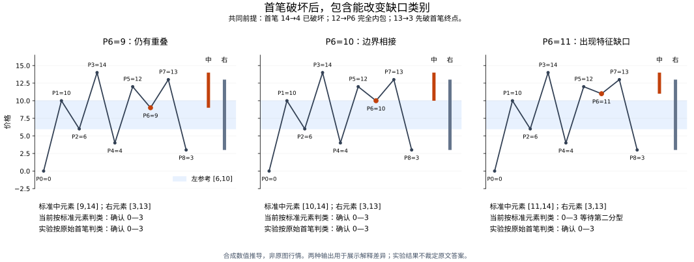

# 首笔破坏与包含后缺口判类的衔接

**2026-09-17 更新：用户已裁定图 01 的 B 合理，生产已改为原始首笔与有效左参考判类，后续标准包含继续用于分型。** [当前规则与验证](segment_review_decisions_20260917.md)；[当前专项复算](../output/segment_audit/gap_classification_reviewed.json)。这项实现选择不冒充作者逐字原话。

以下为裁定前的研究与实验记录，所述“生产未改”“尚未裁定”只表示当时状态。旧实验脚本及生产快照保存于 `output/segment_audit/pre_review_20260917/`，旧结果 `gap_classification_readings.json` 保留其原有哈希；当前同名脚本已更新为“当前原始首笔策略／受控标准中元素策略”比较，不代表完整旧版本。

日期：2026-09-16。理论仅来自实际读取的 `D:\缠论` 文件。下列数值链、区间运算及受控程序均为本次推导，实际行情跳空不在范围内。

**尚未解决的解释问题扩大了：它不只发生在相等价格。** 首笔已经破坏、后续先突破该首笔终点的一组全异价输入，经过当前方向种子的包含处理，会从原始重叠变成标准特征缺口。系统等待第二分型；按原始首笔区间判类的实验则立即确认。两种口径也改变了两份本地行情的实际段界。

此前报告把“移到包含后判类”列作已经确定的修复，结论过强。它实现了当前对第 67 课的解释，但尚缺与第 70、71 课首笔破坏表述的完整衔接。现已更正主报告，生产分段逻辑未因这次实验改动。

## 实际核对的原文

| 文件与定位 | 作者内容 | 本次仍需证明的衔接 |
|---|---|---|
| [第 65 课，第 34—64 行](<D:/缠论/chanlun_lesson_corpus/L065_再说说分型、笔、线段(2007-07-16221416).md:34>) | 向上包含取两边最大值，向下取最小值，按顺序处理 | 该定义决定给定方向后的区间计算；不能单独裁定分界后缺少前项时的方向种子及判类时点 |
| [第 67 课，第 49—118 行](<D:/缠论/chanlun_lesson_corpus/L067_线段的划分标准(2007-08-01223155).md:49>) | 后文特征序列指标准特征序列；按分型前两个元素是否有缺口区分两种结束方式 | 当前实现由此使用合并后的中间元素判类 |
| [第 70 课，第 790—817 行](<D:/缠论/chanlun_lesson_corpus/L070_一个教科书式走势的示范分析(2007-08-15.md:790>) | 作者针对 44 处答复，首笔封闭特征缺口属于第一种，不必探讨第二套序列 | 该行情答复不能未经推广证明就当成任意包含链的完整算法 |
| [第 70 课，第 913—925 行](<D:/缠论/chanlun_lesson_corpus/L070_一个教科书式走势的示范分析(2007-08-15.md:913>) | 读者提出先包含转成标准序列再看分型；作者肯定，并提醒特征序列方向与实际走势相反 | 不能把这条答复解成免除包含，也没有直接回答合并后新增缺口的判类时点 |
| [第 71 课，第 100—124 行](<D:/缠论/chanlun_lesson_corpus/L071_线段划分标准的再分辨(2007-08-16230206).md:100>) | 首笔破坏后，第三笔破首笔结束位置成段；第三笔内包时，随后先破结束位置还是开始位置决定结果 | 下例满足“先破结束位置”的数值关系；若认为它不属于这段话的适用范围，需要给出限制依据 |
| [第 71 课，第 184—208 行](<D:/缠论/chanlun_lesson_corpus/L071_线段划分标准的再分辨(2007-08-16230206).md:184>) | 中间元素由转折点起第一笔提供；前后两元素受边界保护；转折点后元素仍可包含 | “第一笔”是指用于最初判类的原始区间，还是完成包含后的标准区间，必须与上面各条一起解释 |

本次还直接渲染并查看了原 [PDF](<D:/缠论/教你炒股票108课天使版.pdf>) 第 1900—1902 页。1900 页保留了“第三笔内包、随后先破结束位置”的文字及配图；1902 页上方第一种示意图同时标明首二元素没有缺口。它们没有数值刻度，不能把下面特意构造的“包含后出现缺口”关系强行读进图中。1901 页的彩色注释及 1902 页最后一幅图的更正，仍按第 81 课的作者正文区分处理。[第 81 课，第 70—88 行](<D:/缠论/chanlun_lesson_corpus/L081_图例、更正及分型、走势类型的哲学本质(2007-09-17.md:70>)。图像和文字有出处，不等于每个新增数值变体都有作者直接答案。

[原 PDF 第 1900 页](../output/segment_audit/source_first_break_page1900.png) · [第 1901 页](../output/segment_audit/source_first_break_page1901.png) · [第 1902 页](../output/segment_audit/source_first_break_page1902.png) · [原文件与渲染图片哈希](../output/segment_audit/source_first_break_pages.json)

## 后续核对：不能用反转包含方向消除分歧

第 79 课作者直接指定 34、56 可以合并为 36，再由 12、36、78 构成底分型。[第 259—268 行](<D:/缠论/chanlun_lesson_corpus/L079_分型的辅助操作与一些问题的再解答(2007-09-10.md:259>)。这条依据来自正文中的合并结果，不需要采用该课第 310—313 行的整理注释来规定方向。本次重新查看了 [上图](<D:/缠论/chanlun_lesson_corpus/images/1ef1c665acca7500a3f7432868e0436059731f24110bd97170fac3af97ac7b30.jpg>) 和 [下图](<D:/缠论/chanlun_lesson_corpus/images/784c099fdfc87cc5d30e0a036caf5c112c37ff934aae563dabca026cfc8fa6f9.jpg>)；下面只借它们的标号和大小关系，数值仍为合成实现。

两图中均取 P3=12、P4=32、P5=14、P6=26。34 为 `[12,32]`，56 为 `[14,26]`，作者指定的 36 对应 `[12,26]`：

| 包含处理 | 得到区间 | 是否得到作者指定的 36 |
|---|---|---|
| 随原向下段，两边取最小值 | `[12,26]` | 是，低边来自笔 3，高边来自笔 5 |
| 改用相反方向，两边取最大值 | `[14,32]` | 否，连中间元素的极值价格也不同 |

上下两图及其镜像共四个数值实现，当前生产证据都保存正确的 36 区间及来源 `(3,5)`。独立区间计算也检查了相反方向不能得到 36。这证明该图语境对方向已有约束，**不能把所有分界后的包含一律反向处理**来修补缺口分类；它没有把四个实现扩大成任意前史的方向种子定理。

对下面全异价分歧例也有一个独立的价格约束：若仍假定 P3=14 是原段终点，第 67 课要求它对应所用顶分型的高点。`[4,14]` 与 `[11,12]` 向上合为 `[11,14]`，保留 14；反向合为 `[4,12]`，高点已变成 12。后者即使消除了与左参考的缺口，也不能继续把 14 作为这个分型的高点。若改选另一物理转折点，就已经改变待验证的假设，必须重新给出其参考、归属和完成依据。双向镜像均已直接核对这一数值约束。

因此剩下的问题更具体了：需要解释**在同一合法包含结果下，原始首笔区间与标准中元素分别承担什么判类角色，以及首笔破坏文字条件的适用范围**。更换一个方向开关不能解决这个问题。

本次同时实际读取了 [原 DOCX](<D:/缠论/缠中说禅缠论108课教你炒股票配图+回复版本（共3697页）.docx>) 的正文直系段落 37898—37909、40463—40466；段号按 `word/document.xml` 的 `w:body/w:p` 从 1 起计。37899 保留“第三笔内包后先破结束位置”的表述，37906 保留“第一笔”与前侧参考判类的表述，40464 保留 34、56 合并为 36 的结果，未找到能额外裁定本例判类时点的文字。该 DOCX 的 SHA-256 为 `df7848beeeb133eab889b0185d3f3ca24808f303a5fe470319591a437674a78d`。

两个整理版本有细小文字差别：DOCX 第 37900 段写“存不存在”，PDF 逐课文本第 71 课第 133 行写“不存在”；DOCX 第 40464 段没有逐课文本第 79 课第 262 行的“指区间”括注。本次保留这些差异，没有借它们擅自新增分类规则，也没有把 DOCX 内另收的读者“分段分析”当作作者裁定。

## 不涉及同价的具体分歧

点从零编号，笔 i 连接 Pi 与 P(i+1)：

```
0,10,6,14,4,12,11,13,3
```

所有九个价格不同。P3=14 处的原始左参考是 `[6,10]`，从此向下的首笔是 `[4,14]`，已经严格越过左参考的低边。从这一转折点起的第三笔 `[11,12]` 严格处于首笔内部。随后反弹高点 13 仍低于 14，第五笔落到 3，先严格跌破首笔终点 4；在此之前没有碰到或越过首笔起点 14。最初反向三笔也有重叠。这些输入事实由脚本直接比较原始价格核实。

当前实现按向上种子合并同侧中间链：

```
原始首笔 [4,14] + 内包元素 [11,12] → 标准中元素 [11,14]
左参考 [6,10]；第一独立右元素 [3,13]
```

顶分型已有，但标准左、中之间出现 `(10,11)` 缺口。第二序列当时只有 `[4,12]、[11,13]` 两个原始向上元素，不可能已有三个标准元素构成底分型。因此两种判类口径得到不同输出：

| 口径 | P8=3 时 | 随后追加 P9=15、P10=8 |
|---|---|---|
| 当前：合并后标准区间判类 | 0—3 待定，等待第二分型 | 第二分型仍未成，原候选失效，0—9 待定 |
| 实验：原始首笔区间判类 | 0—3 确认，3—8 形成中 | 已确认的 0—3 保留，3—8 形成中 |

这不是两种输出仅在确认延迟上的差别：后续创新高可以使当前口径的原候选被否定。表中实验保持现有包含、右元素、参考筛选和确认时间规则，只替换普通分支与局部分支的两条 `has_gap` 表达式；它没有直接把第三笔文字改写成另一套完整算法。

再仅改变 P6，能明确看出分类阈值：P6=9 时合并中元素为 `[9,14]`，P6=10 时为 `[10,14]`，两者与左参考有重叠，两种口径均确认；P6=11 时才分歧。



## 已完成的验证及其限制

[裁定前对照脚本](../output/segment_audit/pre_review_20260917/script/check_segment_gap_classification.py) 与 [历史完整结果、代码及行情哈希](../output/segment_audit/gap_classification_readings.json) 记录以下结果：

- 上述三个阈值及上下镜像共 6 个直接对照，另检查创新极值后的双向结果。
- 追加第 79 课上下两图及镜像共 4 个合成实现，核对作者指定的 36 区间；另以分歧例的双向镜像检查反转方向会改变假定分型的极值价格。结果记录在 `source_seed_constraints`，不主张已证明所有方向种子。
- 在 9、10、11 个价格等级上，枚举一个指定的九点严格顺序族及镜像，共 132 个输入，全部复现差别。它们具有同一大小关系，不能算成 132 种独立规则问题，也不是全部九点图形的枚举。
- 连续 K 线构造的双向版本各 640 根，均由未改动的生产笔算法得到 18 根连续笔，最初八笔全部锁定，且没有未决笔区。截取这八根已锁定笔以及使用完整笔链，都保留上述确认差别。这里证明输入可达；未把批量构造冒充逐根 K 线因果回放。
- 现有 `CASES` 的 50 个含镜像变体中，只有 `67_gap_after_inclusion` 及其镜像改变。这个条目本来就是按第 67 课推导的包含后缺口例，**不是作者原图直接给定该变体的答案**。另外 48 个不变，不能裁定尚有分歧的推广。
- 10,000 条 64 端点随机完整笔链，种子 `19270923`，869 条的输出几何发生变化。这是解释敏感性统计，不能叫作发现 869 条原文错误。

三份本地行情复用同一组当前生产笔，结果为：

| 行情 | 当前总段数／已确认数 | 原始首笔实验总段数／已确认数 | 段界比较 |
|---|---:|---:|---|
| SZ.002299，1m | 254／252 | 262／260 | 当前独有 5 段，实验独有 13 段 |
| SH.600519，5m | 104／102 | 104／102 | 双方各有 2 段的边界不同 |
| QQQ.US，30m | 5／3 | 5／3 | 本例不变 |

其中 SH.600519 的当前已确认边界为 `295—300、300—307`，实验为 `295—302、302—307`。总段数相同不能替代逐段比较。市场差别表只比较几何及确认状态，不主张已对两种口径的所有证据和确认时刻做等价证明。

此前 1,579 项回归及既有大规模前缀检查所用的生产代码未变，结果哈希仍匹配。但它们不能充当这里的原文裁判：五／六价格等级的有限枚举不能表示这一个九价全异输入；随机集可以包含相关结构，其检查器却明确按当前标准缺口口径验算。程序与检查器在同一解释下相符，不足以证明解释本身符合全部原文。

## 原始首笔实验的因果性与证明结构复核

2026-09-17 补查了这项方案的必要工程条件。此前的完整笔链对照只能说明输出敏感；现在逐次追加固定、已锁定的原始笔，检查已经确认的几何与确认时间是否保持，以及新确认是否使用当时才齐备的证据。[可重复运行的实验](../output/segment_audit/probe_raw_first_causality.py)、[完整记录及代码指纹](../output/segment_audit/raw_first_causality_probe.json)。

本次实际检查 1,000 条 64 端点交替笔链，种子 `19270924`，共 61,000 个输入前缀，未发现已确认段被撤销、确认时间回填或证据重建失败。其中 4,433 个前缀具有至少一份“原始首笔无缺口、标准中元素有缺口”的普通分界证明，因此不是只检查了两种口径恰好一致的输入。共有 187,622 次逐前缀证明检查，其中 4,722 次涉及上述普通分界差异；同一份已确认证明可被多个后续前缀重复检查，这些次数不能算成不同图例数量。给定笔链仍是合成输入，本次没有对所有随机链补作 K 线可达性证明。

证据检查采用明确标识的实验口径：保留既有独立区间重建，只在单独名称空间内把**普通分界**的缺口条件换成“有效左参考与实际首根反向笔是否重叠”。原有检查器和生产文件未改。这里的通过只证明所检查的结构与这一假设一致，**不是通过修改判据来证明该假设就是原文唯一规则**；图 1 的分歧尚未裁定。

### 继承的第二分型不能重新套普通首笔判类

这次也检查了容易在规则切换时遗漏的边界。采用合成笔链：

```text
0,10,6,18,13,16,11,14,11,12,11.5,15
```

父段的第二序列中，左元素为 `[13,16]`，中间原始元素 `[11,14]` 与 `[11,12]` 按向下包含合为 `[11,12]`，右元素为 `[11.5,15]`，构成严格底分型。父子段共同确认于末笔，段界为 P0—P3、P3—P6。这里同价低点沿用当前较早来源约定，不作为同价规则的新裁定。

| 后继段被继承的分型对象 | 与左元素 `[13,16]` 的关系 | 用途 |
|---|---|---|
| 原始反向首笔 `[11,14]` | 重叠 | 不能据此把继承证明重新改成普通首笔判断 |
| 父第二序列的标准中间元素 `[11,12]` | 有缺口 | 如实记录继承分型的结构；仍不要求第三序列 |

第 78 课明确要求第二序列严格处理包含，第 67、77 课明确不再递归要求第三序列。因而这是**证明语境必须保留**的约束，不是由本次随机测试发明的新例外。[第 78 课，第 232—259 行](<D:/缠论/chanlun_lesson_corpus/L078_继续说线段的划分(2007-09-06222831).md:232>)、[第 67 课，第 106—109 行](<D:/缠论/chanlun_lesson_corpus/L067_线段的划分标准(2007-08-01223155).md:106>)、[第 77 课，第 367—391 行](<D:/缠论/chanlun_lesson_corpus/L077_一些概念的再分辨(2007-09-05232401).md:367>)。逐前缀检查中另有 2,123 次这种继承分型的原始／标准缺口不同，均按父第二序列的语境核对。

具体到现有数据结构，继承证明的 `initial_gap` 记录父第二序列的标准区间关系，所以检查器要求它与该关系一致。这是当前字段的工程含义；原文并未规定这个字段，也不禁止另行记录原始区间的重叠情况。不能把字段一致性要求扩大成作者要求软件必须保存某种缺口标签。

检查器的识别能力另由四个镜像实例核实：未篡改证据通过；故意翻转普通缺口标记、删除第一或第二序列的包含贡献、把继承分型误改为原始首笔判类，共 10 份篡改均被拒绝。原始首笔的争议实例仍被原默认检查器以 `standard_gap` 拒绝，这个差别被保留，并未掩盖。[识别能力脚本](../output/segment_audit/probe_raw_first_controls.py)、[四实例及篡改结果](../output/segment_audit/raw_first_causality_controls.json)。

这项补查排除了所测输入中的一些工程缺陷，但不能以“当前方案和实验方案都通过各自的结构检查”推出任一方案在理论上正确。生产口径、原始笔规则和图解中的待判断选项均未切换。

## 结论与下一项必要工作

应当撤回的是该项“已经证明修复符合原文”的确定性表述。现有证据尚不足以把实验口径部署成正式规则，也不足以把当前口径宣称为唯一原文结论。

下一项需要解决的具体问题是：在第 71 课受保护的假定分界上，首笔的原始区间、后续同侧包含后的标准中元素，分别承担什么判类角色；第 71 课的“先破结束位置”表述是否还有尚未明确列出的适用条件。第 79 课已经排除了不分语境地反转后侧包含方向这一做法，任意前史下的方向种子仍须另行证明。必须给出可同时解释第 67、70、71、79 课及配图的规则，再修改生产语义及相应测试。不能靠放宽检查器来把受控实验变成“验证通过”。

此前的精确回到起点问题仍见 [等值边界复核](segment_output_and_tie_audit.md)。本次全异价例说明，仅解决同价处理不足以完成这一原文衔接。

后续合读第 83 课并重算阈值，进一步把本问题限定为：在固定合法候选、固定左参考和当前方向的中间包含组内，原始低边不高于左参考高边，而标准低边已经越过它。两种判类在这个范围外一致；这是一项条件性区间推导，不是对两种解释的裁决。精确返回首笔起点的例子在两种口径下都缺少第一分型，不能靠更换判类时点一起解决。[五项未决规则、已确定边界及推导](segment_unresolved_rules_analysis.md)。
