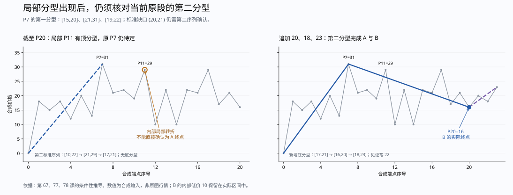

# 第二种待定结构的候选优先级复核

日期：2026-09-16。理论只依据实际读取的 `D:\缠论` 原文和配图。本文的数值、条件性证明、后续构造和程序检查均为本次推导，不是作者给出的原始行情或程序。

## 结论及前提

**如果较早候选 P 的第一分型及其前史资格已经成立，标准前两个元素有缺口，第二分型仍待定，那么不能仅凭后面的局部第一分型，把当前原段不可撤回地结束在另一个 Q。** 下文给出具体例子和可构造后续的因果理由。

这项结论解释了当前等待策略的必要性，未发现需要修改生产分段规则的新反例。它仍以“P 确实是当前原段的合格候选”为前提，不能用来证明参考元素、观察起点或同价来源的选择已经全部正确。若两个看似竞争的候选导出冲突，应先核实它们的前史资格，不能只比较谁的局部三元素先出现。

## 原文依据与图示

第 67 课要求：第一分型有特征缺口时，从该分型极值开始的反向序列须出现相应第二分型，原段才在第一分型的极值处结束；第二分型自身不再区分第一、第二种情况。[第 85—118 行](<D:/缠论/chanlun_lesson_corpus/L067_线段的划分标准(2007-08-01223155).md:85>)。

第 77 课说明，第二分型对应 C 对 B 的破坏，由此 B 和 A 同时完成；此前 A、B、C 只是先作的假设称呼。[第 367—418 行](<D:/缠论/chanlun_lesson_corpus/L077_一些概念的再分辨(2007-09-05232401).md:367>)。本次实际查看了同处所收图 8，图中 C 的反向特征提供 B 的底分型：


第 78 课强调，其局部续接分析的前提是 B 对前段的破坏已经确认；第二种情况没有相应分型便直接原向新高／新低时，假设部分应合回原段。同时，第二特征序列必须严格处理包含，不能借用第一种跨假设分界的包含豁免。[第 208—259 行](<D:/缠论/chanlun_lesson_corpus/L078_继续说线段的划分(2007-09-06222831).md:208>)。本次也实际查看了所收图 6；图中的绿色说明是整理版图上标注，正文规则以刚列出的作者段落为依据，不将标注另当一条作者新规则。


## 一个不能靠局部分型绕过的待定例子

点和笔从零编号；笔 i 连接 Pi 与 P(i+1)。合成输入为：

```
0,18,15,18,12,20,13,31,21,22,19,29,10,22,10,22,21,29,17,21,16
```

P7=31 的第一特征分型为 `[15,20]、[21,31]、[19,22]`。左元素来源笔 `(1,3,5)`，中间为笔 7，右侧为笔 9，标准前两个元素存在 `(20,21)` 缺口。

截至 P20，另一个局部转折 P11=29 已有强首笔破坏，其局部三元素为 `[19,22]、[21,29]、[16,21]`，没有特征缺口。但从 P7 开始的第二序列，必须按自己的完整来源计算：

| 第二序列标准元素 | 来源笔 | 区间 |
|---|---|---|
| 第一项 | 8、10、12、14 | `[10,22]` |
| 第二项 | 16 | `[21,29]` |
| 第三项 | 18 | `[17,21]` |

这里没有底分型。中间项反而两边都较高。不能把 P11 的局部顶分型，移来替代从 P7 开始所需的第二序列底分型。当前系统仍输出 0—7 待定；局部几何检查能够识别 P11，却不能据此授予它结束当前原段的权限。

继续追加 `20,18,23`，第二序列增加笔 20 的 `[16,20]` 和笔 22 的 `[18,23]`。现在，笔 18、20、22 构成严格底分型，按第 67、77 课即可完成：

```
0—7 确认；7—20 确认；20—23 仍在形成。
```

两条确认段的见证均为笔 22。B 的实际终点 P20=16 高于其内部最低价 10；本例没有用同价来源选择来决定 B 的终点。测试还将底分型中间高边改为 14，使其与左元素有缺口，核对仍由同一第二分型承接 B，不要求第三套序列。

受控对照仅将普通扫描器的“等待第二分型”返回值改为继续寻找局部候选。它会在追加之前确认 0—11；这条局部证据甚至能通过逐条几何证据检查。追加上述后续后，原 P7 的第一、第二分型前提却都成立，原文要求的结束位置是 P7。这说明**局部证据检查通过，不足以证明候选选择完整且正确**。对照不是生产代码，也没有被当成另一套原文判定器。



## 为什么可以用可行后续排除提前确认

以下是价格标量模型中的条件性推导。前提是：观察起点和已确认前缀固定；原始笔前缀已经给定；P 的第一分型及缺口确实有效；第二序列尚无所需分型，也没有先发生令 P 失效的原向新极值。同价段界资格仍按另文列明的未决范围处理，本构造新增的关键不等式均严格。

取原方向向上，候选高点为 H，将已有全部价格最小值记为 m。若输入最后一笔向下，其终点 u 必小于 H，先补向上一笔到 `(u+H)/2`；若这一笔已经补齐第二分型，结论已经得到。否则，第二序列仍有一个标准尾元素 T，其上下边均不小于 m。

再选正数 d，依次追加四个转折价格：

```
m−4d → m−2d → m−3d → m−d
```

它们形成的两根向上特征笔分别为 M=`[m−4d,m−2d]`、R=`[m−3d,m−d]`。M 两边都严格低于 T，R 两边都严格高于 M；相邻元素不包含，因此 T、M、R 必然构成底分型。新增向上笔的高点均低于 m，因而也低于 H。加上可选的第一笔，至多五根新增笔即可在不出现原向新高的情况下补齐第二分型。向下情形将价格取负，完全对称。

当原价格全为正且原方向向上时，可取 `0<d<m/4`，使新增价格仍为正。实现使用精确有理数，并在小正价格时相应缩小 d；不使用近似相等或浮点容差。这里证明的是当前价格标量模型下的可行笔后续，**没有宣称任意指定的交易所报价步长、价格上下限或原 K 线前缀都已完成可达性证明**。

第一分型已经取得独立右元素后，后来对该右元素的包含按从中间到右侧的下降方向处理，取较小边界，不会把右肩抬过中间高点；新的非包含元素则接在后面。顺序处理不能将已解决的旧关系倒回去重做。因而上述后续没有通过改写第一分型，重新制造一个原本无效的 P。[第 65 课，第 34—64 行](<D:/缠论/chanlun_lesson_corpus/L065_再说说分型、笔、线段(2007-07-16221416).md:34>)。

由于 P 的第一分型没有失效，而构造后续补齐了第二分型，第 67 课的结束条件要求原段结束在 P。如果在同一个旧前缀上已经把另一位置 Q 确认为原段终点，这条可行后续就会要求撤回 Q，与“确认后不回改”的因果要求冲突。因此，内部局部分型可以是条件性分析材料，不能仅凭它提前给原段发出另一个正式段界。这里的不可撤回确认指现有系统 `XD.done/locked_at` 在固定笔前缀追加时的完成契约；作者原文提供两种结束定义，本段因果反证是本次推导。

这个论证没有偷换“当前代码选择 P，所以 P 正确”。它明确把 P 的原文资格列为前提，然后依据第二种结束定义与构造的严格第二分型，检验另一种提前确认是否能承受后续。还须独立证明代码选出的 P 总满足这个前提，这仍是参考元素与历史语境审查的任务。

## 检查范围

[复算脚本](../script/check_segment_pending_priority.py) 生成 10,000 条双向随机完整笔链，每条 64 个端点，种子 `19270921`。其中实际取得 1,254 个等待第二分型的上下文；分别构造至多五笔的完成后续，并逐一回放新增部分，共 5,757 个新增前缀。455 个上下文中还找到合计 502 个没有自身缺口的内部局部第一分型。所有上下文均在构造后续中完成原候选，已有确认段保持不变，没有回填更早确认时间。

第二序列由独立的区间元组计算重建，没有调用生产包含或分型辅助函数。随后对生产输出继续执行前侧参考、第一包含链、第二序列、父子承接和确认时间检查。这里按完整随机输入和新增后续前缀分别计数，不能说成已回放全部旧输入前缀，更不能说成所有图形穷举。

[定向测试](../tests/core/test_segment_pending_priority.py) 共 13 项，覆盖上下镜像、第二分型自身有／无缺口、故意绕过待定的对照、输入末笔的两种方向、失效与完成的区分，以及小正价格。当前生产划分与笔构建规则未因这项验证改变。[结果与代码 SHA-256](../output/segment_audit/pending_priority.json)。

```powershell
python -m pytest tests/core/test_segment_pending_priority.py -q
python script/check_segment_pending_priority.py --walks 10000 --points 64
```

未解决的重点仍是：任意前史下最初参考元素和候选 P 的资格、同价物理分界、精确返回首笔起点，以及缺少完整原行情输入的历史标号图。不能用上述条件性论证替代这些要求。
