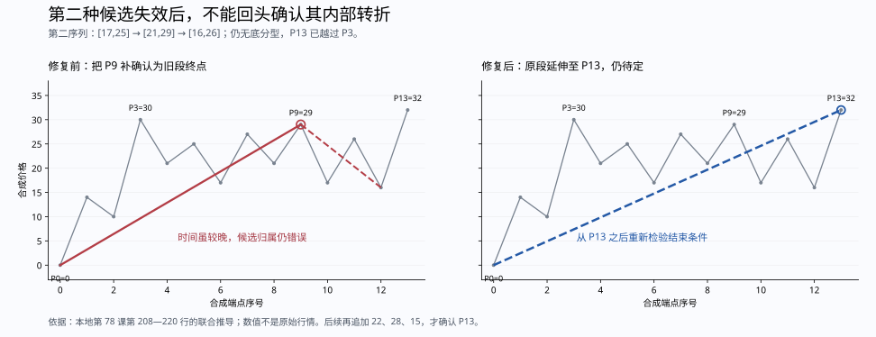

# 线段候选扫描的证明义务与复核

日期：2026-09-16。本文进一步审查 `XdCalculator` 的候选选择。理论只使用实际读取的 `D:\缠论` 原文；下面的程序性质、区间推演和验证工具均为本次推导，不是作者给出的程序，也不代表已经证明整个实现与所有原文走势等价。实际行情跳空仍在本次范围之外。

本项审查发现并修复了候选失效后的错误复用，同时补足了一项扫描优化的证明与独立检查。随后补上第 79 课同向内包后的有效参考，区分包含链价格来源与实际分界来源，并提前排除不可能成为普通分型的候选；相应局部来源也由独立检查器重建。当前完整回归为 1,579 项通过，其中候选审查器的识别能力测试为 29 项。

## 新发现：失效时必须推进原段，不能只推进确认时间

合成点链为 `0,14,10,30,21,25,17,27,21,29,17,26,16,32`。在 P12 之前，P3=30 对应的第一分型有特征缺口，第二序列尚未构成所需的底分型，系统也只输出 0—3 待定。

追加 P13=32 后，第二序列的标准元素是 `[17,25]、[21,29]、[16,26]`，仍无底分型。最后一个元素来自 `[17,26]` 与 `[16,32]` 的顺序向下合并；新增笔同时越过原候选 P3=30。第 78 课第 208—220 行要求先满足破坏前段的前提；没有第二分型就原向新高／新低时，原假设结构应归入同一线段的延续。不能借这一否定事件，反过来给其内部一个此前未具备前史资格的局部分型补发段界。[原文第 208—220 行](<D:/缠论/chanlun_lesson_corpus/L078_继续说线段的划分(2007-09-06222831).md:208>)

修复前：`0—9 已确认、9—12 待定`。程序在发现 P13 的否定事件后回到较早位置扫描，拿 `[21,27]、[17,29]、[16,26]` 这个局部分型确认 P9=29。其确认时间包含 P13，但依赖所属的旧结构已经失败；没有时间回填，不等于候选归属正确。

修复后：先将 P13 的延伸笔纳入原段，从它之后继续寻找新分界，当前输出 `0—13 待定`。若再追加 `22,28,15`，才通过新分型确认 `0—13`，后一段 `13—16` 仍在形成。上下镜像同样检查。此前第二序列未完成时被阻止的局部候选，不再因父假设刚被否定而被重新确认。

实现将 `_GapConfirmationInvalidated` 与普通延伸统一推进到真实见证笔，连续更新前侧参考；另保存失效候选和见证的位置，以供审查。若同一根新高／新低笔已经补齐第二分型，仍先确认第二分型，根本不会进入失效分支；第 81 课的这一正例保留。



## 原文约束与程序中不同的角色

| 原文定位 | 实际约束 | 不能据此扩大的规则 |
|---|---|---|
| [第 65 课，第 34—64 行](<D:/缠论/chanlun_lesson_corpus/L065_再说说分型、笔、线段(2007-07-16221416).md:34>) | 向上包含取两侧最大值，向下取最小值；按先后顺序处理，不能使用包含的传递律 | 不能把两个分别与某旧区间包含的原始元素直接视为等价 |
| [第 71 课，第 172—208 行](<D:/缠论/chanlun_lesson_corpus/L071_线段划分标准的再分辨(2007-08-16230206).md:172>) | 假定分界再检查两种条件；跨分界的前后元素受保护，候选之后的同类元素可以处理包含 | 不能把跨边界保护推广到第二特征序列，也不能把任意局部三笔都视为完成证据 |
| [第 81 课，第 958—1024 行](<D:/缠论/chanlun_lesson_corpus/L081_图例、更正及分型、走势类型的哲学本质(2007-09-17.md:958>) | 该图先选择 1，排除比 1 低的 3 的参考顶资格，明确选择 12、56、78 | 不能全局删除不创新高的反向笔；78 仍然是必要的右侧材料 |
| [第 78 课，第 208—241 行](<D:/缠论/chanlun_lesson_corpus/L078_继续说线段的划分(2007-09-06222831).md:208>) | 局部续接分析要求 B 已破坏前段；第二序列没有相应分型就原向新高／新低，不能先称为三段；第二序列须严格包含 | 不能把另一个尚未满足前史的局部分型直接移来结束当前待定的第二种结构 |

因此，当前代码中的前侧有效参考、假设转折点、后侧包含链、第二序列和父段依赖必须分别核对。只看某三个区间能否画出一个顶／底，不能证明它们具有当前段所需的来源与前提。

## 已补足的扫描性质：一条未分开的包含链不会藏有已完成的子转折

这里仅讨论 `_try_end` 的两种出口：尚未取得第二个后侧标准元素，返回 `waiting-first-feature`；或者仍处于这一包含链时出现原方向严格新极值，返回 `_CandidateExtension`。它不涉及 `waiting-second-feature` 的候选优先级。

将原方向取为向上。设当前候选之后，到某时刻为止的全部同类特征元素始终按包含关系合成一个区间 `G=[L_G,H_G]`。在这个单元素语境内，包含取两侧最大值，所以 `G` 的上下边分别是这段来源的最大低边和最大高边。

假定区间内部另有较晚候选 Q。它若尚在自己的中间元素包含链中，该中间元素为 `M=[L_M,H_M]`，来源是上述来源的一段后缀，且采用相同的向上合并。因此一定有：

```
L_G >= L_M
H_G >= H_M
```

Q 要取得顶分型的右侧元素 R，M 与 R 在同一侧，必须先完成包含处理。若 R 仍与 M 包含，它就还不是独立右肩；若二者不包含且 R 的高边低于 M，那么 R 的低边也必须严格低于 M。故一个有效外向右肩必满足：

```
L_R < L_M <= L_G
H_R < H_M <= H_G
```

此时 R 与 G 也不包含。这和“当前候选之后一直只有一个包含合成元素”的前提矛盾。因而这样的右肩不会被藏在同一条尚未分开的包含链内部。

向下情形取两侧最小值：`L_G<=L_M、H_G<=H_M`；有效外向右肩要求 `L_R>L_M、H_R>H_M`，同样使 R 与 G 不包含。两个方向都成立。

这一推演没有要求 Q 必须高于全段旧极值；它适用于第 79 课那种内部存在更高／更低价格的局部转折。它也没有把“第一笔已破坏”当成完成条件：仍然需要右侧完整结构。第 67 课要求出现特征分型才有结束资格；第二种情况首先也需要第一特征分型，所以在这些前提下，等待或跳转不会漏掉一个已经完成的子分界。[第 67 课，第 64—118 行](<D:/缠论/chanlun_lesson_corpus/L067_线段的划分标准(2007-08-01223155).md:64>)

代码核对：后侧只保留一个合成元素时使用同一原方向；第一次出现不包含的第二元素后，先完成当前三元素判定，不再继续把后续元素并入旧中间元素。`_CandidateExtension` 只出现在尚未取得第二元素的分支。没有用本推演授权跨已成立分界合并，或授权跳过等待中的第二特征序列。

## 独立检查及其识别能力

[check_segment_candidates.py](../script/check_segment_candidates.py) 记录生产扫描器实际返回的两类区间，再逐一检查其中的较晚局部第一笔破坏候选。审查器自己用原始价格区间重建包含链、取消条件和外向右肩，不调用生产包含、转折或分型辅助函数。返回的局部分型若有缺口，仍然不是独立的完成段；但仅它的第一分型已足以反驳“整段一直只有一个包含元素”的扫描前提。

另单独检查第二种失效事件：从真实候选重建整套第二序列，确认第一次原向严格越界发生前及当根均没有所需分型；然后检查同一原段最终取得的几何证据，不能再把终点放回这次延伸笔之前。这个检查与上一段的“包含链内部没有右肩”不同：失效结构里可以有看似成立的局部分型，问题在于它不具备结束当前原段的前史资格。

识别能力通过 [test_segment_candidate_audit.py](../tests/core/test_segment_candidate_audit.py) 核实：

- 假设扫描器错误地跳过第 79 课上图的 P8 转折，审查器必须报告候选笔 8、见证笔 10；实际扫描器没有做该跳过。
- 将局部中间高点设为 19、20、21，前侧高点为 20，只允许最后一组被识别为顶；检查上下镜像。
- 第一笔已经破坏，但后续仍在包含链中时不得报告完成；最终独立右肩到来才报告。
- 保留较晚见证时间、故意把已确认端点移回失效区间，审查器必须拒绝；不能仅因时间正确就放过。
- 第 81 课同一根笔既补足第二分型又创新极值时，审查器必须拒绝把它标为失效。
- 第 79 课下图补齐反向三笔后，审查器必须识别包含链支持的 P10；删除该链、篡改来源或区间，证据检查必须拒绝。
- 同价内包链最早在 P10 提供价格，但 P12 才具备当前局部破坏证据时，审查器必须识别 P12；将包含链的较早价格来源强行改作段尾必须被拒绝。

本轮检查范围：

| 集合 | 实际输入数 | 延伸区间 | 等待第一分型区间 | 逐一检查的局部候选 | 结果 |
|---|---:|---:|---:|---:|---|
| 10,000 条 64 端点随机完整笔链，双向，种子 19270918 | 10,000 | 21,231 | 2,766 | 28,661 | 未发现被跳过的局部分型 |
| 5 个价格等级、最多 12 端点、双向的全部交替前缀 | 1,235,092 | 38,640 | 413,922 | 692,906 | 未发现被跳过的局部分型 |

随机组还独立重算了 2,837 次第二种失效事件，其中 2,377 次在该输入内已有后续完成段，检查其终点未回到失效区间。有限枚举组有 200 次失效事件，在其长度边界内尚无后续完成段，因此不能把这 200 次当作已完成边界检查；相应的非空检查来自随机组与定向反例。提前排除不合格普通候选及修正同价内包后，实际进入包含链跳转／等待的区间数会变化；表内计数已按当前代码重新取得。

随机检查这里按完整输入计数，不是逐前缀因果回放；不同集合可能重叠，不能相加声称是独立图例数量。有限枚举只证明列明集合的程序性质；上面的区间推演给出了该扫描优化的条件性理由。它们都没有替代对全部原文语境的证明。

```powershell
python -m pytest tests/core/test_segment_candidate_audit.py -q
python script/check_segment_candidates.py --walks 10000 --points 64 --output output/segment_audit/candidate_search_random.json
python script/check_segment_candidates.py --levels 5 --points 12 --output output/segment_audit/candidate_search_bounded.json
```

结果文件保存生产代码、证据类型、输入生成器和检查器的 SHA-256，分别见 [随机检查](../output/segment_audit/candidate_search_random.json) 与 [有限枚举](../output/segment_audit/candidate_search_bounded.json)。

## 补足第一特征分型的独立重建

复查验证工具又发现一处缺口：原检查器重建了前侧参考、局部同向内包链和第二特征序列，但对第一分型的中间／右侧元素，只检查价格确有来源、索引有序以及几何分型成立。它没有逐笔验证中间元素的包含过程，也没有要求右元素是此过程遇到的第一个独立元素。这是**验证工具的漏检**，不能称为已经复现了生产分段错误。

依据第 71 课，假设分界后的第一笔提供中间元素；前后参考受边界保护，但后侧同类元素仍须处理包含。[第 184—208 行](<D:/缠论/chanlun_lesson_corpus/L071_线段划分标准的再分辨(2007-08-16230206).md:184>)。本次新增 `check_first_sequence`，从实际段界后的第一反向笔开始，以独立区间运算逐笔重建中间包含链，取得第一个不包含的右元素即比对证据。同时核对反向前三笔重叠、右元素方向，以及分型取得之前是否已原向越界。方向种子沿用报告中公开的实现约定；这不是宣称原文已给出所有初始上下文的唯一方向种子。

合成链 `0,10,6,20,4,18,9,17,10,16,5,15,3` 中，中间元素应由笔 `(3,5,7)` 向上合为 `[10,20]`，第一右元素为笔 9 的 `[5,16]`。以下篡改都保留了真实的价格供应笔和看似成立的顶分型，旧检查器仍会接受：

| 故意篡改 | 旧检查遗漏的要求 |
|---|---|
| 来源只列 `(3,7)`，删除笔 5 | 包含链必须连续覆盖实际同类笔 |
| 来源仍为 `(3,5,7)`，低边却取笔 5 的 9 | 包含后的标准边界必须按顺序重建 |
| 中间链截成 `(3,5)`，低边也停留在 9 | 后续仍包含的笔 7 不能被省略 |
| 右元素改用更晚的笔 11 `[3,15]` | 不能跳过已经独立的第一右元素 |

四类篡改的上下镜像共 8 项，新增测试在修正检查器前全部因“没有拒绝错误证据”而失败，修正后全部通过。测试先检查未篡改证据能通过，再检查同一证据的篡改版本必须失败。[识别能力测试](../tests/core/test_segment_candidate_audit.py)。这补上了具体漏检，仍然没有给出对所有可能错误都完备的检查器证明。

继承自父段第二分型的后继段，继续由父段的严格第二序列重建检查。不能把它从物理段界重新当成普通第一序列处理，否则会改变第 77—78 课所要求的语境；父子身份、连续边界和相同见证也仍须通过原有检查。[第 77 课，第 367—418 行](<D:/缠论/chanlun_lesson_corpus/L077_一些概念的再分辨(2007-09-05232401).md:367>)、[第 78 课，第 232—259 行](<D:/缠论/chanlun_lesson_corpus/L078_继续说线段的划分(2007-09-06222831).md:232>)。

## 尚未获得的全局证明

以下项目仍需继续工作，不能以本轮局部性质替代：

**新增优先项：首笔破坏与标准缺口判类的衔接。** 全异价链 `0,10,6,14,4,12,11,13,3` 满足首笔破坏、从该转折点起第三笔内包、随后先破首笔终点的数值关系；当前中间合并为 `[11,14]` 后却与 `[6,10]` 留下缺口，等待第二分型。只改成原始首笔区间判类即确认。受控对照改变两份本地行情的实际段界，现有检查器采用同一标准判类口径，不能裁定原文解释。主报告已撤回该项“确定修复”的过强表述。第 79 课作者指定的 34、56 合并为 36 又排除了不分语境地反转后侧包含方向；反转也会改变本例所假设分型的极值价格。下一步必须同时解释第 67、70、71、79 课的原文和配图，检查受保护分界上原始首笔与标准中元素的不同角色。[原文逐项定位、图解和受控实验](segment_gap_classification_audit.md)。

1. **参考元素推广的完备性。** 第 81 课直接说明的是其特定图中的 1、3、5、7。当前维护包含后的前侧参考，辅以局部第一笔破坏和同向内包 `pivot_stem`。已修正“先筛选新顶点，因而丢掉已有包含贡献”的问题，补齐标准另一侧边界与来源；相应段界、确认时间及范围对照不变。[参考包含复核](segment_reference_inclusion_audit.md)。同向内包还纠正过一类原始相邻参考过强的拒绝。[内包端点与推导](segment_contained_pivot_audit.md)。这些修正仍未证明任意前史都只有现有角色足以描述。
2. **等价候选的完整处理。** 第 75 课明确一端相等也是包含，当前按精确值执行。[第 406—424 行](<D:/缠论/chanlun_lesson_corpus/L075_逗庄家玩的一些杂史1(2007-08-29220023).md:406>)。第 77 课“相等的，都可以先保留”及随后连接最先分型的讨论位于笔划分章节，不能直接冒充线段所有等价候选的排序定理。[第 247—280 行](<D:/缠论/chanlun_lesson_corpus/L077_一些概念的再分辨(2007-09-05232401).md:247>)。当前已修复把包含链价格来源强制当作实际分界的问题；但实际分型中间元素内，较早、较晚同价来源的输出仍可能不等价，甚至改变后续确认段数。该处仍保留较早者作为公开约定。另有反弹精确回到首笔起点的边界，需要厘清三笔文字条件与等值包含的衔接，已通过 K 线构造证明该输入可达。单个合成元素的边界单调性不能解决这些选择。[完整实验与限制](segment_output_and_tie_audit.md)。
3. **第二种待定结构的候选优先级。** 已补足一个条件性因果论证：给定合格的第一分型及待定第二序列，可以构造至多五笔的后续，使原候选在未原向创新极值前完成；因此，不能仅凭内部局部分型提前确认另一个原段终点。10,000 条随机输入中实际得到 1,254 个待定上下文，包括 455 个含内部局部分型的上下文，均通过该构造与新增前缀检查。[推导、原文图示及验证](segment_pending_priority_audit.md)。这解释了等待的必要性，但仍须证明最初候选及其前史资格的完整选择，不能把条件性结论标为整个候选算法已获全局证明。
4. **原行情逐笔复算。** 本轮再次检索 `D:\缠论` 中的 CSV、Parquet、Excel、文本、JSON、压缩包及常见行情格式；找到的是既有研究生成数据和资料索引，没有找到三组历史标号图的完整原始行情输入。不能将这些合成示例替代原行情，也不能靠像素相近裁定相等。

第 78 课原文主张划分唯一，这是应检验的理论要求；它本身不是当前具体参考筛选、候选优先级和来源选择代码已实现该要求的证明。[第 34—37 行](<D:/缠论/chanlun_lesson_corpus/L078_继续说线段的划分(2007-09-06222831).md:34>)
