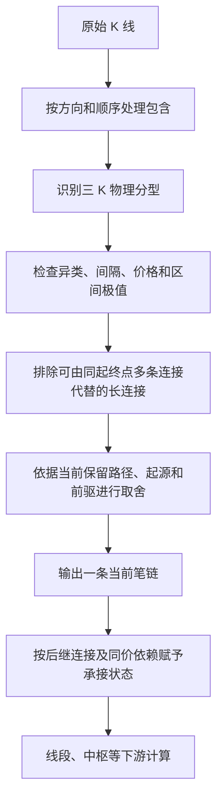

**当前旧笔构建的整体逻辑审查：取舍关系、历史保留与完成状态**

审查日期：2026-09-15。对象：当前工作区的 `old-source-sequence-v11`。

**当前实现存在结构性问题。最明显的两个表现是：后段长期不能进入输出，以及重选起点时整条历史笔链被替换。两者都发生在局部成笔条件已经通过的情况下。继续调整间隔、极值或某一个等待分支，无法单独解决这个问题。**

本次把代码作为审查对象，把 `D:\缠论` 中实际读取的第 62、65、66、69、77 课作为原文依据。以前的重构文档和回归结果只用于核实实现及实验，不作为原文标准。全文仅讨论旧笔。

第 66 课的最高最低要求来自资料所附作者回复；第 65、77 课中的“注”另外标明。下文的图关系、状态结构和实验价格均为工程分析，不冒充作者原文。引用定位见文末。[^62][^65][^66][^69][^77]

**1. 先区分存量批量处理与实时增量处理**

两种场景使用同一套旧笔定义，但可以使用的信息、保存的状态及验收方式不同。第 77 课讨论给定图形中的取舍步骤，第 69 课还专门讨论当下暂定与后来分型使取舍明确的过程；下面的模式划分是为实现这些要求建立的工程契约。[^69][^77]

| 项目 | 存量数据一次性批量处理 | 实时行情增量处理 |
|---|---|---|
| 输入 | 截至 T 已有的一份完整行情快照及明确的左侧上下文 | 初始历史快照，加上逐次到达的新 K 或末根 K 更新 |
| 可以使用的信息 | 所给快照内全部已知材料，包括某历史分型右侧已存在的 K 线 | 当前时刻已经到达的材料，不能使用以后才出现的分型 |
| 首要输出 | 截至 T 的整段取舍结果，以及仍不能判定的区间 | 每次更新后的当下结果、修订范围及相应证据时间 |
| 历史取舍 | 应利用快照中已有的右侧材料重新检查，不能把扫描早期的等待状态直接当作最终解释 | 可修订尚未确定的选择；必须说明修订原因和范围 |
| 末尾状态 | 存量不等于全部图形已完成，最右侧仍可能未决 | 末根 K、刚出现的分型和未解决的取舍均需要更新机制 |
| 基本验收 | 完整图上的成笔条件、取舍依据、输入区间归属 | 同一截止时刻与批量结果一致，并核验时间因果与状态变化 |

当前入口没有两套独立的取舍规则。[`BiCalculator.calculate`](<D:/project/chanlun-pro/src/chanlun/core/bi_calculator.py:300>)在首次调用或不信任历史前缀时收集全部分型，然后全量重放；在可信数据代次前进时尝试更新末尾分型。两条路径最终都进入同一个 `StrokeResolver`。

具体而言，批量分支先执行 `_collect_fxs(all_klines)`，再在 `_build_endpoint_stack` 中按顺序逐个调用 `resolver.advance(fx)`。全部 K 线虽然已经在内存中，取舍仍由逐个分型推进的同一选择器完成，没有另外一轮针对整张已知图的取舍补充裁决。[全量分支](<D:/project/chanlun-pro/src/chanlun/core/bi_calculator.py:357>)、[逐个推进](<D:/project/chanlun-pro/src/chanlun/core/bi_calculator.py:183>)。

顺序重放可以作为批量算法的实现方式，本身不构成错误。但它使当前“冷计算与增量一致”的证明范围十分有限：两者可以一致地执行同一处停滞或重选错误。因此批量规则的正确性，必须先由原文和独立案例核对，不能用它与同源增量程序一致来替代。

还需区分“传入全量 DataFrame”和“重新批量建模”。现有 CL 实例的 `process_klines` 仍经过有状态的 K 线处理器；该处理器会按已有末尾时间裁切数据。[数据处理入口](<D:/project/chanlun-pro/src/chanlun/core/kline_data_processor.py:42>)、[尾部裁切](<D:/project/chanlun-pro/src/chanlun/core/kline_data_processor.py:149>)。生产的已验证增量入口也要求发现旧事实变化或滑窗时丢弃旧实例。[入口契约](<D:/project/chanlun-pro/src/chanlun/core/cl.py:186>)。需要重新处理一份历史快照时，应明确新建或重建状态，不能仅凭传入数组较长就认定做了批量重建。

本轮追加了针对这一差别的实际检查：对停滞、长前缀替换、同价连接点重选三个案例及其镜像，分别执行“一次性全部输入”“逐根输入”“分批输入”“先批量载入历史再追加实时数据”。六组输入、每组四种方式的最终结果都一致；一次性输入时，也实际观察到每个分型依次进入 `advance`。[模式审查脚本](<D:/project/chanlun-pro/script/review_stroke_processing_modes.py>)、[完整结果](../output/bi_code_review/v11_processing_modes_review.json)。

**2. 当前程序的共同规则链路**

当前调用顺序可以概括为：



对应实现：包含在 [cl_kline_process.py](<D:/project/chanlun-pro/src/chanlun/core/cl_kline_process.py:105>)，基础条件在 [stroke_rules.py](<D:/project/chanlun-pro/src/chanlun/core/stroke_rules.py:18>)，局部关系与选择在 [stroke_sequence.py](<D:/project/chanlun-pro/src/chanlun/core/stroke_sequence.py:45>)，证据与状态在 [stroke_resolver.py](<D:/project/chanlun-pro/src/chanlun/core/stroke_resolver.py:98>)，最终对象和下游调用在 [bi_calculator.py](<D:/project/chanlun-pro/src/chanlun/core/bi_calculator.py:226>)、[cl.py](<D:/project/chanlun-pro/src/chanlun/core/cl.py:219>)。

其中必须区分四个问题：某处是不是三 K 分型；两个分型能不能作为一笔的候选两端；这两个分型在整段取舍后是否相邻；这种取舍是否已经完成。原文分别涉及分型定义、成笔约束、分型取舍和完成图形。满足前一个问题的条件，不能直接回答后一个问题。[^62][^65][^69][^77]

当前代码已在注释中承认这些区别。但实际选择层仍主要输出一个 `selected` 端点及其唯一前驱链，不能完整表达“旧结构待裁决，同时后段已经有候选进展”的情况。后面的停滞、整链替换和状态缺口与这个表示方式有关。

**3. 原文能支持哪些基础条件，哪些地方属于程序推导**

| 问题 | 本地原文依据 | 当前实现与审查判断 |
|---|---|---|
| 三 K 分型 | 第 62 课正文 37–61 行，中心 K 的高低点同时满足顶或底的关系 | `fractal_kind` 同时比较高低点，本次未发现新错误 |
| 包含的方向与顺序 | 第 62 课正文 85–100 行；第 65 课正文 31–100 行 | 向上取高高，向下取低低，按顺序处理；不能用后面走势任意改写前面的合并方向 |
| 旧笔最小距离 | 第 62 课正文 73–82 行；第 77 课正文 139–145 行 | 两端完整分型之间至少一根独立 K；中心差至少 4 是坐标转写 |
| 顶底的价格关系 | 第 77 课正文 142–148 行 | 顶分型最高 K 的区间须有部分高于底分型最低 K 的区间 |
| 两端为笔内极值 | 第 66 课作者回复 265–280 行 | 有明确作者答复；应注明是回复，不能称为课程正文中的这句话 |
| 同类分型取舍 | 第 77 课正文 253–283 行 | 严格更极端与相等分开处理；还要核对连续同类序列和后续异类分型 |
| 相邻顶底 | 第 62 课正文 64–70 行；第 65 课正文 166–214 行；第 77 课正文 271–283 行 | 应是按条件取舍后的相邻，不能仅由一次两点检查推定 |
| 完成 | 第 69 课正文 151–166、205–223 行；第 77 课正文 211–229 行 | 末端分型是必要条件；暂时选择、后继连接、完成图形需要区分 |

上述每一行的全文定位均列于文末；第 65、77 课的资料注释没有被用于替代正文。[^62][^65][^66][^69][^77]

以中心编号 `i < j` 表示两个三 K 分型，其内侧肩部分别是 `i+1`、`j-1`。两肩之间至少还有一根独立 K，得到 `j-i≥4`；连同两端外侧肩部，最小完整图形为 7 根合并 K。这里计算的是包含处理后的 K 线数量。这个表达是对原文独立 K 条件的推导。[^62][^77]

当前区间极值检查使用两端中心之间的合并 K 闭区间，允许内部出现与端点相等的价格；它不把起点外侧左肩和终点外侧右肩并入该连接的价格跨度，也不重新加入包含处理中消去的原始价格。这是代码对作者回复的坐标表达，应保留这一推导说明，不能说原文逐字给出了 Python 的切片边界。[实现及边界说明](<D:/project/chanlun-pro/src/chanlun/core/stroke_audit.py:1>)。[^66]

有一个容易误判的问题：代码还要求顶中心 K 的最低价高于底中心 K 的最低价，这是不是无依据的额外限制？在“标准三 K 分型、中心差至少 4、中心区间两端取极值”同时成立的前提下，这个比较实际可推出。顶分型朝向笔内的肩部最低价严格低于顶中心最低价，又不能低于该笔底点，因而顶中心最低价必然高于底点。底分型内侧肩部最高价严格高于底中心最高价，又不能高于该笔顶点，另一项高价比较也随之成立。**这是对既有条件的推导，本次没有理由把这两项比较认定为大量漏笔的独立原因。**[^62][^66]

同样，短促反向分型不够成笔，只能排除某一条连接；它的价格仍然是区间事实。把它从端点候选中舍去，不能顺便删除它对应的价格。第 65 课关于过小转折的取舍，需要与第 66 课的区间极值要求一起处理。[^65][^66]

这里“没有发现单项公式错误”不意味着这些程序化条件已经构成全图划分的完备规范。下文的候选断开实验进一步说明，还要核查这些条件在复杂图形中如何共同适用。

**4. 第一处根本缺口：局部连接关系尚未完成整段取舍的证明**

用 `Q(A,B)` 表示异类、距离、价格和区间极值检查全部通过。它表达的是候选两端具备必要资格。

当前 `SourceStrokeSequence` 在 `Q` 之上，再排除能分解为相同起点、相同终点的至少三条合格连接的长边。没有被这项检查排除的起点进入 `relation.adjacent`。[具体计算](<D:/project/chanlun-pro/src/chanlun/core/stroke_sequence.py:50>)。

这项检查能发现一类跨笔连接，但它检查的条件仍是“相同起终点是否存在完整多段路径”。它没有证明所有内部候选的取舍，也没有处理另一起源的后段如何与前段衔接。因此 `adjacent` 这个名称的含义强于这一步单独已经完成的验证。

现有反例对此很直观：一段输入有 260 条逐条通过局部条件的后段候选，后续出现更高的顶后，当前输出变成 `1→11→1059`。其中 `11→1059` 跨过这些候选所在的价格区间，却没有相同起终点的完整多笔分解，所以两项输出审计都不报警。[原实验及完整价格](../output/bi_code_review/v11_current_rule_review.json)。

这个实验**不证明**那 260 条候选可以直接接到旧前缀上，也不直接证明 `11→1059` 是原文意义的错误笔。它证明的是：当前两项局部检查没有回答整段结构如何取舍，不能拿“无报警”作为已经完成原文相邻划分的证据。

原文第三步的“最先一个”，针对的是经过前面步骤处理后的连续同类分型。当前的 `min(candidates)` 则作用于通过程序前驱筛选的候选集合，并且优先选择与当前路径同起源的候选。两者等价，需要证明这个筛选集合恰好对应原文规定的剩余分型，不能由变量名称或取最小编号本身保证。[代码](<D:/project/chanlun-pro/src/chanlun/core/stroke_sequence.py:255>)。[^77]

`_retained_predecessors` 还把当前笔链跨度内部没有入选的分型当作临时已舍弃点，并据此排除使用这些点的候选历史。这里已经记录了支持舍弃的旧连接，也提供了最后一个同价连接点恢复的例外。问题是其一般正确性仍依赖于旧连接的取舍依据：旧连接成立依赖内部点可以舍弃，内部点不可返回又依赖旧连接已经入选。[代码](<D:/project/chanlun-pro/src/chanlun/core/stroke_sequence.py:207>)。

这属于需要补足证明和依赖表达的实现推导，不能笼统说“每次这样筛选都错”。本次特意搜索了一个更具体的疑点：某个候选因为固定前驱历史包含已舍弃点而被拒绝，但另有一条避开这些点、来自当前起源的历史可用。7,000 组构造中没有找到这种反例。因此本报告没有把“一个候选只有一个前驱”单独列为已证实漏选缺陷。

**5. 已复现的高优先级问题：等待条件可以阻塞任意长的后段**

核心分支在 [stroke_sequence.py 第 259–288 行](<D:/project/chanlun-pro/src/chanlun/core/stroke_sequence.py:259>)：

```python
retained_can_continue = bool(viable.intersection(retained))
if parent >= 0 and (connected or not retained_can_continue):
    ...
```

`retained` 是整条当前路径，而不是当前末端。`viable` 是尚未被同类更极端价格淘汰的未来起点集合。一个历史顶仍在这个集合中，只说明它的价格资格没有被同类新高排除，不说明当前末端已经有可用接续，也不说明后来候选可以暂时不处理。

合成例中，关键分型为：

| 名称 | 中心编号 | 类型 | 端点价格 |
|---|---:|---|---:|
| P | 1 | 顶 | 30 |
| A | 5 | 底 | 8 |
| B | 9 | 顶 | 22 |
| C | 11 | 底 | 6 |
| D | 13 | 顶 | 28 |
| E | 15 | 底 | 10 |
| F | 19 | 顶 | 26 |
| G | 23 | 底 | 12 |
| H | 27 | 顶 | 24 |
| I | 31 | 底 | 13 |

输入没有包含和缺口，编号从 0 开始。当前选择保留 `P→A→B`；后面的 `E→F→G→H→I` 四条连接通过局部条件。A、B 已不在未来起点集合中，P 仍在，整条后段因此被挡在当前输出之外。

把后段往返继续延长，已有记录显示 33、289、1,057 根输入分别存在 4、68、260 条后段局部合格连接，当前输出一直只有前面的 2 笔。上下镜像一致，冷计算与逐根更新一致。[上轮完整复现记录](../output/bi_code_review/v11_current_rule_review.json)。

这里已经有候选前驱，动作仍可能叫 `await_qualified_opposite`；`pending_continuation` 又没有被置为真，所以 `continuation_blocked_at=None`。`unresolved_endpoint_choices` 只覆盖特定同价取舍，仍为空。这构成明确的诊断状态缺陷：实际存在未解决的接续关系，接口却没有表达它。[状态写入](<D:/project/chanlun-pro/src/chanlun/core/stroke_resolver.py:158>)、[同价依赖的范围](<D:/project/chanlun-pro/src/chanlun/core/stroke_sequence.py:185>)。

上轮的本地行情回放也发现同一问题：`SH.600519_5m.parquet` 在第 3,954 根输入时，当前笔末端中心停在原始 K 线 3,886，后段候选已经到 `3891→3900→3905→3939→3952`，受阻标记仍为空。五个命中前缀属于同一个阶段。本次重新读取其验证记录，没有把它们计为五个独立故障，也没有把旧行情回放计为本轮新跑的数据。[行情记录](../output/bi_code_review/v11_retained_wait_markets.json)。

**6. 本轮进一步确认：重选可以替换任意长的历史笔链**

这比“末笔延伸”或“最后两笔待定”的影响范围大得多。

我在原有短反例前增加连续的、间隔为 4 的正常往返，每次增加一组上涨和下跌，再在末尾追加相同的 8 根 K 线。所有输入均无包含、无缺口，并做了上下镜像。结果如下：

| 追加前原始 K 数 | 追加前当前笔数 | 其中 `continued` 数 | 再追加 | 追加后当前输出 |
|---:|---:|---:|---:|---|
| 11 | 2 | 1 | 8 根 | 只剩 `13→17` |
| 139 | 34 | 33 | 8 根 | 只剩 `141→145` |
| 523 | 130 | 129 | 8 根 | 只剩 `525→529` |
| 2,059 | 514 | 513 | 8 根 | 只剩 `2061→2065` |

这里“只剩”指 `BiCalculator.bis` 的当前输出；物理 K 线和历史分型没有被删掉。追加前后的端点极值和同端点可再分审计均无报警。八个镜像案例完整逐根回放，共 5,528 个输入前缀；各例在追加前、追加后各做一次冷计算对照，共 16 次，全部一致。[本轮实验数据](../output/bi_code_review/v11_architecture_review.json)。

**按两种场景解释这个结果：**一次性输入 2,067 根存量 K 线的批量调用，对外直接返回后段 1 笔，前面那段历史没有得到完整归属说明；它没有先向调用方发布 514 笔再撤回。先批量载入 2,059 根、随后实时追加 8 根的调用，则确实从 514 笔变成后段 1 笔。新增模式实验分别验证了这两条路径。前者是批量结果的结构覆盖问题，后者还涉及实时结果的历史修订范围，不能混为同一个运行过程。

原因有明确的代码链路：当旧路径上的价格起点都不再存活，选择器允许跳到另一 `origin`；`path()` 只沿新端点的前驱追溯到它自己的根；`BiCalculator` 以这条新路径重建当前输出。没有独立的结构对象交代旧前缀与新后段之间的待解区间及归属。[选择新根](<D:/project/chanlun-pro/src/chanlun/core/stroke_sequence.py:273>)、[追溯路径](<D:/project/chanlun-pro/src/chanlun/core/stroke_sequence.py:177>)、[重建输出](<D:/project/chanlun-pro/src/chanlun/core/bi_calculator.py:226>)。

这说明现有修改的作用范围可以延伸到整条历史选择。上游允许这种替换，下游就必须承认输入来源可被撤换；不能同时把这些输入宣传为永久确认。固定再等几笔也不能解决该实现的承诺问题：上述构造可以继续增加往返，使被撤换的承接历史继续增长。

原文第 69 课明确区分暂时取舍和完成图形，并在具体月线例中以后来分型决定前面的取舍。它没有给出“换了程序起源就把旧路径从整图输出中整体抛开”的规则。[^69] 本文也不把表中所有旧连接自行宣布为作者已证明永久完成；这里已证实的是**当前输出的历史保留范围不受尾部边界限制，且这种替换没有同时给出完整划分的解释**。

进一步独立枚举全部分型，得到一个比选择器等待更基础的结果：在 2,067 根例子中，以中心 2,057 为界，前面有 515 个分型，后面有 3 个分型；逐一检查 1,545 对跨界组合，**没有一条满足当前局部成笔条件的连接**。镜像也相同。这个检查没有使用选择器的 `origin`、当前路径或舍弃位图。[候选跨界检查](../output/bi_code_review/v11_processing_modes_review.json)。

其最短的 19 根版本即可手工核查：前段为顶 `1=20`、底 `5=8`、顶 `9=22`；后段为底 `11=6`、顶 `13=24`、底 `17=4`。`9→11`、`11→13` 太近；旧底 `5→13` 的区间里出现更低的 `11=6`；旧顶 `9→17` 的区间里出现更高的 `13=24`；更早的顶 `1→11` 又被 `9=22` 超出。旧前段与新后段因此没有局部合格的桥接关系。

这不是选择更早前驱或计算更多候选就能弥补的：对于这一输入和当前条件集合，跨界连接根本不存在。继续保持这些历史价格不变，后面的 `24` 已高于所有旧顶、`4` 已低于所有旧底，旧分型也无法再作为两端区间极值连接到更晚的新异类分型。

**这项结论限于当前程序化条件集合，不能直接据此宣布原文自相矛盾，也不能擅自取消原文中的独立 K 或最高最低要求。** 已经核对的这些原文段落，没有为该合成结构提供足以直接裁定完整接法的明确实例。重构必须继续核清分型取舍、笔的价格跨度及全图连接之间的适用边界；在此之前，至少应如实报告未解区间，不能把保留某一后缀当成整段历史已经完成原文划分。

**7. 为什么两种直接改法都不够**

本轮在独立审查进程内做了两种刻意削弱条件的实验。它们没有写入生产代码，也不作为推荐算法。

| 同一组 33 根输入 | 得到的端点链 | 实验说明 |
|---|---|---|
| 当前实现 | `1→5→9` | 后段未进入输出 |
| 仅去掉起源等待门 | `15→19→23→27→31` | 后段可以输出，但旧前缀整体退出当前笔链 |
| 保留等待门，取消区间极值检查 | `1→11→19→23→27→31` | `11→19` 顶点价为 26，而区间内最高为 28，连接不满足极值条件 |

上下镜像均得到相应结果。基准选择器的输出还与真实 `BiCalculator` 比较一致。[复现脚本](<D:/project/chanlun-pro/script/review_stroke_architecture_v11.py>)、[隔离实验记录](../output/bi_code_review/v11_architecture_review.json)。

第一个改法解决了“后面看不到”的表象，却没有解释前面怎样处理；第二个改法直接破坏了已有作者依据的必要条件。[^66] 因此重构需要处理选择之间的依赖和连接范围，不能把“增加输出笔数”当成目标函数，也不能直接把两段互不衔接的候选串在一起。

**8. 完成状态的缺口仍然存在，而且会传到下游**

当前状态的实际含义是：

| 接口 | 实际判断 | 可以证明到哪一步 |
|---|---|---|
| `fractal_visible_at` | 三 K 分型具备物理证据的时间 | 分型在相应输入时刻可见 |
| `selected_at` | 该连接进入当前选择的时间 | 当时选择了这条连接 |
| `continuation_at` / 兼容字段 `locked_at` | 当前选择有后继，且未被已识别的同价依赖阻止 | 当前承接证据 |
| `completion_status == continued` | 有上述承接时间 | 不能保证以后仍在输出中 |
| `completion_is_final` | 固定返回 `None` | 原文最终完成尚无实际判断结果 |
| `is_done()` | 返回 `has_qualified_successor()` | 兼容调用，不是不可修改的证明 |

这些含义可直接核对 [BI 类型](<D:/project/chanlun-pro/src/chanlun/core/types/line.py:165>) 和 [承接证据生成](<D:/project/chanlun-pro/src/chanlun/core/stroke_resolver.py:113>)。返回 `None` 如实表达了尚未证明，不能简单改成 `True` 来补齐需求。

第 69 课的“笔的完成，必须要构成一个顶分型”处于正在进行的向上笔语境，给出的是必要条件。该课前面又说明完成图形的分型取舍不能随时改动。第 77 课对较低底分型、下一顶分型、N 与 N+1 的讨论，说明取舍关系也是判断的一部分。不能只抽取“有末端分型”或“下一笔出现”做无条件充分条件。[^69][^77]

特别需要诚实保留文本边界：第 77 课正文第 217 行在本地文件中写的是“如果前面的底不低于后面的底”，与前一段的情况划分存在文字解释问题。本报告保留原字，没有擅自改成另一不等号来构造完备算法；第 193–196 行则是资料的“注”，不能与作者正文混为一谈。[^77]

下游还有具体契约需要处理。[unit_adapter.py 第 163 行](<D:/project/chanlun-pro/src/chanlun/core/strict_structure/unit_adapter.py:163>)仍把 `line.is_done()` 适配为 `locked`；[XdCalculator 的说明](<D:/project/chanlun-pro/src/chanlun/core/xd_calculator.py:178>)仍使用“追加数据不得改写已确认前缀”的表述，但它会根据被重选的整条笔链全量重建。

已有修复通过证据版本化生成不同单元 ID，并让受影响的缓存重新计算。这个处理能避免将新选择的时间混入旧证据。[证据身份](<D:/project/chanlun-pro/src/chanlun/core/strict_structure/unit_adapter.py:104>)、[缓存失效](<D:/project/chanlun-pro/src/chanlun/core/cl.py:227>)。但“旧 ID 的记录保留不变”不等于“旧几何结构持续保留在当前图中”。

重新查看此前 153 个笔重选事件的依赖记录，已有 5 个事件让先前确认的线段退出当前结果，19 个事件改变确认线段的身份或时间，2 个事件使原中枢 ID 退出当前结果。记录中的一致性错误为 0，说明重算和证据版本处理可以保持内部一致；这些数字不能被解释为结构永不改变。本轮只复核此已有记录，未重复执行全部行情依赖回放。[原始依赖记录](../output/bi_code_review/v11_dependencies_final.json)。

本次没有对线段、中枢原文规则另做完整审查；这里指出的是笔状态向下游传递的实际含义。

**9. 批量结果不能直接作为当时实时结果**

设 `B(D≤t)` 是只使用截至 t 的行情做一次批量计算，`I(D≤t)` 是实时处理到同一时刻的状态。相同输入、上下文和规则下，两者的当前几何及取舍状态应一致。但把更晚 T 时刻的最终图按端点时间裁到 t，不一定等于当时的状态：

```text
应当核验：I(D≤t) 与 B(D≤t) 的当前结构一致。
不能推定：把 B(D≤T) 按端点时间裁到 t，就得到了 I(D≤t)。
```

本轮用同价底取舍例实际验证：只给前 17 根时，当前连接是 `1→11→15`，同价取舍仍未解决；给足 21 根后，当前连接改为 `1→5→19`。如果把后一张图按终点编号不大于 16 裁切，只得到 `1→5`，与当时真实计算的 `1→11→15` 不同。[时间对照记录](../output/bi_code_review/v11_processing_modes_review.json)。

当前代码在这个例子中把重新选入 `1→5` 的时间记在编号 20 的 K 线证据上，没有把这次重选倒填到端点编号 5。这部分应保留。实验演示的是一种错误回放方法的后果，并不声称当前某个生产调用已经采用了这种裁图方法。

因此，历史静态展示可以使用截至 T 的批量结构；重现“当时看到什么”必须限制当时的可用输入，或读取当时保留的选择事件和状态快照。几何端点时间、支持取舍的 K 线时间、系统实际首次接收该事实的时间也应分清。只有最终 OHLC 的存量数据，不能还原当年盘中每一次 tick 的观测过程。

本轮模式实验输入的是不可变的 OHLC 快照。实时末根 K 线尚会变化时，还应分别验证“新增一根”和“更新同一根”的影响范围；这属于数据和状态处理要求，不能冒称为原文另加的笔间隔或成笔条件。

**10. 整体重构应围绕哪些对象和规则展开**

以下是根据已核对原文及代码缺口提出的工程设计要求，不是作者提供的数据结构或一套已证明完备的新算法。

应先定义一个明确的批量快照解算契约：给定全部可用 K 线、左侧上下文和截止时刻，返回这份图的取舍与未解区间；它的正确性先通过原文及独立案例核验。实时增量再维护这个结果，只重新检查受新事实和取舍依赖影响的范围，并记录实际修订时间。两种入口共用旧笔规则，分别管理批量输入和实时状态，避免将“速度优化分支”误当作规则正确性的标准。

在动手替换选择器之前，要把前面的候选断开案例列为规范核查的必答题：原文条件应怎样共同适用于这种图形，哪些区间可以判断，哪些仍缺乏充分依据。单独建立更复杂的路径搜索，并不能让一个没有合格跨界连接的关系集合自动变得可连接。

首先，保留独立的行情事实层。包含结果、三 K 分型、原始来源、价格极值及物理可见时间，只由相应 K 线证据决定。某分型没有被选择为笔端点，不得改变这一层事实。已有包含、区间查询和物理时间处理有保留价值。

其次，保留“两端是否有资格”的关系层，但把通过检查的关系明确称为候选连接。失败理由应分别指出类型、独立 K、价格关系或区间极值。比如 `B→C` 太短，结果应是这条关系不成立，不能由此全局删除 C。

第三，独立表示分型取舍的依据。一次舍弃至少要能回答：舍弃哪个候选关系或哪个端点角色；依据哪一段原文和哪组物理分型；依赖哪些尚未确定的选择；后续什么事实使这条依据失效。对应第 77 课第二步的严格极值取舍，必须先说明两点为什么处在应比较的同类序列；对应第三步的“最先一个”，必须先说明剩余连续同类序列已经成立。[^77]

第四，用明确的未解区间表达前后衔接。一个范围前面有暂定结构、后面有局部候选链时，系统应同时保留这两类事实，并标出连接尚未解决的范围。对当前例子，至少应该能表达 `P→A→B` 的当前选择、`B` 之后的接续问题，以及 `E→F→G…` 的后段候选；它们在原文取舍解决前不能被直接拼成一条连续笔链。

第五，把“选择修订”做成有范围和依赖的操作。新的结构替换旧结构时，必须交代旧区间是被重新划分、因观察窗口缺失前情而无法判断，还是仍在等待后续证据。一个新的 `origin` 编号只应是存储信息，不能决定旧图的理论归属。

第六，在取舍证据之上判断完成。程序需要分别记录：末端分型可见、候选连接符合条件、该连接已进入当前取舍、后继已经承接、相关分型取舍是否已确定。哪些具体证据足以给出原文完成结论，必须逐个对应本地原文并经过后续扩展检验；尚无充分依据的情况继续明确未决。不能让“暂定末端有了下一条候选”自动承担完整的最终完成承诺。[^69][^77]

最后，下游消费接口应声明接收的是当前取舍还是已确定结构。候选链及未解区间可以供图表和诊断查看；线段等需要连续输入的计算不能跨越未解决的断口。证据身份和缓存失效机制仍应保留，同时让承接与最终完成的含义贯穿所有调用方。

这些要求允许使用压缩图、前驱链等高效存储方式；采用任何压缩都需要说明为何被合并的历史在后续判断上等价。本次没有证据要求无条件穷举所有候选，也没有把“最长路径”“笔数最多”或“所有候选共有前缀”定为原文选笔规则。

**11. 如何验证重构确实处理了问题**

现有验证主要回答“输出的每条连接是否合格”和“增量是否与冷计算相同”。接下来还需要检查：

| 验收问题 | 应当观察的证据 |
|---|---|
| 两点检查有没有偏离原文必要条件 | 从三 K 与价格区间直接计算，不拿生产函数自己的结果作标准 |
| 全部条件共同使用时，是否存在可贯通的候选路径 | 独立检查跨界连接；无路径时给出适用边界问题，不能由选路程序静默裁掉前段 |
| 一次性处理存量是否完成了已知图的取舍 | 全部已知右侧材料都参与相应依赖检查，未解区间有明确边界 |
| 批量载入后能否继续实时处理 | 同一数据前缀经一次输入、分批、逐根和批量后续接得到相同当前状态 |
| 回放有没有使用后来才知道的选择 | 按截止时刻重新计算或读取当时状态，不能仅裁切最终图 |
| 每个端点为什么被保留或舍弃 | 原文条件、支持分型、被影响的区间、尚未解决的依赖 |
| 后段已经有进展时能否被系统表达 | 候选范围和受阻原因，而不只是当前笔数 |
| 改选时旧前缀发生了什么 | 修订范围与替代关系，能够解释本次 514 笔案例 |
| 一个状态能否承诺原文完成 | 有定位的取舍证据及后续扩展验证，未知不能转成已完成 |
| 下游为何新增、撤换或保留结构 | 真实输入及证据版本对应，不能用新 ID 掩盖几何是否变化 |

应优先以本地原文的明确例子和条件构造预期，再用少量可手工核查的完整 K 序列验证。在复杂分支缺少充分原文依据时，测试应要求它如实表达未解关系，不能先把当前输出写成预期，再用测试通过证明规则正确。

**12. 本轮验证结果与范围**

本轮新增了可独立运行的[审查脚本](<D:/project/chanlun-pro/script/review_stroke_architecture_v11.py>)，保存了[完整输入、状态、源码摘要与结果](../output/bi_code_review/v11_architecture_review.json)。

批量与增量的追加核验另见[模式审查记录](../output/bi_code_review/v11_processing_modes_review.json)；原文、生产源码和本轮产物摘要汇总在[核验清单](../output/bi_code_review/v11_architecture_review_manifest.json)。

| 本轮新执行 | 结果 |
|---|---|
| 等宽区间的随机构造 | 2,000 组，78,000 个分型事件 |
| 变宽区间的随机构造 | 5,000 组，195,000 个分型事件 |
| 所有较早分型两端资格的独立检查 | 合计 5,187,000 对，局部关系差异为 0 |
| 相同起终点可再分关系的独立集合计算 | 在以上 273,000 个事件中与生产关系一致 |
| 固定前驱遗漏替代历史的特定搜索 | 检查 27,966 个被舍弃前驱记录，未找到该特定反例 |
| 去等待门、去区间条件的隔离实验 | 两组镜像输入均复现本文表格 |
| 延长历史前缀后再重选 | 8 个案例，5,528 个增量输入前缀，16 次关键时点冷计算比较均一致 |
| 批量、逐根、分批、批量后续接四种方式 | 6 组输入各跑 4 种方式，同一截止时刻的最终状态一致 |
| 长前缀案例的跨界可行性 | 两个镜像分别检查 1,545 对跨界分型，没有局部合格连接 |
| 截取最终批量图冒充历史状态的隔离实验 | 与真正前缀计算不同；现有重选证据时间在此例中正确保留 |
| 生产代码完整性 | 本轮前后 41 个生产文件与上轮核验基线一致 |
| 两个新审查脚本静态检查 | Ruff 通过 |

随机构造全部没有包含和缺口，所以本轮的随机关系检查不覆盖包含算法。独立可再分计算仍只检查“相同起终点”的图性质，不是原文全图取舍的独立标准。特定前驱反例没有找到，也不是整个选择器完备性的证明。

上轮 109 项相关回归、20 个合成例的 7,808 个前缀，以及四份本地行情的 35,333 根 K 线记录，本次用于复核已知现象，未把它们重复计作本轮新测试。[上轮验证清单](../output/bi_code_review/v11_current_review_manifest.json)。本轮没有修改生产规则，也没有通过重启或缓存清理改变实验结果。

因此，重构应先核清**局部条件在全图中的共同适用边界**，再重做 **`SourceStrokeSelection` 的取舍范围、条件依赖和输出语义，以及 `StrokeResolver` 和下游的完成契约**。先让存量批量结果有原文依据和完整的区间说明，再据此验证实时增量的当下结果及修订过程。完成整体重构的标准应是每次取舍都能对照原文说明，而不是某几个异常图暂时消失。

**原文出处**

[^62]: 缠中说禅，[第 62 课《分型、笔与线段》](<D:/缠论/chanlun_lesson_corpus/L062_分型、笔与线段(2007-06-30094951).md:37>)，正文第 37–61 行为分型定义；[第 64–82 行](<D:/缠论/chanlun_lesson_corpus/L062_分型、笔与线段(2007-06-30094951).md:64>)为相邻和独立 K 要求；第 85–118 行为包含处理及笔的组成。本轮实际读取对应文件。

[^65]: 缠中说禅，[第 65 课《再说说分型、笔、线段》](<D:/缠论/chanlun_lesson_corpus/L065_再说说分型、笔、线段(2007-07-16221416).md:31>)，正文第 31–100 行为包含的顺序和方向；[第 166–214 行](<D:/缠论/chanlun_lesson_corpus/L065_再说说分型、笔、线段(2007-07-16221416).md:166>)为同类分型间两种情况及交替连接。第 172–175、184–187 行是资料注释，本文与正文区分。前一注释的文字按文件原样保留，没有擅自纠正。本轮实际读取对应文件。

[^66]: 缠中说禅，[第 66 课资料所附作者回复](<D:/缠论/chanlun_lesson_corpus/L066_主力资金的食物链(2007-07-30224205).md:256>)，作者时间 2007-07-31 16:14:47；第 265–271 行是网友问笔内非顶底 K 能否超出端点范围，[第 277–280 行](<D:/缠论/chanlun_lesson_corpus/L066_主力资金的食物链(2007-07-30224205).md:277>)为作者“一笔……顶和底，当然一定是那一笔的最高最低”的回答。这里明确作为作者回复引用，不称为课程正文。本轮实际读取对应文件。

[^69]: 缠中说禅，[第 69 课《月线分段与上海大走势分析、预判》](<D:/缠论/chanlun_lesson_corpus/L069_月线分段与上海大走势分析、预判(2007-08-09.md:28>)，正文第 28–49 行为四个箭头的取舍例；[第 151–184 行](<D:/缠论/chanlun_lesson_corpus/L069_月线分段与上海大走势分析、预判(2007-08-09.md:151>)区分当下暂定与完成图形；[第 205–223 行](<D:/缠论/chanlun_lesson_corpus/L069_月线分段与上海大走势分析、预判(2007-08-09.md:205>)讨论当时正在进行的向上笔，第 220 行是末端顶分型必要条件。文件名按本地实际名称保留。本轮实际读取对应文件。

[^77]: 缠中说禅，[第 77 课《一些概念的再分辨》](<D:/缠论/chanlun_lesson_corpus/L077_一些概念的再分辨(2007-09-05232401).md:118>)，正文第 118–148 行为基础条件；[第 169–244 行](<D:/缠论/chanlun_lesson_corpus/L077_一些概念的再分辨(2007-09-05232401).md:169>)为唯一性论证，其中第 193–196 行是资料注释，第 211–229 行涉及未完成与 N、N+1，第 217 行的“不低于”未被本文改写；[第 247–295 行](<D:/缠论/chanlun_lesson_corpus/L077_一些概念的再分辨(2007-09-05232401).md:247>)为三步划分。本轮实际读取对应文件。
