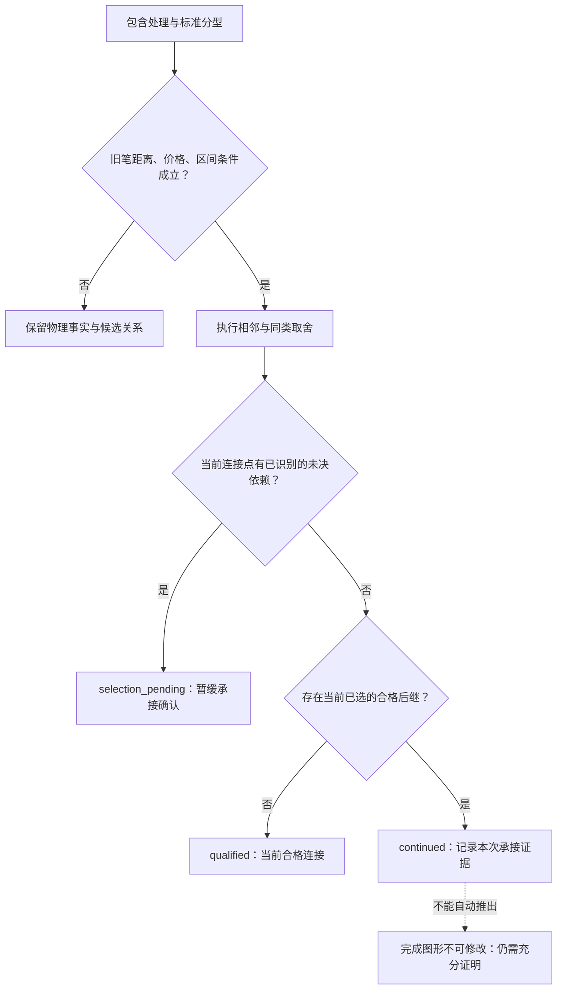

# 旧笔的完成条件与 v11 修改复审

**原文要求区分“末端分型已经出现”“当前取舍下已经构成一笔”和“完成图形的取舍不能再改”。当前代码已修正等价端点取舍、错误等待、确认依赖及初始包含；仍不能把一次合格后继的出现，宣称为全图永久完成的通用证明。**

本报告只使用 `D:\缠论` 下实际读取的材料。旧笔的几何条件依据第 62、65、66、69、77 课；第 66 课端点极值的明确表述来自所附作者回复，不能称为课程正文。另核对了目录中的 DOCX 原文版本，以及两篇后期解盘文章中的“完成”用语；后期文章不用于引入新笔的根数或间隔要求。[^1][^2][^3][^4][^5][^6][^7][^8]

代码中的索引、状态、位图和时间戳是实现数据。下面明确标识哪些是原文条件，哪些是工程推导，哪些还缺乏充分证明。测试通过表示列出的性质得到验证，不表示原文关于任意全图唯一划分的论证已经全部转写为算法。

**一、原文所说的“完成”，首先要有相应的末端分型**

第 69 课讨论正在进行的向上笔时，正文第 220–223 行说：“笔的完成，必须要构成一个顶分型。”这至少确立了一个必要条件：向上笔不能在尚无有效顶分型时声称结束。结合第 62 课对上下笔的定义，向下笔对应的是末端底分型；后一个对称表达是依据上下定义的推导。[^1][^4]

因此，价格已经反向走了一根 K 线、从最高价回落一定幅度，或者某个内部变量切换方向，都不足以替代末端分型。分型先要满足三 K 线高低关系，且必须按原文处理包含关系。计算中的 `FX.done` 只表达物理分型成立，不能自动证明它已经成为最终保留的笔端点。

有末端分型也不能省略成笔条件。第 62 课要求两个完整分型之间至少有一根独立 K 线，第 77 课再次重申；按合并 K 线中心编号转写，中心距离至少为 4。还要满足顶底价格关系、端点区间极值和取舍后的相邻性。这里不能把未满足距离的短促分型直接当作一条反向笔，也不能把它的实际价格从区间检查中删除。[^1][^3][^5]

| 条件 | 原文定位 | 实现含义及边界 |
|---|---|---|
| 顶、底为标准三 K 分型 | 第 62 课第 37–61 行 | 中间 K 的高、低都须满足相应比较；只看最高或最低价不够 |
| 按方向、顺序处理包含 | 第 62 课第 85–100 行；第 65 课第 31–100 行 | 有前情才能确定方向；缺少初始前情另行表示 |
| 顶底分型之间有独立 K 线 | 第 62 课第 73–82 行；第 77 课第 139–148 行 | 旧笔中心距离至少 4；这是工程转写，不是新笔根数条件 |
| 两端是该笔最高、最低 | 第 66 课所附作者回复第 277–280 行 | 区间核验是必要条件；不是全图完成证明 |
| 顶底必须经过取舍后相邻 | 第 62 课第 64–70 行；第 77 课第 247–283 行 | 不能把原始分型列表中任意合格的一对都直接画成最终笔 |
| 向上笔结束必须形成顶分型 | 第 69 课第 205–223 行 | 是末端必要条件，不能单独替代其余条件与取舍判断 |

**二、同类延伸和暂时取舍，是判断未完成的关键**

第 77 课第 211–214 行写道：“一个底不经过一个顶后就有一个更低的底，这是最典型的笔没完成的情况。”此句位于笔划分论证中，应结合成笔要求理解其中的顶；不能把任何过近的三 K 顶分型都当成足以终止延伸的合格反向连接。资料中的第 193–196 行另有“满足笔的划分”的注释，本文不把该注释冒充作者正文。[^5]

对向下笔而言，后来出现更低的底，而其间没有形成应保留的有效反向结构，需要继续审查延伸或重选。对向上笔作相应对称判断。第 65 课也区分中间已经存在其他顶底、实际是多笔的情况，以及转折太小、可以忽略相应分型的情况。[^2]

相等又与严格更极端不同。第 77 课步骤二明确说，相等的“都可以先保留”；步骤三再对经过取舍的连续同类分型，连接最先者与新异类。由此不能推出“同价的后一个一律覆盖前一个”，也不能推出“曾经在当前路径内部的分型一律永远不能回来”。排除必须有仍然成立的取舍依据。[^5]

但相等候选的存在也不能永远压住确认。当中间已经形成应保留的反向连接，再恢复更早候选会绕过这些转折时，原先的取舍依赖应当重新评价。v11 将可恢复的等价候选限定在最后一个仍允许调整的连接点，并把确认依赖限定到同一位置，避免选择器已经不再允许恢复、确认层却仍无限等待的矛盾。

**三、“当前有笔”与“完成图形不可修改”不能混成一个布尔值**

第 69 课第 151–157 行明确允许当下暂时确定的分型随后被修改；第 160–166 行又说：“一旦完成的图形，这修改就不可能了。分型可修改，证明图形没完成。”随后给的是月线图中特定分型取舍的例子。这里的“完成图形”不能直接换成“程序当前标记了 `is_done=True` 的任何连接”。[^4]

第 77 课的 N、N+1 论证及三步划分，说明后续合格关系可以帮助确定前面的取舍。它并没有直接给出一个与所有候选关系无关的固定等待公式，例如“后面一笔出现，此前所有笔永不改”“等三笔，全部锁定”或“必须先突破原起点才完成”。这些规则若用于程序，必须说明其充分条件和适用范围，不能只给它们贴上原文标签。[^5]

两处后期作者解盘用语也提示应审慎区分语境。2007-12-14 的文章讨论先构成日底分型、再确立该底分型，随后说向下笔完成；2008-04-28 的文章说某点使向上笔完成，又讨论继续延伸所需的条件。这些都是具体走势中的判断，不能把其中的五日线或指定价格提炼成所有旧笔的通用完成定义。它们也不足以单独证明任意历史端点何时不可再变。[^6][^7]

DOCX 版本中，第 69 课相关表述在正文 XML 第 36426–36427、36442 段，第 77 课相关论证在第 39839–39846 段，与本次使用的课程文本相互核对。第 77 课的“前面的底不低于后面的底”在两个版本中都如此，不能擅自换一个不等号来补全二分证明。[^8]

因此，当前可明确列出的判断关系是：

1. 没有相应末端标准分型，不能认定对应方向的笔已经结束。
2. 有末端分型，但旧笔距离、价格、相邻取舍等条件不成立，仍不能据此成笔。
3. 条件成立并选入当前划分，可以记录当前合格连接，但仍要保留尚未解决的端点取舍。
4. 有效反向关系出现后，检查它实际消除了什么取舍依赖，不能只按连接数量批量确认。
5. 若声称达到了原文“完成图形不可修改”的程度，还必须有足以排除相关取舍变更的证明；当前实现没有提供覆盖任意后续输入的通用充分判据。

前两项是原文必要条件的直接落实，第三、四项是依据原文进行程序表达的边界，第五项是当前尚未完成的证明任务。不能把第五项简化成再加一个经验阈值。

**四、v11 的状态与时间规则**

v11 为当前笔公开区分以下状态。`qualified`、`continued` 等名称属于程序接口，不是作者原文术语。

| 程序事实 | 判定和时间 | 能说明什么 |
|---|---|---|
| 物理分型出现 | 三 K 条件成立；记录 `fractal_visible_at` | 该分型在当前输入下可见 |
| `qualified` | 连接满足旧笔必要条件，并被选入；记录 `selected_at` | 当前存在一条合格连接；没有宣称永久完成 |
| `selection_pending` | 已识别出尚未解决的等价连接点取舍 | 受影响部分暂不写入承接确认 |
| `continued` | 当前已选路径中存在合格后继，且相关已识别依赖已经解除 | 记录 `continuation_at`；事实仍限于当前取舍 |
| `completion_is_final` | 当前返回 `None` | 未证明不可修改的最终完成；不是返回“已证明最终完成” |

实际判断流程如下。图中最后的证明边界不是一个已经实现的自动锁定分支。

确认时间也随依赖处理。若 C 的物理分型早已出现，但到 D 才被选入，则选入时间应晚于物理可见时间；若直到 E 才解决与较早等价候选的竞争，承接确认时间不能倒填到 D 出现时。对应实现在 [stroke_resolver.py](<D:/project/chanlun-pro/src/chanlun/core/stroke_resolver.py:98>)。

为了兼容现有线段和严格结构调用，`BI.is_done()`、`BI.locked_at`、`completion_evidence`、`confirmed_bis` 这些旧接口暂时保留，但其说明明确限定为当前取舍中的承接证据。新调用使用 `has_qualified_successor()`、`continuation_at`、`continuation_evidence` 和 `completion_status`。**不能继续依据旧接口名称，把它们当作原文最终完成判据。**[接口定义](<D:/project/chanlun-pro/src/chanlun/core/types/line.py:166>)。

图表中的笔已改为 `continued` 或待定状态，`locked` 不再被设置为真；旧图表缓存中带有笔 `locked` 标记的记录，以及没有状态字段的旧实线笔，渲染时都转换为承接含义。状态文本的大小写与空格也统一处理。线段的既有显示协议保持其独立语义。[图表输出](<D:/project/chanlun-pro/src/chanlun/cl_utils/tv_chart.py:96>)。

**五、等价端点与确认状态如何联动修改**

审查例中的关键分型为：P 为位置 1 的顶 20，A 为位置 5 的底 6，B 为位置 8 的顶 14，C 为位置 11 的底 6，D 为位置 15 的顶 12。全部输入无包含、无缺口，数值是合成数据。

D 出现时，A→D 的区间内有更高的 B，因此不能通过端点极值检查；C→D 可以通过。当前可以保存 `P→C→D` 这条临时选择，但 A 与 C 等低，A 仍存在后续作用的可能，不能只因 C 接出了 D，就把 P→C 的取舍视为已经解决。

后来出现更高的 E，有三类不同结果：

| 后续条件 | v11 当前选择 | 确认处理 |
|---|---|---|
| E=13，仍低于 B=14 | P→C→E | A→E 仍不合格，保留等价取舍依赖，暂缓受影响部分的确认 |
| E=14，与 B 并列最高 | P→A→E | 重新审查较早 A，不能仅因旧 P→C 的存在排除它 |
| E=16，高于 B | P→A→E | 同上；按本次重选时间建立证据 |

恢复 A 的条件有明确限制：只把最后一个等价连接点前移，候选此前的路径必须与保留前缀一致，新连接本身必须合格，不能借此恢复其他内部点或绕过应保留的反向结构。实现位置见 [stroke_sequence.py](<D:/project/chanlun-pro/src/chanlun/core/stroke_sequence.py:207>)。这些输出属于对原文条件的程序推导，不能称为作者针对这组 21 根 K 线逐字给出的答案。

复审还补充了另一种后续：D 后出现距离合格的底 E，E 与 A、C 仍然等低。此时保留了 C→D→E 的反向结构；虽然 A 仍未被更低价格从候选表淘汰，也不能让它继续冻结所有旧连接。v11 使已识别依赖只覆盖最后一个仍可调整的连接点，在实际保留后续转折时解除早先依赖，并以 E 的观察时刻记录新确认。这里没有要求 E 必须跌破 A/C，也没有增加“必须突破起点”的成笔门槛。

**六、后续接续与初始包含的修改**

原先的等待策略检查有没有候选带着旧 `origin`，即使那条候选路径从未被选中，也可能阻止整个后段进入当前划分。v11 改为检查实际保留端点是否还保有后续连接的价格资格：仍有实际端点可接续时，不提前抛弃旧链；真正失去这类资格时，也不让一个未选中候选的起源编号无限阻挡后段。[接收条件](<D:/project/chanlun-pro/src/chanlun/core/stroke_sequence.py:263>)。

在 33 根和 289 根的反例中，旧版本始终只保留开头的 2 笔；v11 分别重选到后段的 4 笔与 68 笔，并保存前缀重选记录。这里是选择了后段当前路径，**没有把 68 笔强行接在旧 2 笔后面**。未解前缀与后段的全局关系仍需额外论证，不能用“输出更多笔”证明全图正确。

初始包含依据第 65 课的方向前提处理。没有前情时，分别按向上、向下两种假设进行包含处理，只输出两者共同确定的几何后缀；有了共同的相邻 K 线以后，后续方向判断可以使用共同前情。被排除的起始范围和缺少初始上下文的状态分别通过 `initial_excluded_raw_count`、`initial_context_unresolved` 保留。[实现](<D:/project/chanlun-pro/src/chanlun/core/cl_kline_process.py:66>)。

这是对输入信息不完整的工程处理，并非原文规定的第三种包含算法。原始 K 线仍保留在行情处理器中；不会把一项缺少依据的默认方向变成确定的初始分型。9 根反例原先上下镜像分别输出 1 笔、0 笔，现在均为 0 笔；补充一根明确前情后，双方均为 1 笔，方向对称。

盘中更新还需要重建正确的尾部范围。末根原先独立的 K 线可能在更新后并回前一根，使共同后缀缩短；v11 从新旧尾部中较早的位置重建，避免保留过时的倒数第二根。这一问题经过针对性反例和随机盘中更新对照验证。

**七、复审结果及保留的限制**

验证覆盖核心与网页测试、前端笔状态、合成反例、盘中更新和本地历史行情。具体数量与运行结果以[本轮验证清单](../output/bi_code_review/v11_source_manifest.json)为准；清单同时记录原文、源码、行情输入及结果文件的摘要，防止把不同代码版本的结果混在一起。

最终 Python 核心及网页测试 **1,139 项通过**；前端状态测试 **6 项通过**。最后补充旧缓存的状态归一化后，又运行了相关 **17 项图表测试，全部通过**；这 17 项属于前述 Python 测试集的子集，不额外累计。150 组盘中数据共 **45,000 次更新与冷计算对照，未发现差异**。代码静态检查通过。

| 验证范围 | 结果文件 | 核查内容 |
|---|---|---|
| 核心及网页测试 | [测试结果](../output/bi_code_review/v11_core_web_final.xml) | 旧笔条件、取舍、状态、缓存、线段、中枢和网页集成 |
| 前端状态测试 | [Node 测试记录](../output/bi_code_review/v11_node_final.txt)、[最终图表回归](../output/bi_code_review/v11_chart_final.xml) | 笔的承接状态及旧缓存转换 |
| 16 组原审查情形 | [逐步记录](../output/bi_code_review/v11_rule_reaudit.json) | 等价价格边界、上下镜像、接续、完成语义、初始包含；846 个增量前缀 |
| 新增完成依赖反例 | [测试文件](<D:/project/chanlun-pro/tests/core/test_stroke_completion_reaudit.py>) | 确认不能过早、不能倒填，也不能在后续取舍已解决时持续压住 |
| 150 组盘中更新 | [更新对照](../output/bi_code_review/v11_intrabar_final.json) | 45,000 次更新与冷计算对照，包含完整合并 K 线、笔及证据 |
| 四份本地行情 | [行情复核](../output/bi_code_review/v11_market_final.json) | 35,333 根原始 K 线，输出区间极值、完整可再分检查及承接修订记录 |
| 承接修订对下游的影响 | [依赖复核](../output/bi_code_review/v11_dependencies_final.json) | 在实际修订时刻重新检查线段、中枢、来源身份与冷计算一致性 |

四份行情的最终数据如下。修订事件数按观察时刻统计，不是把被撤回的每一条笔分别计数。

| 行情输入 | 原始 K 线 | 最终当前笔数 | 承接选择修订事件 | 下游回放不一致 |
|---|---:|---:|---:|---:|
| QQQ.US，30 分钟 | 819 | 39 | 2 | 0 |
| SH.600519，30 分钟 | 488 | 18 | 1 | 0 |
| SH.600519，5 分钟 | 12,072 | 582 | 39 | 0 |
| SZ.002299，1 分钟 | 21,954 | 1,772 | 111 | 0 |
| 合计 | 35,333 | 2,411 | 153 | 0 |

全部 **153 个修订事件**已完成下游复核：增量计算与冷计算一致，历史确认登记没有被改写或删除。与此同时，**5 个事件撤回了此前标记确认的线段，19 个事件改变了同一端点线段的来源身份或时间，2 个事件淘汰了旧中枢标识**；这两个中枢事件均存在相同初始核心几何的替代记录。上述事件类别可能重叠，不能简单相加。“零不一致”只表示修订后的计算同步，不表示线段或中枢的历史标记已经永久不可变。

现有区间和可再分审计仍只是必要条件检查。因此又保留了未被选中候选、取舍依赖和状态变化的反例，避免仅对已经输出的笔检查后，就宣称遗漏与取舍问题也不存在。

**已经证实的剩余事实是：当前选择仍会发生历史重选。** 19 根反例中，第 11 根时已获得承接的 P→A，在第 19 根时仍可能不属于当前重选后的路径。四份历史行情也仍有承接选择修订。v11 没有把这些事件藏起来，也没有通过强制锁死旧端点让测试表面不变；它把它们明确限定为当前选择的修订，并让依赖结构同步重算。

这意味着本次不能交付“所有情况下原文最终完成的充分判据已经实现”这个结论。已经交付的是有出处的必要条件、未完成与取舍判据的分析，以及对应的代码修正、状态区分和复审。要继续向不可修改的最终完成推进，需要证明哪些相邻取舍关系足以排除后续重选，尤其是短促反向分型同时破坏两端价格边界时的完整划分；在该证明没有完成前，`completion_is_final` 保持未判定。

生产版本更新为 `old-source-sequence-v11`，缓存格式更新为 `chanlun-analysis-cl-v11`，旧版本缓存拒绝复用。`is_done/locked_at` 的兼容含义和尚未证明的边界均在接口与本报告中明确说明，不能因版本升级而把它们重新解释成原文最终完成。

**原文定位**

[^1]: 缠中说禅，[第 62 课《分型、笔与线段》](<D:/缠论/chanlun_lesson_corpus/L062_分型、笔与线段(2007-06-30094951).md:37>)，正文第 37–61、64–82、85–118 行。文件路径：`D:\缠论\chanlun_lesson_corpus\L062_分型、笔与线段(2007-06-30094951).md`。

[^2]: 缠中说禅，[第 65 课《再说说分型、笔、线段》](<D:/缠论/chanlun_lesson_corpus/L065_再说说分型、笔、线段(2007-07-16221416).md:82>)，正文第 31–100 行，尤其第 82–100 行的方向前提；第 166–214 行两类转折及交替连接。第 172–175、184–187 行为资料中的“注”，不作为作者正文。文件路径：`D:\缠论\chanlun_lesson_corpus\L065_再说说分型、笔、线段(2007-07-16221416).md`。

[^3]: 缠中说禅，[第 66 课所附作者回复](<D:/缠论/chanlun_lesson_corpus/L066_主力资金的食物链(2007-07-30224205).md:256>)，第 256 行为 2007-07-31 16:14:47 的作者标记，第 265–271 行为网友提问，第 277–280 行为作者对笔端点极值的答复，非课程正文。文件路径：`D:\缠论\chanlun_lesson_corpus\L066_主力资金的食物链(2007-07-30224205).md`。

[^4]: 缠中说禅，[第 69 课《月线分段与上海大走势分析、预判》](<D:/缠论/chanlun_lesson_corpus/L069_月线分段与上海大走势分析、预判(2007-08-09.md:151>)，正文第 28–49 行具体取舍，第 151–184 行暂时取舍与完成图形；[第 205–223 行](<D:/缠论/chanlun_lesson_corpus/L069_月线分段与上海大走势分析、预判(2007-08-09.md:205>)讨论正在进行的上行笔，末端顶分型必要条件在第 220–223 行。文件实际路径：`D:\缠论\chanlun_lesson_corpus\L069_月线分段与上海大走势分析、预判(2007-08-09.md`。

[^5]: 缠中说禅，[第 77 课《一些概念的再分辨》](<D:/缠论/chanlun_lesson_corpus/L077_一些概念的再分辨(2007-09-05232401).md:118>)，正文第 118–148 行基本条件，第 169–244 行唯一性论证，第 211–229 行未完成与 N、N+1；[第 247–295 行](<D:/缠论/chanlun_lesson_corpus/L077_一些概念的再分辨(2007-09-05232401).md:247>)为三步划分，第 253–259 行相等同类取舍，第 271–283 行最先者连接。第 193–196 行为注释；第 217 行保留“不低于”的原字，不擅自改成另一不等式。文件路径：`D:\缠论\chanlun_lesson_corpus\L077_一些概念的再分辨(2007-09-05232401).md`。

[^6]: 缠中说禅，所附解盘《周底分型构成待确立》，2007-12-14 15:48:40，[收入第 90 课资料的第 946–979 行](<D:/缠论/chanlun_lesson_corpus/L090_中阴阶段结束时间的辅助判断(2007-12-03.md:946>)。这是该课资料附录中的作者文章，不是第 90 课正文。文件路径：`D:\缠论\chanlun_lesson_corpus\L090_中阴阶段结束时间的辅助判断(2007-12-03.md`。本报告只用来核对用语，不把其五日线或周线操作条件加入旧笔定义。

[^7]: 缠中说禅，所附解盘《3656点的神奇捍卫技术分析的尊严》，2008-04-28 15:06:21，[收入第 105 课资料的第 667–694 行](<D:/缠论/chanlun_lesson_corpus/L105_远离聪明、机械操作(2008-04-13215114).md:667>)，相关文字第 685–691 行。非第 105 课正文，原句“要在继续延伸”按文件保留。文件路径：`D:\缠论\chanlun_lesson_corpus\L105_远离聪明、机械操作(2008-04-13215114).md`。本报告不以这篇后期文章增添新笔条件。

[^8]: 本地 [DOCX 原文汇编](<D:/缠论/缠中说禅缠论108课教你炒股票配图+回复版本（共3697页）.docx>)，`word/document.xml` 按文档顺序的 `w:p` 节点编号，从 1 开始计数：第 36426–36427、36442 段为第 69 课对应文字；第 39839–39846 段为第 77 课对应文字；第 46032、52556 段为上述两篇后期解盘对应文字。文件路径：`D:\缠论\缠中说禅缠论108课教你炒股票配图+回复版本（共3697页）.docx`。定位摘录见[检索记录](../output/bi_code_review/v11_docx_completion_search.json)，作者原文依据仍是该 DOCX 本身。
