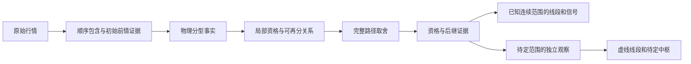

# 旧笔构建 v13：修改结果、原文依据与验证边界

2026-09-15。本轮代码已经修改，并通过 1,178 项 Python 测试、405 项 Node 测试及 22 组历史行情验证。修改依据只来自实际读取的 `D:\缠论`。本轮没有引入新笔规则。

**本轮修复的是已复现的实现缺陷，并为未决取舍建立独立观察范围。不能据此宣称已经实现原文全图唯一划分，或已经证明了不可修改的完成笔判据。** 全图仍有待定连接，下面明确列出这一限制。

## 1. 原文要求与工程实现分开

| 实际读取的出处 | 材料性质与内容 | 本次实现中的对应处理 |
| --- | --- | --- |
| [第 62 课，第 37–61 行](<D:/缠论/chanlun_lesson_corpus/L062_分型、笔与线段(2007-06-30094951).md:37>) | 正文：用三根 K 线的高低价确定顶、底分型 | 初始原始成员归属不同，不再直接等同于价格几何不同；左肩有多个可能结果时，分型必须同时通过检查 |
| [第 62 课，第 64–118 行](<D:/缠论/chanlun_lesson_corpus/L062_分型、笔与线段(2007-06-30094951).md:64>) | 正文：相邻顶底、独立 K 线及包含处理 | 保留旧笔中心序号差至少 4 的坐标表达；待定范围之间不补画连接 |
| [第 65 课，第 31–100 行](<D:/缠论/chanlun_lesson_corpus/L065_再说说分型、笔、线段(2007-07-16221416).md:31>) | 正文：包含须按顺序处理；方向定义有此前不包含 K 线的前提 | 缺少初始前情时保留两种方向的证据；不会指定一个默认方向并称其为原文规则 |
| [第 65 课，第 166–214 行](<D:/缠论/chanlun_lesson_corpus/L065_再说说分型、笔、线段(2007-07-16221416).md:166>) | 正文区分中间已有顶底与转折过小的情形，反对把几笔当成一笔。第 172–175、184–187 行是资料中的注释 | 路径取舍检查覆盖整条前驱链；注释没有作为独立的作者规定 |
| [第 66 课，第 256–280 行](<D:/缠论/chanlun_lesson_corpus/L066_主力资金的食物链(2007-07-30224205).md:256>) | **所附作者回复，不是该课正文**；第 277–280 行明确笔内最高、最低要求 | 保留端点与合并 K 线中心闭区间极值的核验，不为接通而放宽 |
| [第 69 课，第 151–184 行](<D:/缠论/chanlun_lesson_corpus/L069_月线分段与上海大走势分析、预判(2007-08-09.md:151>) | 正文区分暂时取舍与已完成图形；第 160–166 行说明完成后的图形不可修改 | 区分成笔资格、观察到后继和永久完成；未决范围的局部结果只作为条件观察 |
| [第 69 课，第 205–223 行](<D:/缠论/chanlun_lesson_corpus/L069_月线分段与上海大走势分析、预判(2007-08-09.md:205>) | 正文针对该段月线上行，提出完成需要顶分型 | 结束分型是必要条件；没有据此推导“出现一个分型即永久完成” |
| [第 77 课，第 247–295 行](<D:/缠论/chanlun_lesson_corpus/L077_一些概念的再分辨(2007-09-05232401).md:247>) | 正文列出确认分型、同类取舍、连接剩余相邻顶底的步骤 | 分型事实、局部连接关系、当前取舍分别保存；相等候选仍允许在已有条件下重审 |

完整路径保护、状态对象、观察范围、缓存版本都是工程表达，不是作者给出的程序或新的笔定义。第 77 课第 193–196 行是资料注释；第 217 行的字面表述仍按文件保留，没有用外部解释修改。原文摘录、行号和 SHA-256 见 [source_evidence.json](../output/bi_code_review/v13_validation/source_evidence.json)。

## 2. 修改后的数据流



**初始包含。** 原先把成员 K 线列表也放入“几何是否相同”的比较，导致双方已确认的左肩被丢弃。现在价格几何与成员归属分开保存。进一步复核发现，两个不同价格的左肩也可能确认同一个分型，因此新增 `initial_context_alternatives`：左肩候选本身不充当分型中心，首个分型须同时满足各个可能左肩。共同后缀稳定后只继续更新尾部，盘中合并回退仍保留必要前情。

这修复了两类真实遗漏：`SH.600189 / 5m` 的 2025-09-15 09:50 顶 7.40，以及 `SH.600088 / 30m` 的 2025-04-29 14:30 底 16.31。前者的左肩几何相同、成员不同；后者的两个左肩高价分别是 16.46 和 16.45，却都确认同一个底。相关实现见 [cl_kline_process.py](../src/chanlun/core/cl_kline_process.py) 和 [stroke_rules.py](../src/chanlun/core/stroke_rules.py)。

**完整路径取舍。** 活动路径和历史范围的恢复都通过 `_compatible_predecessors`。此前被拒绝的局部连接保留在关系表中，但不会写入已选节点的父链。后来的分型因而不能仅凭相同起点编号，绕过中间已保留的转折。最后一个同价连接点的条件重选仍单独检查。拒绝原因及所需、拟议路径记录在 `rejected_paths`，回滚时与选择状态一起恢复。见 [stroke_sequence.py](../src/chanlun/core/stroke_sequence.py) 和 [stroke_resolver.py](../src/chanlun/core/stroke_resolver.py)。

**完成状态。** 局部连接满足资格、当前路径已有合格后继、原文意义的完成图形，仍是三个不同命题。兼容接口 `is_done()` 表达当前连续范围的承接状态；`completion_is_final` 保持未知，不把它包装成永久完成证明。待接续范围的原始 BI 不写全图确认时间。

**后段持续计算。** 新增 [stroke_observations.py](../src/chanlun/core/stroke_observations.py)。每个未接通范围在内部使用自己的连续序号及后继证据计算线段、中枢。局部投影和确认登记独立；对外线段的 `locked_at` 为空，`selection_pending=True`，中枢不提供正式买卖确认。正式适配器拒绝图表条件观察混入。范围解决或盘中回滚时，对应观察和缓存一起撤销。

图表通过 `get_chart_xds()` 展示这些结果；正式结构继续使用 `get_xds()` 的已知连续输入。待定线段全部保留，避免旧渲染逻辑把它们裁成最后一条。待定中枢独立序列化、使用虚线，并随所属范围变化替换。见 [cl.py](../src/chanlun/core/cl.py)、[strict_chart.py](../src/chanlun/cl_utils/strict_chart.py) 和 [chart_line_states.js](../web/chanlun_chart/cl_app/static/js/chart_line_states.js)。

**不能接通的诊断。** `retained_prefix_has_live_connection=False` 表示：在保留此前端点、历史数据不变的条件下，必要连接关系图中已没有可延续起点。这类情况不能靠一直等新行情解决。该标记只说明既有前缀的限制，不擅自给出新的历史取舍结论；值为 True 也不保证候选必然通过完整取舍。

## 3. 批量与增量的边界

| 场景 | 接口与行为 |
| --- | --- |
| 完整历史快照、更正旧历史、补入前史、截短数据 | `CL.process_klines_batch(frame)` 创建全新分析状态，成功后替换旧实例状态 |
| 追加行情、修改当前末根 K 线 | `CL.process_klines(...)` 或 `process_kline_values(...)` 更新尾部，重审受影响分型与依赖 |
| 已由外层核对历史前缀的行情帧 | `process_validated_incremental_klines(...)` 使用既有验证后的增量入口 |

实时接口会裁去旧日期的数据，**不能用它默默更正历史价格**；更正历史必须使用批量替换。两种处理方式共用分型、局部资格、取舍和证据规则。本次还把初始左肩候选加入来源指纹，防止几何相同但证据已变化时误用旧结果。

分析缓存 schema 已升级为 `chanlun-analysis-cl-v13`，固定规则版本为 `old-source-sequence-v13`，图表快照身份升级到 v6。旧版分析对象不能按新版规则恢复。本轮没有删除原始行情文件，也没有重启运行服务；以下结果来自修改后工作区的验证进程。

## 4. 真实案例


这是保存的真实行情回归案例，不是缠论原文图例。使用同一份 106 根 K 线，截至 2025-09-17 10:20。

`P=1437.15 → A=1446.41 → B=1438.88` 已经进入当前划分。随后出现 `C=1450.67`，其直接重选曾被拒绝；旧代码却在 `D=1431.28` 出现后借助 C 的父链选入 `P→C→D`，使 A、B 消失。新代码保留 P、A、B，把 `C→D` 记录为独立待定连接，B 与 C 之间没有放宽间隔补出一笔。

该处理修复了前后两次判断不一致的问题，**没有声称已经从原文证明这些范围应如何最终接成一条全图笔链**。详细数值见 [short_reversal_case.json](../output/bi_code_review/v13_validation/short_reversal_case.json)；可缩放图见 [SVG](../output/bi_code_review/v13_validation/short_reversal_comparison.svg)。

## 5. 验证结果与实际影响

主样本为 6 个标的 × 1m、5m、30m，共 18 组、146,562 根原始 K 线；行情截至 2026-09-11。另加 4 组已有测试数据，共 22 组、181,895 行。这是各输入文件行数之和，不是去重市场观测数；稀疏的 `SZ.002299_1m` 测试文件不作为完整一分钟行情证明。

| 验证项目 | 结果 |
| --- | --- |
| Python 核心及网页回归 | 1,178 项通过 |
| Node 图表测试 | 405 项通过，0 失败 |
| 笔计算的分块增量 | 722 次调用，22 组最终结果与批量一致 |
| 完整 CL 的分块增量 | 191 次调用，包含条件线段和中枢，结果与批量一致 |
| 上轮实际原始前缀异常 | 57 个时点逐一回放，其中 49 个属于主样本；本版未再出现当时已标承接的笔或已确认线段被移除 |
| 两个短案例逐根冷算与增量 | 43 + 106 = 149 个前缀一致 |
| 初始方向存在歧义的主样本 | 11 组双方共同确认的物理分型均未再遗漏；其中 10 组两种初始方向的最终物理笔一致，另 1 组仍有初始取舍差异 |
| 独立必要条件核验 | 顶底类型、旧笔间隔、区间极值、范围内连续性及可再分关系均通过 |
| 盘中、镜像、缓存 | 包含回退、同价端点恢复、镜像、批量替换、序列化和范围撤销测试通过 |

“57 个时点通过”检验的是 **v13 在同一原始前缀追加一步时是否撤去自己的既有确认结果**，并不表示 v12 的所有历史线条都被原样保留。冻结最终分型序列的扫描另行保存，只用于检查取舍，不冒充逐根真实行情回放。

主样本汇总变化如下。笔候选包括各待定范围内的合法局部连接，不能把总数称为全图已完成笔数。

| 指标 | v12 | v13 |
| --- | ---: | ---: |
| 全部当前笔候选 | 5,233 | 5,583 |
| 已知连续首段内标记有承接的笔 | 1,053 | 295 |
| 正式连续输入计算的线段 | 147 | 48 |
| 图表可展示的线段，含条件观察 | 147 | 755 |
| 单独标记的条件中枢 | 无此通路 | 19 |

候选笔增加了 350 条，同时确认范围缩小。这反映了端点取舍和状态依赖的变化，不能作为“原文最终只应有 295 根完成笔”的裁决。v13 的 18 组主样本共保留 340 个连续观察范围，仍存在连接未决。冻结分型扫描中还有 157 次撤换待定范围内后继关系的事件；它们均不属于首段已确认输入的回撤，也说明条件观察仍会修订。

本轮没有把“待定”当成全图划分问题的最终答案。尚需原文依据支持的工作，是给这些连接未决处建立可验证的历史取舍规则，以及证明哪些承接证据足以代表原文的已完成图形。不能通过强行拼接、放宽旧笔距离、跨过区间极值或给后段强加完成状态来掩盖这一缺口。

## 6. 复核入口

- [生产代码与来源哈希、验证汇总](../output/bi_code_review/v13_validation/verification.json)
- [22 组标的前后对照](../output/bi_code_review/v13_validation/summary.json)
- [57 个实际前缀事件回放](../output/bi_code_review/v13_validation/prior_event_replay.json)
- [Python 测试结果](../output/bi_code_review/v13_validation/pytest.xml)、[Node 测试结果](../output/bi_code_review/v13_validation/node.xml)
- [新增真实案例回归测试](../tests/core/test_stroke_real_market_v13.py)、[案例数据来源清单](../tests/fixtures/stroke_v13/manifest.json)
- [可重复验证脚本](../script/verify_stroke_refactor_v13.py)、[行情对照图脚本](../script/render_stroke_refactor_v13.py)
- [修改前备份](../output/bi_code_review/v13_before/source.zip)、[已备份文件的本轮差异](../output/bi_code_review/v13_validation/changes_from_v12.patch)；新增模块和脚本直接见上面的源文件链接

复现命令：

```powershell
python -X utf8 script/verify_stroke_refactor_v13.py --source-root 'D:\缠论'
python -X utf8 -m pytest tests/core tests/web -q
$testFiles = (Get-ChildItem -LiteralPath web/chanlun_chart/cl_app/static/js/__tests__ -File -Filter '*.test.js').FullName
node --test $testFiles
```
