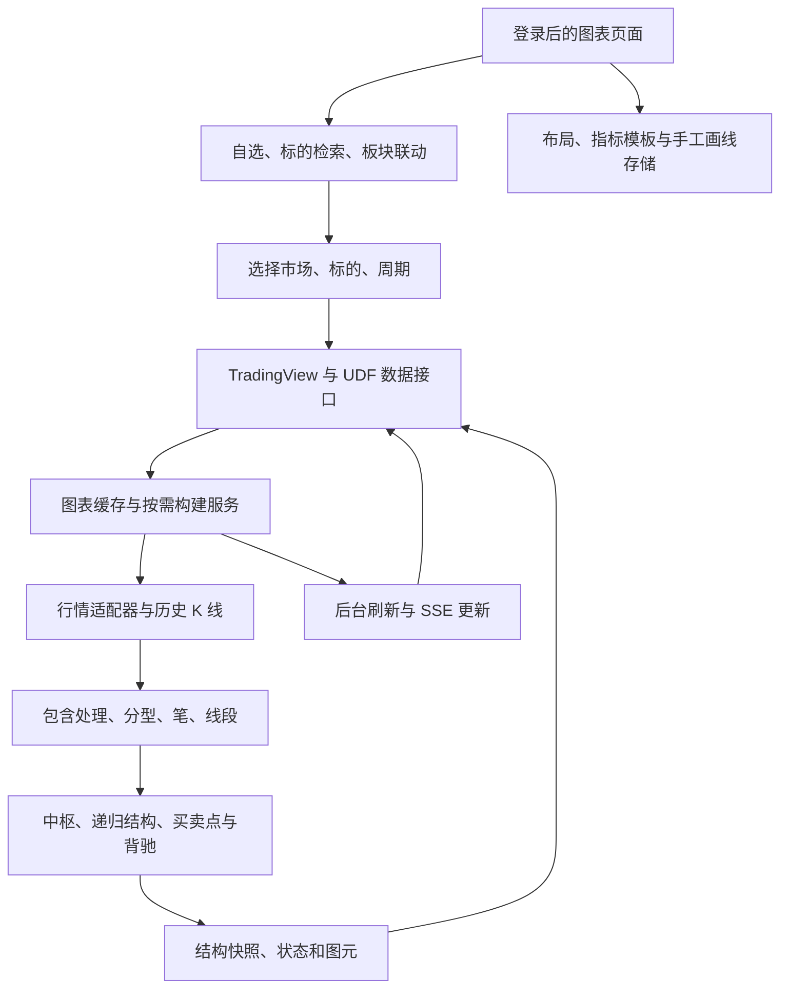

当前系统功能说明，对应 2026-09-12 在 `aee14d1d` 基础上清理并恢复必要图表分析功能后的代码。

当前实现的主要用途是多市场行情查看、当前 K 线周期的缠论基础结构分析、自选管理与个人图表工作区。本文以已注册页面和接口、实际调用关系、数据模型及配置为依据；历史需求、旧注释和仍存在的字段名不作为功能已经实现的证据。

本次核对涵盖 Web 入口、TradingView 前端与 UDF 数据传输、K 线与结构算法、行情适配器、数据库、缓存和部署脚本。文中的“已实现”表示存在连通的代码路径，不表示本次已经对所有市场、标的、周期进行了实盘验证，也不构成对中枢划分理论正确性的证明。

用户的主要操作链路是：登录 → 从自选、代码检索或板块选择标的 → 打开一个或多个周期图表 → 查看 K 线、分型、笔、线段、各结构级别中枢、买卖点和背驰 → 添加指标或手工画线 → 保存工作区。

用户能够接触的主要功能如下。

| 功能 | 当前实现 | 使用边界 |
| --- | --- | --- |
| 登录与会话 | 配置式命名账号登录、退出、会话查询、记住登录 | 没有用户注册或账号管理后台 |
| K 线图表 | 按市场、标的、周期加载行情，向左查看历史 | 周期、历史长度和行情新鲜度取决于适配器及数据权限 |
| 图表布局 | 单图、上下双图、左右双图、上下 7:3、三图、四图 | 多图各自计算本周期结构 |
| 基础结构 | 分型、笔、线段，区分形成中、已形成、已锁定 | 默认隐藏分型；图上的分型来自笔端点 |
| 中枢 | 本周期线段中枢、递归高层中枢，按级别开关，区间框、编号、上下界和状态 | 高层级来自当前行情的递归结构，不直接等同于另一个 K 线周期 |
| 买卖点 | 一、二、三买与一、二、三卖各有开关，也可按级别开关 | 确认点与待确认观察点分开标注；三类点触边不成立 |
| 背驰 | 盘整背驰、趋势背驰按级别独立开关 | 使用结构关系和 MACD 力度证据，不以普通指标背离代替 |
| 笔类中枢观察 | 独立开关，较浅图框标记笔级观察区间 | 不作为正式线段中枢或交易信号发布 |
| 技术指标 | TradingView 指标能力及 16 个已注册自定义指标 | 指标名称中的“背离”“趋势”不代表缠论背驰或走势类型引擎 |
| MACD 区间统计 | 手选区间，对比柱面积、峰谷、DIF/DEA 极值等 | 属于人工观察工具，不自动给出结构背驰或交易结论 |
| 手工分析 | 画线、矩形、颜色快捷工具、独立周期画线 | 手工图形和自动结构分开管理 |
| 自选 | 跨市场分组、添加与移除、排序、标色、文本导入导出 | 自选目前系统共享；“我的持仓”为手工分组 |
| 标的目录 | 代码、名称、拼音首字母检索，分页或一次返回当前目录 | 默认目录范围有限，界面“全市场检索”不等于已加载全市场 |
| A 股板块 | 行业、概念列表，成员选择与切图 | 读取本地目录；成员超过 20 个的板块请求会被拒绝 |
| 手动缓存 | 显式代码的小范围后台预热、进度查询、取消 | 默认最多 12 个，可显式提高到 20 个；与选股任务分开 |
| 缠论选股 | 行情源 A 股股票池或指定股票、5m 买卖点与 1m 区间套确认、逐候选复核、结果导出 | 手动启动，后台运行；显示实际交易所覆盖、进度与结果时效 |
| 显示配置 | 图层开关、市场通用或标的专用显示设置、配置导出与重置 | 不能通过页面调整结构算法 |
| 系统设置 | 行情请求代理的 Host、Port | 不提供券商账户、策略和风险参数管理 |
| 运行维护 | 启动、重启、进程守护、健康检查、版本校验、QMT 与 FRP 辅助维护 | 运维能力与交易分析页面分开 |

主图默认使用单图布局；保存的个人布局可以覆盖初始默认值。默认显示笔、线段、本级中枢、本级买卖点和背驰，分型、笔类中枢观察与高层结构由用户按需开启。显示开关保存在个人账号下，并按窗口和周期区分。页面不自动添加 MACD 副图，已保存或主动添加的指标仍可使用。1m 图初始视口偏向展示已加载的完整历史。

右栏显示当前标的与周期、已加载 K 线数、笔数、线段数、中枢数；中枢表按 `Z1、Z2…` 列出已成立区间，按 `P1、P2…` 列出形成中区间。已有中枢的未确认延伸和回试状态归入原中枢，不重复计数。右栏还提供图层开关、自选、标的检索、手动缓存和 A 股板块联动。主题、侧栏宽度和收起状态可以保存。多图布局和多周期对照属于看图能力，各图之间不存在自动的递归结构装配。

笔与线段的绘图有状态约定：形成中的尾部使用虚线；已形成但尚未锁定的线段、已锁定结构使用实线。因此，实线本身不足以证明线段已锁定。正式中枢计算还会检查底层线段的锁定状态。实现见 [图元序列化](D:/project/chanlun-pro/src/chanlun/cl_utils/tv_chart.py) 与 [线条状态处理](D:/project/chanlun-pro/web/chanlun_chart/cl_app/static/js/chart_line_states.js)。

缠论基础结构的计算入口是 [CL](D:/project/chanlun-pro/src/chanlun/core/cl.py)，生产规则集中在 [base_profile.py](D:/project/chanlun-pro/src/chanlun/core/strict_structure/base_profile.py)。流程是行情时间与价格口径校验 → 原始 K 线处理 → 包含关系处理 → 分型与笔 → 特征序列线段 → 本级中枢 → 已完成低层结构递归与信号证据。MACD 用于背驰力度比较，背驰边界证据可参与后续中枢与结构划分。

笔采用固定的分型距离、价格关系、同类端点替换与后续证据锁定规则；线段采用特征序列，并处理特征序列缺口和第二特征序列确认。生产配置包含这些规则的确定性版本，`CL` 会拒绝不受支持的算法参数或对固定规则的修改。页面中的“结构显示设置”只控制展示。

中枢成立使用五个连续、交替且已锁定的物理角色：进入段、三段核心、独立离开段。进入向上时，五段方向为“上｜下、上、下｜上”；进入向下时，为“下｜上、下、上｜下”。这里的方向来自线段序列，当前代码没有先构造完整上涨或下跌走势类型再反向选择中枢。

设三段核心的价格范围分别为 `[L1,H1]`、`[L2,H2]`、`[L3,H3]`，则 `ZD=max(L1,L2,L3)`，`ZG=min(H1,H2,H3)`。成立要求 `ZD<ZG`，只在一点相交不够。进入段和离开段分别需要与核心产生正宽度重叠；离开段的终点还必须沿离开方向越过核心边界。进入、核心、离开使用不同实体，进入和离开不混入三段核心区间。实现见 [establish_center](D:/project/chanlun-pro/src/chanlun/core/strict_structure/center_machine.py)。

中枢成立后还有独立的生命周期，而非成立即结束。

| 状态或后续情况 | 当前行为 |
| --- | --- |
| 已有五个成立角色，后续尚未确认脱离 | 保持 `ongoing`，继续观察离开与回试 |
| 离开后返回核心 | 将失败的离开及回试纳入延伸处理，保留核心上下界 |
| 向上离开，首次反向回试的最低价严格大于 `ZG` | 确认向上结束证据，内部对应三买几何条件 |
| 向下离开，首次反向回试的最高价严格小于 `ZD` | 确认向下结束证据，内部对应三卖几何条件 |
| 回试最低价等于 `ZG`，或最高价等于 `ZD` | 不构成三类确认 |
| 当前延续几何不能继续，后面成立了核心严格分离的已锁定中枢 | 可转为 `superseded`，保留桥接证据与后继中枢身份 |
| 已有进入段与三段重叠核心，尚无独立离开段 | 发布“形成中 / 待离开段”的虚线框，尚不成立正式中枢 |
| 五个角色已具备，但仍有未锁定线段 | 发布“形成中 / 待线段确认”的虚线框，不生成已确认三类点 |
| 已成立中枢受未锁定尾部影响 | 保留正式框；只将超出原框的未确认延伸画为虚线，回试状态关联原中枢 |

中枢表相应显示“延伸 / 观察”“已结束”“后继中枢已成立”。后继中枢成立与三类确认是不同的结束路径；两者也都不能自动推出某个本级别走势类型已经结束。代码区分成立离开段、后续离开证据与图框横向终点，避免简单把最后观察到的线段都塞入核心矩形。价格比较使用整数最小单位；结构还携带价格基准、实体身份、发生时间和证据可用时间。[生命周期状态机](D:/project/chanlun-pro/src/chanlun/core/strict_structure/center_machine.py)、[触边判定](D:/project/chanlun-pro/src/chanlun/core/strict_structure/center_geometry.py)、[图框角色](D:/project/chanlun-pro/src/chanlun/core/strict_structure/center_frame.py)。

中枢扫描按时间顺序寻找满足条件的五段种子，再沿当前中枢推进；结束后继续扫描后继中枢。它使用一条确定的扫描与归属规则，没有对全部合法划分进行全局评分，因此不能把当前输出描述成已经证明了“最利于观察”的最优划分。内部的候选预览仍有尾部观察用途，已删除的未完成走势多方案分析产品没有因此恢复。

图框的右边界跟随当前有效离开段的起点；没有当前离开段时跟随已归属本体末端。最初离开尝试若已失败，其历史身份仍保留，但不能再用它裁掉之后的已确认延伸。最终离开方向与进入方向相反，也不触发这种裁剪。形成中预览使用相同的边界规则。

图表通过 `get_strict_evidence()` 与 `build_center_snapshot()` 发布已成立结构及其信号。L0 以当前 K 线构造的线段为原料；更高层以已完成低层结构为原料递归。菜单只列出本次数据实际产生的层级。

图层中的 `center_previews` 只发布状态机已选定的未确认结构及原中枢延伸，复用各级中枢显示开关。触点交集、只有一两段核心的观察片段不画中枢矩形。2026-09-12 的覆盖核对包含 600088、600189、600519、000001、002299、601059 的 1m、5m、30m，共 18 组、148,296 根 K 线和 1,041 条线段，并逐组完成真实页面绘图坐标验证。这证明该批样本的发布和绘图链路连通；涉及前后中枢边界段复用、背驰分界附近的归属仍需规则确认。

| 所选 K 线 | 中枢原料 | 发布的中枢层 |
| --- | --- | --- |
| 1m | 1m K 线构造的线段 | 本级及数据支持的 L1、L2 等递归层 |
| 5m | 5m K 线构造的线段 | 本级及数据支持的 L1、L2 等递归层 |
| 30m | 30m K 线构造的线段 | 本级及数据支持的 L1、L2 等递归层 |
| 日、周等受支持周期 | 对应周期 K 线构造的线段 | 本级及数据支持的递归层 |

递归层级不与固定分钟数一一对应，因此菜单使用“本级、L1 高1级”等标签，不把 1m 数据内的 L1 自动标为 5m。内部低层结构装配、同级别组合、背驰与小转大证据服务于中枢及买卖点计算；页面不恢复走势类型、多方案结合律、研究审计或回测产品。中枢、信号均携带可用时间及价格口径，超过当前数据截止时间的证据不会发布。选股也使用这套证据。实现见 [结构入口](D:/project/chanlun-pro/src/chanlun/core/cl.py)、[信号规则](D:/project/chanlun-pro/src/chanlun/core/strict_structure/signals.py)、[正式快照输出](D:/project/chanlun-pro/src/chanlun/cl_utils/strict_chart.py)。

MACD 默认参数为 12、26、9。后端还计算第一档更高周期的因果 MACD：`1m→5m`、`5m→30m`、`30m→日`、`日→周`、`周→月`、`月→年`；没有映射的周期不具备这条高周期链。高周期值从当前输入行情按时间桶构造，未完成桶只使用当时已知收盘，图表显示通过对齐后的序列完成。这个映射服务于指标，不会产生相应高周期中枢。

当前注册的 16 个自定义指标由 [getCustomIndicators](D:/project/chanlun-pro/web/chanlun_chart/cl_app/static/js/charts.js) 明确列出。

| 指标类别 | 名称 |
| --- | --- |
| 后端计算指标 | MACD_HTF |
| 均线和通道 | AMA 自适应移动均线、MA 均线、VegasMA+BOLL、ATR 价格区间 |
| 摆动和量能 | KDJ 随机指标、成交量 |
| 其他公式指标 | 抄底必备、超买超卖、发财线、海底捞月、黑马、弘历背离王、弘历飞天线、龙头趋势、MACD 背离版+金死叉 |

MACD 区间统计支持在工具栏或右键菜单选择起点、终点，统计本周期及可用高周期的红绿柱面积、净面积、峰谷、DIF/DEA 极值和斜率，保留当前工具实例最近 5 个对照快照。它没有连接到持久化背驰事件、买卖点、提醒或交易执行模块。[区间统计实现](D:/project/chanlun-pro/web/chanlun_chart/cl_app/static/js/macd_stats.js)。

行情层抽象了八类市场。下表中的“当前选择”来自本地配置中的非敏感字段，只说明配置选择；本次没有逐一登录供应商并验证全部市场的数据权限。

| 市场 | 当前配置选择 | 工厂中保留的适配器选择 |
| --- | --- | --- |
| A 股 | QMT | QMT、通达信、富途、BaoStock、数据库、长桥、盈立 |
| 港股 | 盈立 uSMART | 盈立、通达信港股、富途、长桥、数据库 |
| 美股 | 盈立 uSMART；历史源配置为长桥 | 盈立、长桥 |
| 国内期货 | 通达信期货 | 通达信期货、天勤、数据库 |
| 纽约期货 | 通达信纽约期货 | 通达信纽约期货、数据库 |
| 外汇 | 通达信外汇 | 通达信外汇、数据库 |
| 数字货币合约 | Binance | Binance、数据库 |
| 数字货币现货 | Binance Spot | Binance Spot、数据库 |

支持的周期由每个适配器返回。全局周期映射包含秒、分钟、小时、日、周、月、季、年等名称，不能据此推断每个数据源都支持每一种周期。QMT 等客户端、可选 SDK、网络与行情授权仍是对应市场的运行前提。工厂通过每市场共享实例和初始化锁避免重复建连。[行情适配器工厂](D:/project/chanlun-pro/src/chanlun/exchange/__init__.py)。

美股的实时 Tick 与历史 K 线可能来自不同后端：当前盈立实例按 `US_HISTORY_KLINE_SOURCE` 选择历史源；长桥所需凭据不完整、周期不支持或请求并非适用复权类型时，会走盈立原生历史路径。最终行情元数据用于标记实际提供者和价格基准，不能仅凭配置名判断某次图表使用的具体来源。[历史后端选择](D:/project/chanlun-pro/src/chanlun/exchange/exchange_usmart.py)。

行情预处理包括价格精度与复权口径、重复记录和时间顺序、已闭合 K 线边界、交易时段、分钟线开盘/收盘标签、跨市场显示时区，以及增量合并时的数据口径一致性。美股图使用纽约时区；A 股、港股等使用配置的市场时区。QMT 会检查本地历史覆盖并补取缺口，境外历史源保留闭市历史缓存和请求退避。不同来源、复权或时间标签的历史不能直接拼成一条结构链。

报价有两条主要消费路径：自选通过 `POST /ticks` 分市场批量刷新；TradingView 通过 `GET /tv/quotes` 获取标准报价字段。自选正常约 3 秒轮询，市场闭市延长到约 5 分钟；失败按 6、12、24、30 秒退避，前端同时最多发出两批报价请求。页面不可见或面板暂停时会停止相应轮询。

供应商返回价格但缺少涨跌幅时，`/ticks` 保留价格并返回 `rate: null`，选股工作台显示“涨跌幅暂缺”，真实的零涨跌仍显示 0%。工作台各市场行情独立更新，并标注接收时间，慢行情源不阻挡已经返回的市场。`/tv/quotes` 仍有 `float(rate or 0)` 处理，且昨收由最新价和涨跌幅反推，所以 TradingView 报价接口尚不能保证缺失涨跌幅不会显示为零。[自选报价](D:/project/chanlun-pro/web/chanlun_chart/cl_app/blueprints/other.py)、[TradingView 报价](D:/project/chanlun-pro/web/chanlun_chart/cl_app/blueprints/tv.py)。

自选内置“我的关注”“我的持仓”，支持添加和删除其他分组、跨市场成员、置顶或置底、标色、添加和移除标的。分组操作按市场加代码识别成员。“我的持仓”仅是手工维护的名单，没有数量、成本、盈亏、券商持仓同步或下单能力。文本导出为逐行 `代码,名称`；导入要求 UTF-8，单文件最多 1 MB、单次最多 20 个显式代码，按当前市场合并已有记录。该导出格式没有显式市场列，不能把跨市场分组导入导出视作完整无损备份契约。

系统有多账号工作区，但不同数据的隔离范围并不相同。

| 数据 | 归属与保存方式 |
| --- | --- |
| TradingView 布局、指标模板、手工画线 | 由登录用户推导存储身份，按账号隔离 |
| 主题、市场、各窗口周期、侧栏宽度、前端图层开关 | 个人偏好 API 保存；图层开关可按窗口和周期区分 |
| 自选分组和成员 | 全局共享；数据库明细没有用户归属字段 |
| 市场通用或标的专用的后端显示配置 | 按市场与代码保存，系统共享 |
| 网络代理、行情适配器、行情与结构缓存 | 系统共享 |

前端图层偏好与后端显示配置属于两套存储：前者是个人工作区状态，后者只保留 `config_use_type`、分型、笔、线段的显示字段。它们都不提供另一套中枢算法。账号工作区隔离不应被解释成所有业务数据已完整按用户隔离。[账号偏好](D:/project/chanlun-pro/web/chanlun_chart/cl_app/services/account_preferences.py)、[自选模型](D:/project/chanlun-pro/src/chanlun/db_models/zixuan.py)、[显示配置](D:/project/chanlun-pro/src/chanlun/cl_utils/chart_config.py)。

标的检索支持精确代码、名称和拼音首字母；列表接口默认每页 50 个、最多 500 个，`all=1` 返回当前已加载目录。普通启动默认采用有限目录，A 股内置 12 个显式代码；全量身份目录刷新需另行配置开启。A 股精确代码查询可以单独向数据源解析并打开目录外标的，不会为了一个代码展开全市场。故“能按代码打开”与“名称检索覆盖全部证券”是不同能力。[目录服务](D:/project/chanlun-pro/web/chanlun_chart/cl_app/services/stock_list.py)、[检索接口](D:/project/chanlun-pro/web/chanlun_chart/cl_app/blueprints/tv.py)。

A 股行业、概念关系读取数据目录下的 `json/new_stocks_bkgn.json`，没有该文件时读取随代码提供的目录。本功能没有自动保证成分股为最新名单。`/a/bkgn_codes` 会将整个成员列表交给 20 个代码的范围限制，超过后直接返回错误；许多常见行业和概念因此无法完整展开。这是当前业务接口的实际限制。[板块数据读取](D:/project/chanlun-pro/src/chanlun/exchange/stocks_bkgn.py)、[成员数量限制](D:/project/chanlun-pro/web/chanlun_chart/cl_app/blueprints/bkgn.py)。

页面“缓存指定标的”仍有完整入口：填写代码 → 确认本次列表 → 后台计算 → 查看进度或取消。默认最多 12 个，可显式增加到 20 个，拒绝 `all/*` 和自动展开市场；默认缓存 30m、5m、1m，周期可由环境配置。它复用图表计算与缓存，不产生排名、买卖点或选股结果；默认不会在启动时自动运行。[手动预热](D:/project/chanlun-pro/web/chanlun_chart/cl_app/blueprints/symbols.py)。

图表请求的主要路径是 `GET /tv/history` → 内存/磁盘图表缓存 → 行情取数 → 结构实例计算 → 图表序列化。首次缺少结构结果时，后端可以先返回 K 线与基础指标，再由有界后台队列完成结构。前端以 100 毫秒逐步退避至 1 秒的间隔查询 `/tv/structure-status`；完成后优先应用仅含结构及指标的补丁，补丁与对应构建编号和行情边界一致才接收，避免切换标的后安装旧请求结果。

当前前端允许 K 线先显示，结构以状态提示随后补齐。结构快照会校验版本、周期、数据截止时间、价格基准和实体角色；实时更新按实体身份协调增删，手工画线独立保存。SSE 开启时，共享订阅刷新同一图表，断开后支持恢复和必要的历史补齐；当前本地配置开启 SSE，刷新间隔为 8 秒。刷新间隔是调度节奏，并非供应商数据延迟保证。

缓存与更新可分为以下情形。

| 行情变化 | 当前计算行为 |
| --- | --- |
| 当前已闭合行情与已发布结果完全相同 | 校验指纹后直接复用图表结果，避免再次处理结构与序列化 |
| 历史前缀相同，只改变尾部或增加 K 线 | 复用 CL 实例，进入已验证前缀的增量路径 |
| 补入更早历史、历史被修订、前缀不一致、价格基准或时间口径变化 | 使用新的结构实例重新计算 |
| 完整缓存可用但需要刷新 | 适用条件下先提供缓存，同时后台重验证，再推送更新 |
| 数据源确认无数据或暂时失败 | 分别使用约 300 秒或 30 秒负缓存，减少重复外部请求 |

图表内存缓存采用容量和时效限制，代码默认估算容量 768 MiB、条目上限 1024、驻留 TTL 12 小时，可由环境变量覆盖；新鲜度另行校验，驻留 12 小时不表示可以把 12 小时前的数据当最新行情。磁盘快照异步原子写入，默认对超过 7 天的图表文件进行机会式回收。缓存身份包含市场、标的、周期、计算与数据源版本等，旧算法快照不会仅因为文件存在而自动成为当前结果。

并发控制包括每图表计算锁、首次结构构建的 2 个 worker 与 16 个排队名额、全量重算最多 2 个并发、后台重验证最多 4 个在途尝试。静态资源、普通 HTTP、健康检查与 SSE 刷新使用不同处理路径，避免大图表或慢行情占满所有请求能力。磁盘读写及大结果称重尽量避开全局缓存锁。相关代码位于 [chart_cache.py](D:/project/chanlun-pro/web/chanlun_chart/cl_app/services/chart_cache.py)、[chart_initial_build.py](D:/project/chanlun-pro/web/chanlun_chart/cl_app/services/chart_initial_build.py)、[kline_recompute.py](D:/project/chanlun-pro/web/chanlun_chart/cl_app/services/kline_recompute.py)。

行情不变时复用完整图表结果和结构证据。行情变化后复用基础结构实例，并清除受影响的整结果备忘；实例内有界中枢前缀缓存可跨更新复用，递归与信号模块再处理当前证据。显示开关只协调已有图元，不发起重新计算。此机制不能等同于永久冻结全部历史：补历史、价格口径变化或历史修订仍可能需要重新计算。

需要区分三种图表结果：K 线仍在等待，属于行情加载；K 线已有而结构处于 `strict_structure_pending`，属于后台结构构建；结构计算成功但中枢数量为 0，表示当前已加载区间没有通过完整条件的正式中枢。价格元数据或结构证据校验失败时，会返回结构不可用和错误原因，K 线可继续保留。不能仅凭没有框，判断算法认定了没有中枢。

数据库支持 SQLite 与 MySQL，当前本地配置选择 MySQL。主要保存 K 线表、键值缓存、自选分组与成员，以及图表工作区记录；文件缓存另存行情和图表快照，当前配置的数据根目录为 `D:/chanlun_pro`。原始行情、用户状态与可再生图表缓存生命周期不同，不应在维护时混为同一类临时数据。缓存模块中的过期淘汰属于运行机制，已删除的独立“清理工具”功能没有因此恢复。

主要页面和业务接口如下，业务接口通常要求登录，写请求还受 CSRF 保护。

| 业务 | 方法与路径 | 用途 |
| --- | --- | --- |
| 登录、会话 | `GET/POST /login`；`POST /logout`；`GET /api/session` | 登录、退出、获取当前账号与请求令牌 |
| 个人偏好 | `GET/PUT /api/chart/preferences` | 读取与更新图表工作区偏好 |
| 主图 | `GET /` | 图表与侧栏 |
| 图表行情 | `GET /tv/config`、`/tv/symbols`、`/tv/search`、`/tv/history`、`/tv/quotes`、`/tv/time` | UDF 能力、标的解析、搜索、历史、报价、时间 |
| 首次结构 | `GET /tv/structure-status` | 查询已经打开的图表构建；查询自身不启动构建 |
| 实时推送 | `/tv/stream`、`/tv/stream/close` | SSE 订阅与关闭；受启用开关控制 |
| 图表持久化 | `/tv/<api_revision>/charts`、`study_templates`、`drawings` | 布局与模板增查删、画线读取保存 |
| 自选读取 | `/get_zixuan_groups/<market>`、`/get_zixuan_stocks/<market>/<group_name>`、`/get_stock_zixuan/<market>/<code>` | 分组、成员、当前标的归组 |
| 自选管理 | `/zixuan_group/<market>`；`POST /opt_zixuan_group/<market>`、`/set_stock_zixuan` | 管理页面、分组与成员操作 |
| 自选导入导出 | `GET /zixuan_opt_export`；`POST /zixuan_opt_import` | 文本名单交换 |
| 自选报价 | `POST /ticks` | 按市场批量报价 |
| 标的目录 | `GET /symbols`、`/symbols/list` | 目录页面、过滤及分页 |
| 指定标的缓存 | `POST /symbols/prewarm`；`GET /symbols/prewarm/status`；`POST /symbols/prewarm/cancel` | 显式小范围后台缓存与进度 |
| 板块 | `GET /a/bkgn_list`；`POST /a/bkgn_codes` | A 股行业、概念与成员 |
| 显示配置 | `GET /get_cl_config/<market>/<code>`、`/export_cl_config`；`POST /set_cl_config`、`/reset_cl_config` | 读取、导出、保存、重置展示配置 |
| 系统设置 | `GET /setting`；`POST /setting/save` | 网络代理 |
| 健康 | `GET /livez`、`/healthz`、`/readyz?market=a` | 进程存活、轻量状态、已监控市场依赖就绪 |

运行采用 Flask 业务应用与 Tornado 服务容器，静态资源和 SSE 使用 Tornado 原生路由。空任务页、业务调度器及专用依赖已删除。图表后台构建、行情预加载、缓存写盘与 SSE 使用各自有界的运行组件。登录使用密码哈希、登录频率限制及 Cookie 会话；账号从配置读取，修改密码会改变会话身份。没有额外的角色权限后台、订单系统或消息通知服务。

`windows_run.bat` 调用 `ops/restart_web.ps1`；启动脚本执行环境和导入预检、识别本项目进程、启动服务并验证就绪状态。`ops/verify_deploy.ps1` 比对运行进程和代码身份；`watch_web.ps1` 及安装脚本管理 Web 守护；`manage_qmt_runtime.ps1` 管理明确配置的 QMT 客户端；FRP 脚本提供可选的网络隧道维护。这些是运行支持，不构成证券账户交易能力。

`/livez` 与 `/healthz` 主要报告进程状态，`/readyz` 检查已配置监控市场的元数据、当前目录、报价依赖，以及由 Web 入口启动的图表运行组件。就绪状态的范围为进程运行依赖，不证明每个标的都能返回足够历史，更不证明全部中枢划分正确。

代码的职责分布如下。

| 目录或文件 | 职责 |
| --- | --- |
| `src/chanlun/core` | K 线处理、分型、笔、线段、本周期与高周期 MACD |
| `src/chanlun/core/strict_structure` | 中枢状态机、递归结构、力度比较、背驰与买卖点证据、身份及复用 |
| `src/chanlun/cl_utils` | 展示配置、价格元数据校验、图表运行时、快照序列化 |
| `src/chanlun/exchange` | 市场适配器、价格与时间口径、交易时段、行情缓存及板块目录 |
| `src/chanlun/persistence`、`db_models`、`file_db_mixins` | 数据库、模型、文件缓存和原子落盘 |
| `src/chanlun/zixuan.py` | 共享自选组和成员操作 |
| `web/chanlun_chart/app.py`、`cl_app/__init__.py` | Web 容器、应用工厂、登录、生命周期、健康与蓝图注册 |
| `web/chanlun_chart/cl_app/blueprints` | 图表、自选、目录、配置、板块、报价等业务接口 |
| `web/chanlun_chart/cl_app/services` | 图表缓存、构建、重验证、账号偏好、实时更新和依赖就绪 |
| `web/chanlun_chart/cl_app/templates`、`static/js` | 页面、TradingView 集成、结构绘制、菜单与指标 |
| `web/chanlun_chart/cl_app/static/datafeeds/udf/src` | TypeScript 行情协议、历史窗口、补丁与增量数据处理 |
| `ops`、启动脚本、`check_env.py` | 安装、进程与依赖维护、部署校验 |
| `tests`、前端测试目录、`.github/workflows` | 当前能力回归测试、构建和持续集成检查 |
| `src/xtquant`、`package` | QMT 第三方 SDK 和按 Python 版本选用的本地依赖包 |

工程层保留 Python 与 JavaScript 回归测试、TypeScript 数据传输构建、Ruff 检查、Poetry 依赖锁定，以及 CI 中的测试、依赖审计、凭据扫描和 CodeQL 配置。测试涵盖结构边界、行情时间与价格口径、缓存并发、页面更新、账号与自选存储、部署流程等。本次恢复后，Python 测试 1270 项通过、2 项跳过，JavaScript 测试 361 项通过；Ruff、启动预检、重启与就绪校验通过。600088 的 1m、5m、30m 实际浏览器图表通过加载检查；五组开关、独立周期画线模式及账号偏好的刷新保存也已验证。

研究审计、模拟与回测、走势类型展示、混合级别分解页面、结合律主划分择优、未完成走势多方案、通知、订单和账户持仓接口，均不属于当前连通的产品功能。电子书、资料转换、原文处理检索及独立清理工具也已移除。`audit/chanlun_lesson_corpus` 原文资料目录仍存在，运行中的应用没有对应的处理或检索入口。

## 手动缠论选股

入口为图表侧栏的“缠论选股工作台”或 `/screening`。旧地址 `/decision-support/early-screening`、`/early-screening` 也进入完整工作台。已移除独立任务页和重复结果表；旧地址 `/screening/tasks`、`/xuangu/task_list/a` 重定向到 `/screening`。开始或重新选股、取消、进度和折叠的条件设置均位于主页面。支持扫描行情源 A 股股票池或最多 100 个明确代码，排除指数、ETF 和 B 股，默认排除名称带 ST 或退市标识的股票。数据诊断列出实际覆盖的交易所和股票数，不把 QMT 当前未提供的市场算作已扫描。使用 QMT 行情和图表相同的复权元数据、分型、笔、线段、中枢及买卖点计算。

工作台恢复板块雷达、买卖点与关注队列、代码/名称/板块搜索、市场/周期/六类点/结构状态/复核状态过滤、人工关注及持仓分组、跨市场最新行情、个股风险与结构证据、单/双/三/四图联动、影院模式、人工确认清单及复核笔记。默认单周期图；同市场同布局切换标的复用现有图表，布局变化才重新载入。“人工复核选股”原来只跳转到当前标的的复核区域，已移除这一重复页签，保留个股分析中的人工复核入口；不另生成一套选股结果。访问工作台或刷新结果不会启动扫描。

工作台固定展示最新一轮选股结果，移除“结果来源”、历史任务列表和旧版选股快照查询。新任务出现后，候选、统计和图表同步切换；暂无候选或任务失败时显示该任务的进度、空列表或错误，不回退显示旧批次。后台保留批次标识以关联当前证据与人工复核，旧批次复核不会混入新结果。板块当前候选数来自所选任务，行业目录和结构强弱来自保留的 QMT GICS 快照并显示原日期，不宣称板块已经按当前算法重算。通知与监听历史按原日期恢复展示，外部自动通知未重新开启。

候选默认打开“当前行情”图表；切换到“本次筛选证据”后固定任务、标的、物理周期及买点 ID，行情、分型、笔、线段、MACD、中枢和点均从同次存档读取，不用新算法重建旧图。支持缩放、平移、按层显示、开关和悬停编号。切回“当前行情”后恢复独立周期、单/双/三/四图和原画图工作台；人工关注标的直接使用当前行情。新记录保存行情和快照的 SHA-256，读取时检查实际内容；旧记录没有完整笔、线段或原始指纹时明确说明缺失，不补画另一版本的结构。

人工复核覆盖中枢、走势、级别、买卖点、分解方法、扩展、九段升级、1m 区间套、处置及笔记；结果写入数据目录 `screening/manual_reviews.sqlite3`。记录按登录用户、固定任务来源与实际候选 ID 隔离，刷新和服务重启后保留；服务校验候选归属，人工判断不改变算法结果。关注组只表示人工范围，不伪装成正式信号。

默认策略为 `5m_with_1m_confirmation`：只以 5m 原生线段的一、二、三类买卖点作为主信号，在同一标的的 1m 原生结构中核对对应区间。两周期统一截止在最新完整 5m K 线，价格基准必须一致；1m 不使用更晚的行情，不单独发布为选股结果。没有合格 5m 候选时跳过 1m 计算。最近信号窗口默认为 5 个交易日，拐点窗口为 20 个交易日，买后涨幅／卖后跌幅上限为 10%。买点之后创新低或卖点之后创新高即排除；三类点触及中枢边界、一二类点越过失效边界、之后出现同级确认反向点也会排除。价格量化与图表统一使用 HALF_UP。

选股默认输出一买、二买、三买、一卖、二卖、三卖。区间套一类点取 5m 末中枢离开比较区间 c，要求该区间内 1m 同向一类点及趋势背驰，并匹配末端同一价格转折；盘整背驰不能代替。二、三类点取 5m 首次回试段，接受价格拐点位于回试区间内的同向 1m 一、二、三类买卖点；不要求两个周期的拐点同价、同一根 5m K 线，1m 中枢及父点等历史依赖可以早于回试起点。1m 信号仍须通过自身语义、有效性与独立回放核验，区间外、反向或失效的点不能确认。5m 与 1m 均确认才作为正式候选；5m 未确认或尚缺 1m 确认则列为“形成与等待”，组合状态与不可变的图表点状态分别保存。1m 数据错误、价格基准不一致、回放失败不会退化成等待结果。

候选同时保存 5m 与 1m 的行情、结构及关联证据。证据图可切换这两个周期，继续使用结构解盘的同一个图表组件。页面周期选项固定按 1m、5m、30m、日线排列，切换布局、图内周期或刷新结果都不改变选项顺序。选中状态同步当前图表周期，多图时对应第一张图；完整图表链接保留所有图的实际周期。1m 用于区间套确认、5m 用于主买卖点、30m 与日线用于背景观察。1m 确认需要独立重算及确认前后回放；其后续确认线段是否完成不限制作为历史结构证据的用途，当前候选有效期由 5m 确认线段控制。保存结果读取会校验两份证据及关联，缺少任一份不能发布为已通过区间套确认。

三买初选核对中枢进入段、三段核心、离开段及回试证据；每个初选候选均检查行情截止、缺失 K 线、买点价格、独立冷重算和确认时刻截断复算，还会检查前一根 K 线时尚未正式确认。个股分析同时显示拐点、最终确认时间、确认间隔交易日、原买点价格、截止时收盘和结构失效边界，完整候选记录与导出包含距拐点涨幅。未确认点、失效旧买点和异常数据不会进入通过列表；排除原因汇总和数据错误保留在同页折叠的数据诊断中。这些核对证明实现规则的一致性，中枢语义仍需结合原图判断。

已确认买点还有线段时效限制：根据结构载体的单元编号，找到紧接其后的确认反向线段；这条线段已锁定完成时，买点退出当前选股结果，历史标记和作为二买来源的一买证据仍保留。形成中或几何已形成但尚未锁定的确认段不因此排除；不能仅凭实线、价格拐点位置或确认时间所在区间代替载体对应关系。新计算、缓存复用及旧结果读取使用同一规则。旧快照不能核实确认线段时，明确标为缺证据并退出候选，不在读取页面时触发重算。

行情完整性检查在结构计算之前运行，覆盖实际输入的全部历史至截止时刻，不依赖是否已生成候选；没有买点也必须检查。已验证的连续前缀仅更新真实末端日期之后的数据；内部缺口会补取一次，仍不完整则记录为无法判断，禁止缓存成正常未入选。保留缺失根数和首个缺失时刻。通用停复牌解析读取公开停复牌记录的实际起止时间，校验标的、截止时刻及成交冲突后才扣除对应缺口；预测复牌日期和 QMT 对齐后的 suspendFlag 不作为豁免依据，外部记录不可用时保留未知状态。交易日历已覆盖 2024–2026 年，其中 2024 年依据[上交所休市公告](https://www.sse.com.cn/disclosure/announcement/general/c/c_20231226_5733939.shtml)。1m 保留 QMT 返回的 09:25、09:30 竞价记录，但不把它们计作或补成连续竞价分钟线；其他不符合周期网格的时间拒绝通过。回看设置按交易日扩展实际取数起点。

一买只接受本级趋势背驰，要求同级趋势结构及末中枢的三类点证据。盘整背驰保留为图表上的独立观察，不能直接命名为本级一买或作为普通二买的父点；“一买包含盘整背驰”条件已移除。二买核对父点、级别、先后时刻及首次回试，保留有明确低级别一类点来源的小转大。弱二买的回试可出现盘整背驰，默认不纳入，需要显式勾选；这与把盘整背驰直接当作一买不同。只有尚未完成、其余条件合格的买点进入“形成与等待”，不计入已确认买点。

趋势背驰的进入段 b 与离开走势 c 不再被强制要求包含相同数量的线段。当前完整比较支持三段进入与三段离开，也支持单段进入与包含三类点的三段离开；后者仍须满足同级趋势、方向一致、新极值及力度转弱。盘整比较保留独立规则。证据分别记录进入段数与离开段数，关闭中枢时使用离开走势的段数，避免误删已确认的三类点。

一买、二买同时处于几何已成形但未正式锁定的状态时，二买保留对待确认一买的引用，并明确列出“等待来源一类点确认”。来源描述不能写成已确认，等待结果也不能进入确认队列。

旧选股结果在读取时也会检查上述语义：排除盘整背驰一买、无效父点派生的二买及无法核对来源的候选，并显示排除数量与原因。旧证据文件保持原样，打开页面不会触发重算；重新选股使用当前算法和新的缓存版本。

线段确认按实际破坏证据推进：无缺口特征序列分型，或有缺口时第二特征序列分型成立，且所依赖的笔已锁定，才正式确认；第 71 课的相邻三笔反向破坏也须满足对应几何条件。已移除固定等待 4 个后继段的延迟。非极值端点仍需同时保证原段和反向段的合法起点，不能通过跳笔衔接。较晚获得确认的单段背驰可以保留观察证据，但不能回头抹掉此前已经完成的中枢及三类点。

一、二、三类买卖点和背驰标记使用价格极值真正发生的 K 线时间。线段或组合走势的最低价、最高价可以出现在内部，不能把内部极值价格与结构结束时间拼成一个虚构坐标；递归与同级组合保留极值来源。结构分段仍按原来连续的单元边界，确认时间仍按完成证据，不会因为标记移到真实拐点而提前可用。

三段背驰比较中，`anchor_unit_id` / `signal_unit_id` 保留组合结束的结构载体，`price_anchor_unit_id` 指向组合极值真实发生的来源单元；价格、时间和失效边界由同一个极值决定。一买的实际极值位于组合前段时，不把组合结束后更晚的一次回试误标成首次二买；不把尚未获得完整组合确认的内部回试回填成早已可用的二买。趋势和盘整的组合比较都按完整比较区间核对是否创新高或新低。

内部确有同级完整反弹和首次回试时，可以生成二买，但可用时刻取父一买与回试证据全部完成的最晚时刻。极值在相反方向单元内部、尚不能构成完整同级反弹时，仍不把后续回试冒充首次回试。底层结构身份使用市场、标的、周期、真实端点时刻、方向、价格及实际极值来源，不再包含历史窗口内的 K 线序号。

每次结果响应固定读取同一个任务与其已发布的进度，前端丢弃被新请求替代的旧响应，防止任务条件和结果串接。启动或取消过程中阻止重复提交，启动成功立即清空上一轮候选。状态轮询按官方交易日历检查各周期最新已收盘 K 线：周末和午休不误判过期，出现新收盘 K 线后明确提示重新筛选；日历不可用时显示无法核对时效。算法版本变化也会提示重新运行。最新结果过期时保留其证据并提示重新选股，不提供历史批次切换。

确认候选的独立重算与确认时刻回放核对完整证据：点的来源级别、锚定单元、背驰比较段和力度条件、父点及关联点，以及中枢成立、离开、回试的几何依据。编号、价格和时间相同而证据不同仍会被拒绝。仅用于绘制的快照修订号，以及不会改变原三类点依据的后续中枢注释，不作为不一致原因。

同一任务过期时，选中标的的详情同步更新，保留图表实例、所选周期和复核草稿。复核读取失败会在后续轮询单独重试，不因选股进度未变化而停止重试，也不重新下载整份候选。较早发出的读取请求不能覆盖刚保存的复核；提交期间输入的新草稿也不会被较早的保存响应清除。算法指纹覆盖运行包、传递依赖、QMT Python SDK、日历和依赖锁文件；版本缺失或变化时提示重新筛选。`cutoff_current` 只表示收盘截止一致，`data_current` 在尚未重新核对历史行情修订时为未知，不宣称相同截止时刻即表示行情内容相同。

接口为 `POST /screening/start`、`GET /screening/status`、`GET /screening/results`、`POST /screening/cancel`，均需登录，写操作使用现有 CSRF 防护。任务在独立后台进程执行，默认 4 个工作进程、上限 6 个，降低 Windows 调度优先级，不占用图表计算线程或向图表缓存写入全市场结果。读取页面和系统启动不会自动启动扫描。任务状态和逐股结果保存在数据目录的 `screening/<run_id>`，初选证据保存为压缩快照和行情文件；结果可在页面导出 JSON，服务重启后仍可查看进度与结果。

候选在行情和快照两份证据均成功落盘后才发布；写入失败、带计算错误的结果、证据缺失、长度或指纹不匹配的结果不会进入候选列表。证据文件的变化会触发前端重新读取，任务进度不变时也可撤下损坏证据。目录读取也在独立可终止进程中运行，限时 60 秒；每个标的限时 180 秒，超时终止并替换工作进程。取消不等待阻塞的原生行情调用，已取消的任务不会再启动目录或个股工作进程。

没有 SHA-256 的旧快照也需通过解压、结构格式及标的／周期核对；文件大小相同不能替代这些检查。损坏证据只影响相关候选，不中断整个选股工作台；证据接口对不支持的格式返回明确的不可用结果。旧快照的校验缓存只保留身份和各买点的确认线段状态，按文件版本失效；需要核对一二类点时另缓存其来源目录，避免为了文件校验长期占用整份快照的内存。

结构缓存保存在独立的 `screening/analysis_cache`，每个标的、周期保留一份可替换缓存，正常无候选的完整输入也保留结构。全部行情内容、成交量、价格元数据和算法版本决定复用资格；每次仍先检查行情质量，再按本次交易窗口、买点类型、涨幅等条件重新过滤。仅修改这些筛选条件可复用结构。已通过的回放依据按完整候选证据记录；以前被过滤、现在刚入选的点必须重新做三项独立复核。缓存损坏、行情或算法变化会重新计算，复用候选仍需在本次任务保存完整证据。证据接口为需登录的 `GET /screening/evidence` 和 `/screening/evidence/data`，仅允许访问最新结果中的实际候选。

清理保留删除 RSX 资源、空任务页及调度器、旧 WPF 标准流适配、停用的启动预热与最后访问状态写盘链路，以及只供旧交付流程使用的交易日证据拼装和判定接口。根据明确的图表需求，笔类中枢观察、按层级中枢、买卖点和背驰已重新接通实际计算与绘制。QMT 正在使用的本地官方交易日历校验保留，对应无调用功能的专用测试已删除。

以下是仍存在的功能限制，不能将它们混同为已接通的完整能力：

| 现象 | 代码依据与影响 |
| --- | --- |
| “全市场检索”名称超过默认目录范围 | 默认使用有限目录；没有匹配结果可能只是未收录 |
| 板块列表可见而成分股无法展开 | 成员接口把超过 20 个的板块整体拒绝 |
| TradingView 报价的缺失涨跌幅可能显示 0 | `/tv/quotes` 仍存在 `rate or 0`；选股工作台使用的 `/ticks` 已保留缺失值 |
| 首次长历史计算仍有成本 | 需要建立完整基础结构、递归层级与信号证据；缓存与实例复用主要减少后续计算 |
